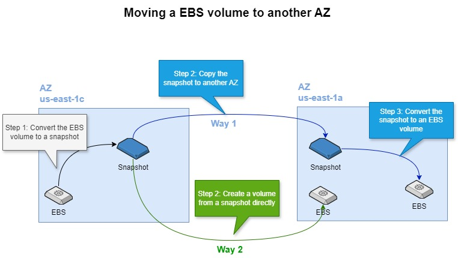
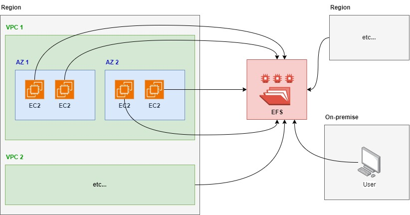

# 1. EBS 💽

**EBS (Elastic Block Store)** in AWS is a block storage service designed for use with Amazon EC2 instances. It provides persistent storage that can be attached to EC2 instances, allowing data to persist even after the instance is stopped or terminated. EBS volumes are highly available, durable, and can be used for a variety of workloads such as databases, file systems, and applications requiring block-level storage.

## 1.1. Key features

- **Persistent Storage**: Data remains intact even when EC2 instances are stopped.
- **Scalability**: You can dynamically increase the size, change the type, or adjust performance without downtime.
- **Snapshot Support**: EBS snapshots allow you to back up your volumes to Amazon S3 for data protection.
- **Types of EBS Volumes**: EBS offers various types of volumes optimized for different workloads, such as General - Purpose SSD (gp3), Provisioned IOPS SSD (io2), and Magnetic volumes.
- **Encryption**: EBS supports encryption for data at rest, in transit, and during snapshots.

EBS is often used for databases, file systems, and applications that require low-latency access to block storage.

# 2. Kinds of EBS volumes 💿📀

| **Price** | **EBS Volume Type**               | **Use Case**                                                    | **Performance**                                  |
|-----------|------------------------------------|-----------------------------------------------------------------|--------------------------------------------------|
| 💵💵💵💵  | **I/O Operation Provisioned SSD IOPS (io2, io1)**| I/O-intensive apps: large databases, critical workloads         | io2: Up to 64,000 IOPS, higher durability         |
|           |                                    |                                                                 | io1: Up to 64,000 IOPS                            |
| 💵💵💵    | **General Purpose SSD (gp3, gp2)** | Most workloads: boot volumes, medium-sized databases, dev/test  | gp3: Up to 16,000 IOPS, 1,000 MB/s throughput     |
|           |                                    |                                                                 | gp2: Scales IOPS with size, up to 16,000 IOPS     |
| 💵💵      | **Throughput Optimized HDD Standard (st1)** | Big data, data warehouses, log processing, streaming workloads  | Optimized for throughput, up to 500 MB/s          |
| 💵        | **Cold HDD Standard Cold (sc1)**                 | Infrequently accessed data, backups, long-term storage          | Lower throughput but very cost-effective          |
| 🪙        | **Magnetic Volumes (Standard)** [Deprecated] | Previously used for lower performance demands, mostly replaced | Older technology, lower performance               |

# 3. Snapshot 📸

A snapshot in AWS EBS (Elastic Block Store) is a point-in-time backup of an EBS volume. **It captures the state of the volume at the time the snapshot is taken**, allowing you to create backups, restore data, and create new EBS volumes from the snapshot. Here’s a breakdown of how snapshots work and their key features:

## 3.1. Key features:

- Point-in-Time Backup:
    - A snapshot records the state of an EBS volume at a specific moment. It includes all the data present on the volume at that time.

- Incremental Backup:
    - After the first snapshot, which is a full backup, subsequent snapshots are incremental. This means that only the data that has changed since the last snapshot is saved, reducing storage costs and improving efficiency.

- Stored in Amazon S3:
    - Snapshots are stored in Amazon S3 (though not directly visible in S3) and are designed for durability and availability. However, they don’t count against your S3 storage limits since AWS manages the storage separately.

- Restoration:
    - You can restore a volume from any snapshot to create a new EBS volume. The new volume will be in the exact state as the volume was when the snapshot was taken.
Snapshots can be restored to volumes of different sizes or types, providing flexibility in volume management.

- Cross-Region and Cross-Account Copying:
    - You can copy snapshots between AWS regions, enabling disaster recovery setups, or share them with other AWS accounts.

- Automatic Snapshots:
    - EBS allows you to automate the snapshot process using AWS tools like Data Lifecycle Manager (DLM), where you can schedule regular snapshots of your volumes for backup and disaster recovery purposes.

- Encryption:
    - If your EBS volume is encrypted, the snapshots will also be encrypted, and any new volumes created from those snapshots will inherit the encryption settings.

## 3.2. Common use cases:

- **Backup & Recovery**: Snapshots provide a reliable backup solution to restore your data in case of accidental data loss, corruption, or system failure.
- **Data Migration**: Snapshots can be used to transfer data across regions or between different AWS accounts.
- **Volume Replication**: Snapshots can be used to create new volumes in different regions or availability zones for replication, scaling, or testing purposes.

## 3.3. Snapshot process flow:

1. Take a snapshot of an EBS volume.
2. The snapshot is stored in S3 as an incremental backup.
3. When needed, restore a snapshot to create a new EBS volume or use it as part of disaster recovery.

## 3.4. Moving the EBS volume to another AZ

EBS (Elastic Block Store) volumes can only be attached to EC2 instances that are in the **same Availability Zone (AZ)**, however, there are two ways to migrate a EBS volume to another AZ:

# 4. AMI 🖼️

An AWS **AMI (Amazon Machine Image)** is a template that contains the necessary information to launch a virtual server (EC2 instance) in the Amazon Web Services (AWS) cloud. It serves as a blueprint for creating instances, allowing you to quickly deploy pre-configured environments. Here’s what it includes and how it works:

## 4.1. Key features

- Operating System (OS):

    - The AMI includes the operating system that will run on your EC2 instance. This can be Linux (e.g., Ubuntu, Amazon Linux) or Windows Server, among others.

- Application Server and Software:
    - AMIs can come pre-installed with specific software, application servers, or configurations, such as a web server (Apache, Nginx), databases, or even entire application stacks (e.g., LAMP stack).

- EBS Snapshots:
    - AMIs include one or more EBS snapshots of the root volume (and any attached volumes), which store the contents of the system's disk at the time the AMI was created.

- Permissions:
    - AMIs can be made private (accessible only to your AWS account), shared with specific AWS accounts, or made public for other users to use.

- Launch Permissions:
    - These permissions control who can use the AMI to launch EC2 instances. Public AMIs can be used by anyone, while private AMIs are restricted to specific accounts.

- Instance Types:
    - You can specify the instance type (such as t2.micro or m5.large) when launching an instance from an AMI. The instance type determines the hardware resources like CPU, memory, and storage.

## 4.2. Types of AMIs

- Public AMIs:
    - Provided by AWS or third-party vendors, these AMIs are available for anyone to use. Examples include standard OS images like Amazon Linux or Ubuntu.

- Private AMIs:
    - Created by you or shared with you, these are custom images only accessible to your AWS account or specific accounts you share it with.

- Marketplace AMIs:
    - Available through the AWS Marketplace, these are pre-configured AMIs built by vendors and developers, often tailored for specific applications, services, or software needs.

## 4.3. Common use cases

- **Quick Deployment**: AMIs allow you to rapidly deploy pre-configured environments with a chosen OS, software, and settings.
- **Backup & Disaster Recovery**: You can create custom AMIs as backups of your current server setup, enabling easy recovery or scaling if needed.
- **Custom Environments**: AMIs can be customized to include specific applications or software configurations that meet your business requirements.

## 4.4. AMI Lifecycle

1. Create an AMI: You can create a custom AMI from an existing EC2 instance. This AMI will contain the OS, applications, and data from the instance at the time the AMI is created.
2. Launch an Instance: Use the AMI to launch new EC2 instances. These instances will start with the OS, software, and data from the AMI.
3. Share or Distribute: You can share your custom AMIs with other AWS accounts or the public if desired.

# 5. EFS 📂

**EFS (Elastic File System)** is a scalable, fully managed file storage service provided by AWS designed to be used with Amazon EC2 instances. It allows multiple EC2 instances to simultaneously access data using a shared file system. EFS is ideal for scenarios where you need file-level storage that can be accessed by several compute resources at once.

## 5.1. Key features

- **Scalable:** EFS automatically scales up or down based on the amount of data stored, so you pay only for the storage you use.
- **Elastic:** No need to provision or manage storage capacity; it grows and shrinks as needed.
- **Multi-AZ Availability:** EFS is designed to provide high availability and durability by storing data across multiple Availability Zones.
- **Shared File System:** Multiple EC2 instances across different availability zones can access the same file system concurrently.
- **POSIX-Compliant:** EFS supports file systems that comply with the Portable Operating System Interface (POSIX) standard, making it suitable for applications that require a file system interface and file access permissions.
- **Data Encryption:** You can enable encryption both at rest and in transit for your data.
- **Performance Modes:**
    - **General Purpose:** Suitable for most workloads.
    - **Max I/O:** Ideal for large-scale, highly parallel applications like big data processing.
- **Bursting Throughput:** EFS can handle spikes in workloads by allowing file systems to burst to higher throughput levels.

## 5.2. Use cases

- **Content Management:** Shared storage for web servers or content management systems.
- **Big Data and Analytics:** Parallel data processing and analytics.
- **Home Directories:** Centralized file storage for user home directories.
- **Machine Learning:** Shared storage for distributed machine learning training.

## 5.3. EFS vs EBS

| **Characteristic**  | **EFS (Elastic File System)**           | **EBS (Elastic Block Store)**            |
|---------------------|-----------------------------------------|------------------------------------------|
| **Storage Type**    | File-level storage (shared)            | Block-level storage (single instance)    |
| **Access**          | Multi-instance, multi-AZ               | Single instance, single AZ (unless detached) |
| **Use Case**        | Shared file system for multiple EC2 instances | Dedicated storage for a single EC2 instance, ideal for databases |
| **Performance**     | Network-based, higher latency           | Low-latency, high-performance            |
| **Scaling**         | Automatically scales with usage        | Pre-provisioned size                     |
| **Durability**      | Multi-AZ replication                    | AZ-specific (Snapshots for backup)      |
| **Pricing**         | Pay for what you use                    | Pay for what you provision               |

