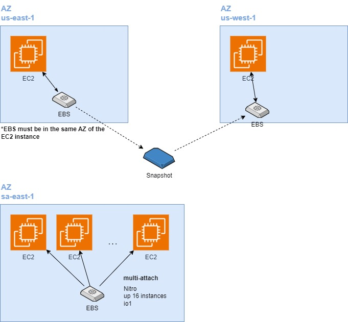

# 1. EBS 💽

**EBS (Elastic Block Store)** in AWS is a block storage service designed for use with Amazon EC2 instances. It provides persistent storage that can be attached to EC2 instances, allowing data to persist even after the instance is stopped or terminated. EBS volumes are highly available, durable, and can be used for a variety of workloads such as databases, file systems, and applications requiring block-level storage.

## 1.1. Key features

- **Persistent Storage**: Data remains intact even when EC2 instances are stopped.
- **Scalability**: You can dynamically increase the size, change the type, or adjust performance without downtime.
- **Snapshot Support**: EBS snapshots allow you to back up your volumes to Amazon S3 for data protection.
- **Types of EBS Volumes**: EBS offers various types of volumes optimized for different workloads, such as General - Purpose SSD (gp3), Provisioned IOPS SSD (io2), and Magnetic volumes.
- **Encryption**: EBS supports encryption for data at rest, in transit, and during snapshots.

EBS is often used for databases, file systems, and applications that require low-latency access to block storage.

# 2. Kinds of EBS 💿📀

