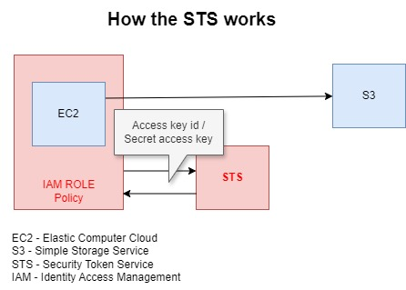
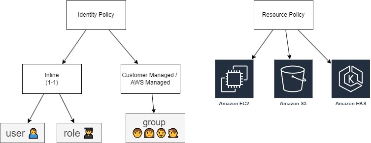

# 1. Introduction 📒

AWS Identity Access Management (IAM) is a web service that helps you securely control access to AWS services and resources for your users. It enables you to create and manage AWS users and groups, and use permissions to allow or deny their access to AWS resources.

You can access it through:

- CLI (Command Line Interface);
- AWS Console;
- API;

# 2. Users, Groups and polices 🧑👨‍👩‍👧‍👦 📜

- **Users**: Who can access to the services and work on them. When some user is created, by default it doesn't have any privileges. 
- **Groups**: They organize the conjunct of users with the same privileges.
- **Roles**: They are applied to the AWS services instead of users.
- **Polices**: They are rules that can able or disable the access of groups or certain users.

# 3. Authentication 🛡️

The user can authenticate itself through:

- Console: The user send its user **name**, **password** and **MFA** (Multi Factor Authentication) optionally.

- CLI and API: Both of them the user need to send its **access key id** and the **secret access key**.

**OBS**:
- You can manage the policy of password creations. For example, how strong the password must be with low case, up case, minimum and maximum length, especial characters, etc.
- 

# 4. STS - Security Token Service 🔐

WS Security Token Service (STS) is a web service that enables you to request temporary, limited-privilege credentials for AWS Identity and Access Management (IAM) users or for users you authenticate (federated users). These temporary credentials provide the same permissions as long-term security credentials, such as IAM user credentials

# 5. Entity Policy x Resource Policy 📝

In AWS Identity and Access Management (IAM), identity policies and resource policies are two types of policies that define permissions for accessing AWS resources. They serve different purposes and are attached to different entities.

## 5.1. Entity Policy

They are applied to users, groups or roles.

### 5.1.1. Inline

When the policy is applied to one single user or role (1-1 relationship).

### 5.1.2. Customer managed / AWS managed

When the policy is applied to a groups (1-N relationship).

## 5.2. Resource Police

When the policy is applied to a service (or resource) such as EC2, S3, etc.

# 6. Best practices 🏆

- Do not use the root as user;
- Create IAM individual accounts;
- Create groups and polices to them instead of a single user;
- Allow as little permission as possible;
- As beginner, start using AWS managed instead of Customer managed policies;
- Able the MFA;
- Do always the revision of policy passwords;

