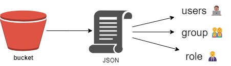

# 1. Introduction 📒

Amazon S3 (Simple Storage Service) is a scalable object storage service provided by Amazon Web Services (AWS). It is designed to store and retrieve any amount of data, at any time, from anywhere on the web.

## 1.1. Common Use Cases

- Backup and Restore: Storing backups of critical data and restoring it when needed.

- Data Archiving: Long-term storage of data that is infrequently accessed.

- Static Website Hosting: Hosting static websites and serving content directly from S3.

- Big Data Analytics: Storing large datasets for processing and analysis.

- Media Storage: Storing and serving media files such as images, videos, and documents.

# 2. Buckets 🪣

S3 organizes data into containers called buckets. Each bucket has a unique name and can contain any number of objects.

## 2.1. Core concepts

- Objects: The fundamental entity stored in S3. An object consists of the data (file), metadata (information about the file), and a unique key (identifier).

- Keys: The unique identifier for an object within a bucket. The combination of the bucket name and object key must be globally unique.

- Regions: S3 stores data in different AWS regions around the world. Choosing a region helps optimize latency and compliance.

# 2. Storage Classes 🧩

| **Storage Class**          | **Use Case**                                          | **Durability**         | **Availability**       | **Storage Cost**       | **Characteristics**                                                                                             |
|----------------------------|-------------------------------------------------------|------------------------|------------------------|------------------------|-----------------------------------------------------------------------------------------------------------------|
| **S3 Standard**            | Frequently accessed data                              | 99.999999999% (11 9's) | 99.99% over a year     | Highest                | Designed for frequently accessed data with low latency and high throughput.                                    |
| **S3 Intelligent-Tiering** | Unknown or changing access patterns                   | 99.999999999% (11 9's) | 99.9% over a year      | Varies (based on access patterns) | Automatically moves data between frequent and infrequent access tiers based on usage.                            |
| **S3 One Zone-IA**         | Infrequently accessed data, rapid availability needed | 99.999999999% (11 9's) | 99.5% over a year      | Lower than S3 Standard | Lower cost; data stored in a single Availability Zone. Ideal for infrequent access data.                       |
| **S3 Glacier**             | Archival data rarely accessed                         | 99.999999999% (11 9's) | 99.9% over a year      | Lower cost             | Retrieval times range from minutes to hours.                                                                     |
| **S3 Glacier Deep Archive**| Long-term archival data rarely accessed               | 99.999999999% (11 9's) | 99.9% over a year      | Lowest                 | Lowest cost; retrieval times range from 12 to 48 hours.                                                            |
| **S3 Outposts**            | Local storage on AWS Outposts                         | 99.999999999% (11 9's) | 99.9% over a year      | Varies (based on Outpost) | Provides S3 storage on-premises for hybrid cloud environments.                                                     |

# 3. Versioning 🔢

Each S3 file can be versioned to:

- Protects against accidental or malicious deletion of objects;
- Protects against accidentally overwrite an object;
- Allows the user to track changes to objects over time. He can retrieve previous versions to review or revert to historical data.
- Maintaining different versions of an object provides an audit trail of changes and modifications;
- Adds an extra layer of redundancy;
- Restoring a previous version of an object is straightforward. You can easily retrieve and make use of older versions without complex recovery procedures;
- helps meet compliance and legal requirements by retaining historical data. This is particularly useful for organizations with data retention policies;

Obs 👀: The file version is disabled by default. The use must enable it.

Aware 💡: The user must be aware of using of version because it takes more space. for example, if a some.txt file has 3MB of size and there is a version 2 of some.txt file with 3.5MB, the some.txt file has 3MB + 3.5MB = 6Mb. And so on.

# 4. Server Access Logging 📋

Uou can track all the activities of any objects inside of a bucket such as some versioning, deletion or update, for instance, through the server access logging. 

To do so: 

1. You need to create a new bucket (to receive the logs);
2. The log bucket must be in the same region of the data bucket (or target bucket);
3. You need to enable the "Server Access Logging" option;
4. You must select the data bucket;

# 5. Life cycle 🔄

**Lifecycle** is a feature that allows you to define rules to automatically manage the lifecycle of objects stored in an S3 bucket. This management can include actions such as transitioning objects to different storage classes, archiving them to Glacier, or deleting them after a specified period of time. The purpose of lifecycle policies is to optimize storage costs and manage the storage duration of objects.

## 5.1. Key Components of an S3 Lifecycle Policy:

- **Transition Actions**: Automatically move objects to a different storage class. For example, you might transition objects to Amazon S3 Glacier after 30 days.
- **Expiration Actions**: Automatically delete objects after a specified period of time. For example, you might delete objects that are older than a year.
- **Filter**: Specify a subset of objects in a bucket to which the lifecycle rule applies, based on prefixes or object tags.
- **Versions**: Lifecycle rules can apply to both the current version and previous versions of objects if versioning is enabled.

## 5.2. Common Use Cases:

- **Cost Optimization**: Transitioning infrequently accessed data to cheaper storage classes like S3 Glacier.
- **Data Retention**: Automatically deleting data after it is no longer needed to comply with data retention policies.
- **Archiving**: Moving old data to an archive class like Glacier to reduce costs while keeping data accessible if needed.

# 6. Object Replication 🧍🏽‍♂️🧍🏽‍♂️

Refers to the process of automatically copying objects between S3 buckets, either within the same AWS region or across different regions. This feature helps improve data availability, durability, and redundancy by ensuring that copies of your objects are stored in multiple locations.

## 6.1. Cross-Region Replication (CRR)
- Copies objects from a bucket in one AWS region to a bucket in another region.
- Useful for disaster recovery, compliance, and reducing latency by keeping data closer to users in different geographic regions.

## 6.2. Same-Region Replication (SRR)
- Copies objects between buckets within the same region.
- Useful for creating additional copies of data for compliance, sharing data across different accounts, or maintaining separate environments (e.g., production and testing).

## 6.3. Key Features
- **Automatic Replication:** Once configured, new objects are automatically replicated according to the rules you define.
- **Versioning Support:** Works with versioning, allowing you to replicate specific versions of objects.
- **Selective Replication:** You can configure replication based on prefixes or tags, meaning you can replicate only certain objects or groups of objects.
- **Replication Time Control (RTC):** An option to replicate objects within a predictable time frame, usually 15 minutes, to meet specific compliance or latency requirements.

## 6.4. Use Cases
- **Disaster Recovery:** Ensure data is replicated to a geographically distant region, protecting against regional outages or disasters.
- **Compliance:** Meet legal or regulatory requirements that mandate data to be stored in multiple locations.
- **Data Localization:** Replicate data to specific regions to comply with data sovereignty laws.
- **Low Latency Access:** Provide users in different regions faster access to data by replicating it closer to them.

# 7. Access management

## 7.1 IAM Polices

There are three ways to manage the user access of a bucket. The **IAM Polices** is one of them. This way is applied to the user, whereas the **Bucket Policy** is applied to the bucket. (It seems silly, but it is important to mention it)

## 7.2. Bucket Polices

As mentioned before, this is a access management applied to the bucket. It uses JSON like **IAM Polices**

## 7.3. ACL

The third method used to manage the user access is ACL. It stands for **Access Control List**. An ACL is a set of permissions associated with an S3 bucket or an object within that bucket. It defines which AWS accounts or groups are granted access and what level of access they have.
Like **Bucket Polices**, ACL is applied to the bucket too.

**Obs👀**: The recommendation is to follow this priority. First try to use **IAM Policies**. If it doesn't worked, try the **Bucket Policies** and, finally, the **ACL**.

**IAM Polices** > **Bucket Policies** > **ACL**

# 8. S3 Encryption

