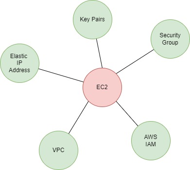

# 1. Introduction 🚩

Amazon Elastic Compute Cloud (EC2) is a web service provided by Amazon Web Services (AWS) that offers resizable compute capacity in the cloud. EC2 allows you to run virtual servers (called instances) in the cloud, giving you the flexibility to scale your computing power up or down as needed.

## 1.1. Key Features of EC2:

1. **Scalability**: 
   - Launch as many or as few virtual servers as you need.
   - Scale up or down quickly to handle changes in demand.

2. **Variety of Instance Types**: 
   - EC2 offers a wide variety of instance types optimized for different use cases, such as general-purpose, compute-optimized, memory-optimized, and storage-optimized instances.

3. **Customizable Configurations**:
   - Choose the operating system, networking features, storage options, and more for your instances.

4. **Elasticity**:
   - Automatically scale your instances based on demand with features like Auto Scaling and Elastic Load Balancing.

5. **Pay-As-You-Go Pricing**:
   - Only pay for the compute capacity that you actually use, making it cost-effective.

6. **Security**:
   - Integrates with AWS Identity and Access Management (IAM) to provide secure access.
   - Allows you to create security groups and configure network access control lists (ACLs) to control the flow of traffic to your instances.

## 1.2. Common Use Cases:
- **Hosting websites and web applications**
- **Running big data analytics**
- **Performing high-performance computing (HPC) tasks**
- **Testing and development environments**
- **Batch processing**
- **Disaster recovery and backup**

In summary, EC2 is a flexible, scalable, and secure service that enables you to run virtual machines in the cloud, suitable for a wide range of applications and workloads.

# 2. Components of a EC2 🧩

## 2.1. Elastic IP address

An Elastic IP address is a static, public IPv4 address provided by Amazon Web Services (AWS) for use with your EC2 instances. Unlike a regular public IP address that might change if you stop and start an EC2 instance, an Elastic IP address is persistent and can be associated with or disassociated from instances as needed.

## 2.2. Key Pairs

It is a set of security credentials that you use to securely connect to your EC2 instances. A key pair consists of a private key and a public key. AWS uses the public key to encrypt login information, and you use the private key to decrypt it and access your instance.

### 2.2.1. Private Key

- A file that you download and keep on your local machine. It's used to authenticate your identity when connecting to your EC2 instance.
- The private key is typically stored in a .pem file (for Linux/Unix instances) or .ppk file (for Windows instances using PuTTY).

### 2.2.2. Public key

- Stored on AWS and associated with your EC2 instance. When you launch an instance and choose a key pair, the public key is placed on the instance in an authorized location (e.g., ~/.ssh/authorized_keys for Linux instances).

## 2.3. Security Group

In Amazon Web Services (AWS), a **Security Group** acts as a virtual firewall for your EC2 instances to control inbound and outbound traffic. Security groups are used to define rules that determine what type of traffic is allowed to and from your instances.

## 2.4. AWS IAM

**AWS Identity and Access Management (IAM)** is a service that helps you securely control access to AWS resources, including EC2 instances. IAM allows you to manage who can access your resources (authentication) and what actions they can perform on those resources (authorization).

## 2.5. VPC 

A **Virtual Private Cloud (VPC)** is a virtual network dedicated to your AWS account that allows you to launch AWS resources, such as EC2 instances, in a logically isolated section of the AWS cloud. It provides full control over your virtual networking environment, including selection of your own IP address range, creation of subnets, and configuration of route tables and gateways.

