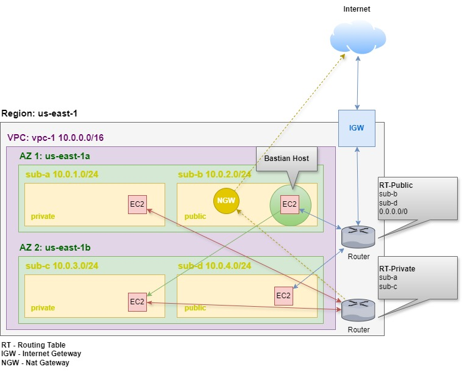

# 1. Introduction 🚩

A **Virtual Private Cloud** (VPC) in Amazon Web Services (AWS) is a virtual network that you can define within the AWS cloud. It allows you to control the networking environment of your AWS resources, providing isolation, security, and customization of your network settings. Here are some key features of a VPC:

- **Subnets**: You can divide your VPC into subnets, which are smaller networks within the VPC. Each subnet can be associated with a specific availability zone, providing high availability.

- **Routing**: VPCs allow you to define custom route tables to control the traffic flow between subnets and the internet.

- **Security Groups**: These act as virtual firewalls for your instances, controlling inbound and outbound traffic at the instance level.

- **Network Access Control Lists (NACLs)**: These provide an additional layer of security at the subnet level, controlling inbound and outbound traffic for subnets.

- **Internet Gateway**: To allow your instances within a VPC to connect to the internet, you can attach an Internet Gateway to your VPC.

- **NAT Gateway**: This allows instances in private subnets to connect to the internet while preventing inbound traffic from the internet.

- **Peering Connections**: VPC peering allows you to connect two VPCs, enabling communication between them as if they were part of the same network.

- **VPN and Direct Connect**: You can also connect your VPC to your on-premises data center using a VPN connection or AWS Direct Connect.

**OBS**: The VPC is a virtual (or logical) isolation your contents from another contents. It is not physics isolated. If you want, you can reserve a whole physical server or rack, for instance.

**OBS 2**: VPCs are associated by Region. So, it's possible different AZ (Available Zone) be in the same VPC, but not different Regions.

**OBS 3**: Even though some instances are in different subnets but they can communicate with each other because they are in the same VPC (EX: 10.0.0.0/16). However, you can configure to one subnet doesn't see other one.

**OBS 4**: When an instance is private, it can't access the internet, therefore, the user can't access the instance through aws console. There are two way to solve this, access the private instance through a public instance in the same network or through **Bastian Host**.