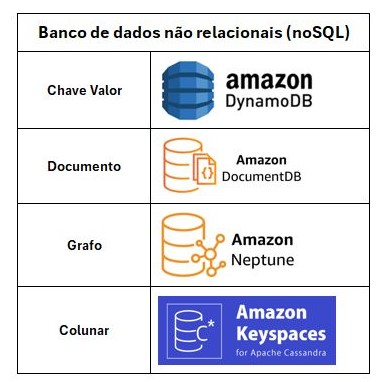

# Database 🛢️

- [Amazon RDS](../services/amazon-rds.md)
- [DynamoDB vs Elasticache](../services/dynamodb-elasticache.md)
- [Amazon Aurora DB](../services/amazon-auroradb.md)
- [Amazon Redshift](../services/amazon-redshift.md)
- [Amazon documentDB](../services/amazon-documentdb.md)
- [Amazon Neptune](../services/amazon-neptune.md)

# Types of nosql databases

