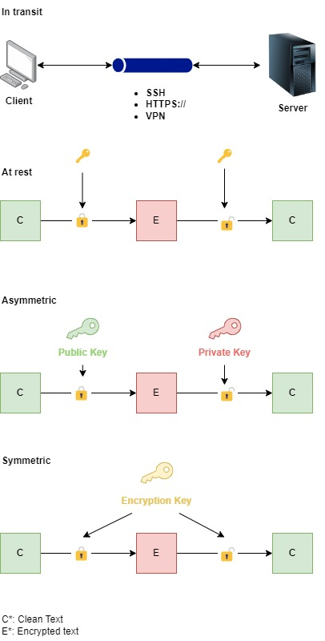

# 1. AWS Directory Service 🗂️

Active Directory (AD) is a directory service developed by Microsoft that provides a centralized platform for managing and organizing users, computers, devices, and other resources in a network. It allows administrators to control permissions, apply policies, and authenticate users within an organization.

## 1.1. Key Components of Active Directory:
- **Domain:** A logical group of objects (users, computers, devices) that share the same AD database and security policies. Each domain has a unique namespace.
- **Domain Controller (DC):** A server that hosts the AD database and handles user authentication and authorization.
- **Organizational Units (OUs):** Containers within a domain used to group users, groups, or computers. OUs simplify administration and allow policies to be applied at different levels.
- **Forest:** The top-level structure of Active Directory that contains one or more domains. A forest represents the security boundary.
- **Tree:** A collection of one or more domains that share a contiguous namespace within a forest.
- **Groups:** Objects that can contain multiple users or other groups, allowing for easier management of permissions and resources.
- **Global Catalog:** A distributed data repository that stores a partial replica of every object in the forest. It helps in speeding up search queries and enabling cross-domain resource access.

## 1.2. Core Functions of Active Directory:
- **Authentication:** AD authenticates users who attempt to log in to the network, ensuring that they are who they claim to be.
- **Authorization:** Once authenticated, AD grants or restricts access to network resources based on the user’s permissions and group memberships.
- **Centralized Management:** Admins can manage all network resources (users, devices, applications) from a central point using AD.
- **Group Policy:** AD allows administrators to apply security policies, configurations, and software deployment across many computers at once using Group Policy Objects (GPOs).
- **Single Sign-On (SSO):** With AD, users can log in once and gain access to multiple resources and applications without re-authenticating.

## 1.3. Use Cases:
- **Enterprise Networks:** AD is widely used in corporate environments to manage employees’ access to computers, shared resources, and applications.
- **User Authentication:** AD enables secure user login across Windows and non-Windows systems (through protocols like LDAP and Kerberos).
- **Access Control:** Administrators can define fine-grained access controls to determine who can view, modify, or access resources on the network.

Overall, Active Directory is a foundational technology for identity and access management (IAM) in Windows-based IT environments.

# 2. Identity Federation 🌐🔐

**Identity federation** in AWS is a method that allows users to access AWS resources using credentials from an external identity provider (IdP), without having to create separate IAM (Identity and Access Management) users in AWS for each user. This provides a secure and scalable way to manage authentication and access control across different systems.

## 2.1. Key features

- **Federated Identity Providers (IdP):**
    - AWS supports identity federation with well-known IdPs like Active Directory (AD), SAML 2.0 (Security Assertion Markup Language), OpenID Connect (OIDC), and OAuth providers such as Google, Facebook, Microsoft, etc.

- **Temporary Security Credentials:**
    - Federated users are not assigned permanent IAM credentials. Instead, AWS issues temporary security credentials via AWS Security Token Service (STS). These credentials allow access to AWS resources for a limited period.

- **Single Sign-On (SSO):**
    - Federation allows SSO so that users can access AWS services with a single set of credentials from their enterprise or social IdP without needing separate AWS credentials.

- **SAML-based Federation:**
    - Often used with enterprise services like Microsoft Active Directory Federation Services (ADFS) or other SAML 2.0 providers to allow on-premises users to authenticate with AWS using their existing credentials.

- **Web Identity Federation:**
    - Used for apps that authenticate users via social IdPs (e.g., Google, Facebook, or Amazon Cognito). After authentication, AWS grants temporary access to resources such as S3 or DynamoDB.

## 2.2. Use cases

 - **Enterprise SSO:** Allow employees to sign in to AWS using their corporate Active Directory credentials via a SAML IdP.
 - **Web and Mobile Apps:** Allow users to sign in to AWS-powered applications using their social media accounts.
 - **Cross-Account Access:** Federated access can also be used to allow users from one AWS account to access resources in another account without creating IAM users in each account.

 ## 2.3. How it works

1. The user logs into their external identity provider (such as AD, Google, etc.).
2. The IdP authenticates the user and provides an authentication token or assertion.
3. AWS uses STS to assume a role based on the user's identity and issues temporary security credentials.
4. The user gains temporary access to AWS resources, based on the permissions attached to the assumed IAM role.

## 2.4. Benefits

 - **Centralized Authentication:** You manage user identities and permissions centrally, without needing to replicate users in AWS.
 - **Increased Security:** Reduces the risk of managing multiple credentials across systems and allows for strong identity controls.
 - **Simplified Access:** Users don’t need separate AWS credentials and can use their existing identities to gain access to AWS services.

**SAML Federation:** A company using Active Directory can allow employees to log in to AWS Management Console using their existing corporate credentials, thanks to SAML-based identity federation.

## 2.5. Security protocols comparison

| Feature                      | **Active Directory (AD)**                   | **SAML 2.0**                                       | **OpenID Connect (OIDC)**                             | **OAuth 2.0**                                     |
|------------------------------|---------------------------------------------|---------------------------------------------------|-------------------------------------------------------|---------------------------------------------------|
| **Type**                      | Directory Service (Identity Management)     | Authentication and Authorization Protocol         | Authentication Protocol (on top of OAuth 2.0)         | Authorization Framework                           |
| **Purpose**                   | Centralized user management, device management, and authentication in Windows environments | Federated Identity and Single Sign-On (SSO)         | Federated Authentication (used for Single Sign-On and user login) | Delegated Authorization for APIs                 |
| **Primary Use Case**          | Manage identities, devices, and groups within enterprise networks | Enterprise-level SSO, Federated identity between organizations | Web and Mobile app authentication (Social Login)      | Granting third-party apps limited access to user resources without sharing passwords |
| **Technology**                | LDAP (Lightweight Directory Access Protocol), Kerberos, NTLM | XML-based protocol                                | JSON Web Tokens (JWT), built on OAuth 2.0              | JSON Web Tokens (JWT) or OAuth tokens             |
| **Authentication or Authorization** | Authentication and Authorization           | Both (authentication via SAML assertions, authorization via roles/attributes) | Primarily **authentication**, but extends OAuth 2.0 for limited authorization | **Authorization**, delegates access to resources (e.g., APIs)                       |
| **Identity Provider (IdP)**   | Active Directory (AD) Domain Controller      | External IdP (e.g., Okta, Active Directory Federation Services) | Social IdPs (e.g., Google, Facebook) or enterprise IdPs | Any IdP implementing OAuth 2.0                    |
| **Token Type**                | N/A (Uses Kerberos tickets or NTLM tokens)   | SAML Assertion (XML)                              | ID Token (JWT)                                         | Access Token (JWT or OAuth token)                 |
| **Single Sign-On (SSO)**      | Not directly for SSO (can be used with ADFS or other solutions) | Yes, widely used for enterprise SSO                | Yes, SSO in consumer and web apps (social login)       | No, typically for authorization, not authentication |
| **Federated Identity**        | No, though AD can integrate with ADFS for SAML support | Yes, widely used for federated identity            | Yes, primarily for consumer web and mobile apps        | No, focuses on authorization rather than identity |
| **Mobile and Web Compatibility** | Not designed for mobile/web apps            | Web-based (not mobile-friendly)                    | Excellent for web and mobile apps                      | Primarily used for web and mobile APIs             |
| **Security Mechanism**        | Kerberos, NTLM                               | Public key infrastructure (signatures, encryption) | Based on OAuth 2.0; JWT tokens signed using public/private key pairs | Token-based, OAuth scopes and permissions          |
| **User Attributes Handling**  | User attributes managed within AD (e.g., groups, roles) | Passed via SAML Assertions                         | User information passed in ID token or from UserInfo endpoint | Not user-centric (focuses on resource access permissions) |
| **Encryption/Signing**        | Encrypted and secured within AD protocols    | Uses XML signatures and encryption                 | Uses JWT signing and encryption                        | Can use signed/encrypted JWTs                      |
| **Common IdP Providers**      | Microsoft Active Directory (on-premises)     | Active Directory Federation Services (ADFS), Okta, Ping Identity | Google, AWS Cognito, Okta                             | Google, AWS Cognito, GitHub, Facebook, etc.        |
| **User Experience**           | Internal enterprise users (authentication to domain) | Used for enterprise SSO to log into multiple services | Users authenticate with external providers (e.g., social logins) | User grants third-party access without sharing credentials |
| **Complexity**                | Can be complex (requires on-premises setup and integration) | High (due to XML, enterprise-level configuration)  | Simpler than SAML (JSON-based, easier for modern apps) | Relatively simple for developers                   |
| **Adoption**                  | Enterprise/Corporate networks                | Enterprises, government institutions, and B2B integrations | Consumer-facing apps, modern web/mobile applications  | Common for API-based systems, mobile apps, and services |
| **Common Use Cases**          | Enterprise user management, device management, group policy | Enterprise SSO, B2B integrations, accessing SaaS tools | Social login, user authentication in modern apps       | API access delegation (e.g., a calendar app accessing a user's Google Calendar) |

This approach is widely used to ensure seamless integration between on-premises or external systems and AWS while improving security and user experience.

# 3. AWS Cognito 📱👨🏽‍💻

AWS **Cognito** is a fully managed service from Amazon Web Services that provides authentication, authorization, and user management for web and mobile applications. It allows you to add sign-up, sign-in, and access control features to your applications quickly and securely, with support for multiple identity providers (IdPs), including social identity providers (like Google, Facebook, and Apple) and enterprise identity providers via SAML 2.0 and OpenID Connect.

## 3.1. Key features

 - **User Pools:**
	 - A user directory to manage and authenticate users.
	 - Supports features like multi-factor authentication (MFA), password recovery, and email/phone verification.
	 - Can be integrated with social IdPs (e.g., Google, Facebook) or with external identity providers via SAML and OpenID Connect.

 - **Identity Pools:**
	 - Allows you to grant users temporary access to AWS services (such as S3, DynamoDB, etc.) via AWS Identity and Access Management (IAM) roles.
	 - Users can authenticate via a User Pool or other external IdPs (such as social logins or federated identities).

 - **Federated Identities:**
	 - Identity federation allows users to authenticate with external identity providers like Google, Facebook, or SAML-based enterprise IdPs.
	 - Provides temporary AWS credentials for authenticated users to securely access AWS resources.
 
 - **Security:**
	 - Provides OAuth 2.0, OpenID Connect (OIDC), and SAML 2.0 support.
	 - Offers built-in security mechanisms like token expiration, multi-factor authentication (MFA), and CAPTCHA.

 - **Scalability:**
	 - Automatically scales to handle millions of users without the need for infrastructure management.

## 3.2. Typical Use Cases

- **Authentication for web and mobile apps:** Use Cognito User Pools to handle user registration, login, and user profile management.
- **Federated Identity Management:** Use Cognito Identity Pools to allow users to authenticate with social providers (like Google or Facebook) or enterprise IdPs.
- **Securing AWS Resources:** Use Identity Pools to provide users with temporary AWS credentials to access AWS services securely.

# 4. Encryption 🔒🔑

**Encryption** is the process of converting data into a coded format to prevent unauthorized access. It ensures that sensitive information is protected from eavesdropping and unauthorized use by transforming readable data (plaintext) into an unreadable format (ciphertext) using a specific algorithm and a key.

## 4.1. Key features

- **Plaintext**: The original, readable data that is to be encrypted.
- **Ciphertext**: The encrypted data that is unreadable without decryption.
- **Encryption Algorithm**: A mathematical procedure used to transform plaintext into ciphertext. Common algorithms include **AES** (Advanced Encryption Standard), **RSA** (Rivest-Shamir-Adleman), and **DES** (Data Encryption Standard).
- **Key**: A piece of information (a string of bits) used by the encryption algorithm to perform the encryption and decryption processes. The security of the encryption largely depends on the secrecy of the key.
- **Decryption**: The process of converting ciphertext back into plaintext using a decryption key or algorithm.

## 4.2. Types of encryption

- **Symmetric Encryption**:
    - The same key is used for both encryption and decryption. This method is faster and more efficient for encrypting large amounts of data. Example algorithms include AES and DES.

- **Asymmetric Encryption**:
    - Uses a pair of keys: a public key for encryption and a private key for decryption. This method is often used for secure communications and digital signatures. An example of an asymmetric algorithm is RSA.

- **In Transit**:
    - Data that is being transferred between two locations, such as over the internet or between servers, is considered "in transit." This includes data sent over networks, such as emails, web traffic, and file transfers.
    - This typically falls under transport encryption or data-in-transit encryption. It involves encrypting data as it moves from one location to another to protect it from interception and unauthorized access during transmission.
    - **Common Protocols**:
        - TLS (Transport Layer Security): Used for securing communications over a computer network (e.g., HTTPS).
        - SSH (Secure Shell): Used for secure remote access and file transfers.
        - VPN (Virtual Private Network): Creates secure connections over the internet.
- **At rest**:
    - Data that is stored on a device or server and not actively being transferred is considered "at rest." This includes data saved in databases, files on hard drives, and backups.
    - This falls under data-at-rest encryption. It involves encrypting stored data to protect it from unauthorized access, theft, or breaches while it is not being transferred.
    - **Common methods**:
        - **Full Disk Encryption**: Encrypts the entire storage device (e.g., BitLocker for Windows, FileVault for macOS).
        - **Database Encryption**: Specific encryption mechanisms applied to database files or individual records.
        - **File Encryption**: Encrypting individual files to protect sensitive data.

# 5. AWS KMS 👨🏽‍💼🔑

AWS KMS (Key Management Service) is a fully managed service provided by Amazon Web Services that allows users to create and control the encryption keys used to encrypt their data. It simplifies the process of managing cryptographic keys and provides a secure environment for key generation, storage, and usage.

## 5.1. Key Features of AWS KMS

1. **Key Management**:
   - Users can create, manage, and delete cryptographic keys (customer master keys or CMKs) in a secure and scalable manner.
   - Supports both symmetric (used for encryption and decryption) and asymmetric keys (public/private key pairs).

2. **Encryption and Decryption**:
   - AWS KMS allows for the encryption of data at rest and in transit using the keys managed within the service.
   - Integrated with other AWS services, enabling automatic encryption of data stored in services like S3, EBS, and RDS.

3. **Access Control**:
   - Provides fine-grained access control using AWS Identity and Access Management (IAM) policies and AWS KMS key policies, allowing users to specify who can use the keys and how they can be used.

4. **Auditing and Compliance**:
   - AWS KMS integrates with AWS CloudTrail to log all key usage and management activities, providing an audit trail for compliance and security analysis.
   - Helps organizations meet regulatory and compliance requirements by enabling encryption of sensitive data.

5. **Integrated with Other AWS Services**:
   - KMS is integrated with various AWS services, allowing seamless encryption for services like Amazon S3, Amazon EBS, Amazon RDS, AWS Lambda, and more.

6. **Automatic Key Rotation**:
   - AWS KMS supports automatic key rotation for symmetric keys, allowing keys to be automatically rotated annually, enhancing security.

7. **Multi-Region Support**:
   - Users can create keys in multiple AWS regions for improved redundancy and disaster recovery.

8. **Data Key Generation**:
   - KMS can generate data encryption keys that can be used in applications without exposing the master key, allowing for better security practices.

## 5.2. Use Cases for AWS KMS

- **Data Encryption**: Encrypt sensitive data stored in AWS services.
- **Secure Data Sharing**: Control and manage access to sensitive data shared across different AWS accounts.
- **Compliance**: Meet compliance requirements for data protection and encryption.
- **Secure Application Development**: Use AWS KMS to manage encryption keys in applications without managing the underlying infrastructure.

## 5.3. Conclusion

AWS KMS provides a robust and scalable solution for managing cryptographic keys, enhancing the security of sensitive data stored in the cloud. By integrating with other AWS services and offering extensive access controls, auditing, and key management features, KMS simplifies the process of implementing encryption within AWS environments.

# 6. AWS CloudHSM 👨🏽‍💼🔑

**AWS CloudHSM** is a **cloud-based hardware security module (HSM)** that allows users to securely generate, manage, and store cryptographic keys within dedicated hardware appliances. These HSMs are isolated and exclusive to each customer, ensuring a higher level of security for cryptographic operations. CloudHSM complies with FIPS 140-2 Level 3 standards for cryptographic modules, providing strong security for applications that require stringent regulatory compliance.

## 6.1. Key Features of AWS CloudHSM

1. **Dedicated Hardware**: CloudHSM provides access to physical hardware devices dedicated to your AWS account, ensuring that only your organization has control over the cryptographic keys stored in the HSM.
2. **FIPS 140-2 Compliance**: It meets FIPS 140-2 Level 3 compliance, which is required for certain highly regulated industries such as finance and healthcare.
3. **Full Control of Keys**: Users have complete control over the encryption keys and the hardware security module (HSM), with no AWS access to these keys.
4. **High Performance**: It is ideal for use cases that demand high-performance cryptographic operations, such as SSL/TLS encryption, database encryption, and code signing.
5. **Integration with On-Premises HSMs**: CloudHSM can be integrated with your on-premises HSMs to maintain hybrid encryption models.

---

## 6.2. Difference Between AWS KMS and CloudHSM:

| Feature                   | AWS KMS (Key Management Service)                        | AWS CloudHSM (Hardware Security Module)                   |
|---------------------------|--------------------------------------------------------|-----------------------------------------------------------|
| **Key Control**            | AWS manages the hardware, but users control the keys via policies and APIs. AWS can access metadata related to the keys. | Users have full control over the HSM and keys, and AWS has no access to the cryptographic keys. |
| **Hardware**               | Fully managed and shared virtual infrastructure. No physical access to hardware. | Dedicated hardware HSM, isolated for each customer. |
| **Performance**            | Optimized for key management tasks (encryption, decryption, key rotation). | High-performance cryptographic operations, suitable for high-traffic or resource-intensive applications. |
| **FIPS Compliance**        | FIPS 140-2 Level 2 certified.                          | FIPS 140-2 Level 3 certified (higher security standard).   |
| **Key Type Support**       | Supports both symmetric and asymmetric keys.            | Supports symmetric and asymmetric keys, including RSA, ECC, and more. |
| **Access Control**         | Controlled via IAM policies and key policies.           | Full control through cryptographic APIs, no AWS access to keys. |
| **Use Case**               | Simplified key management for services like S3, RDS, and Lambda. | Regulatory and compliance-sensitive workloads that require high-level security, like finance or healthcare applications. |
| **Cost**                   | More cost-effective due to shared infrastructure and managed service. | More expensive because of dedicated HSM hardware. |
| **Integration**            | Integrated with many AWS services (S3, EBS, RDS, etc.). | Can integrate with applications directly or with AWS services using custom setup. |

---

## 6.3. Summary

- **AWS KMS** is a fully managed key management service that simplifies the management of encryption keys but operates on shared infrastructure.
- **AWS CloudHSM** offers higher control and security through dedicated hardware, ideal for use cases that demand compliance with stringent regulatory standards and high-performance cryptographic operations.

Choosing between the two depends on your needs for control, performance, and compliance. KMS is easier to use and manage, while CloudHSM offers more control and security but requires more setup and higher costs.

