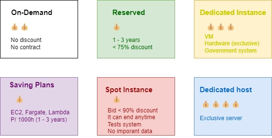
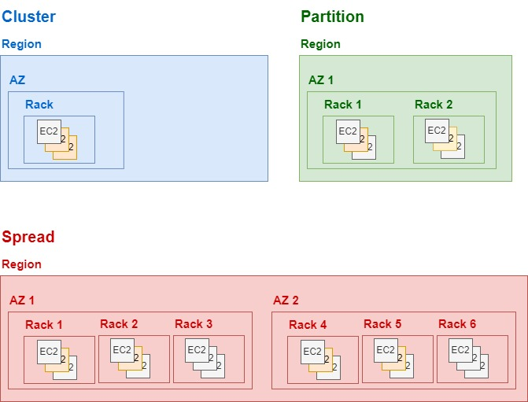
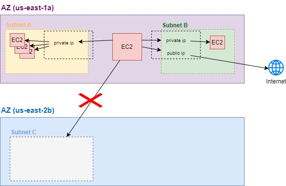
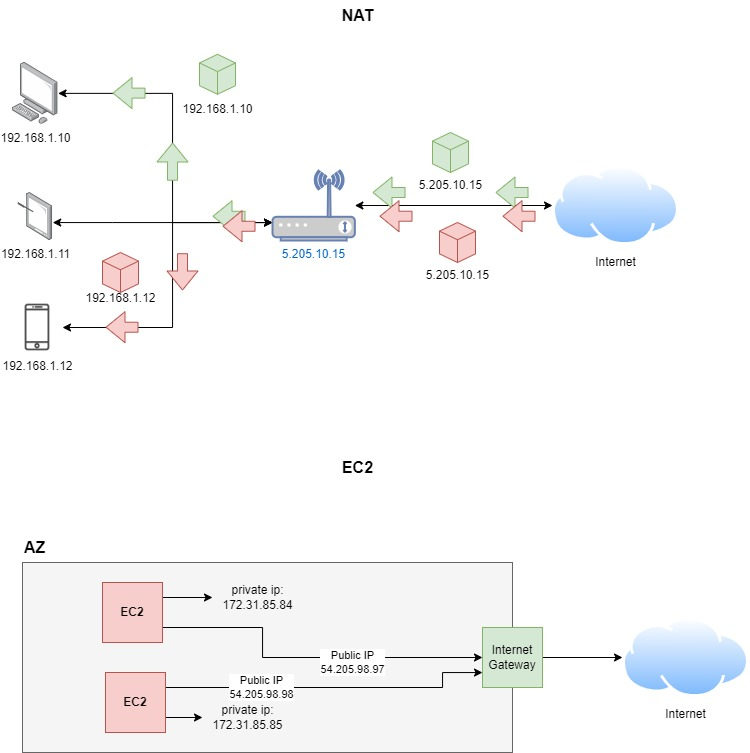
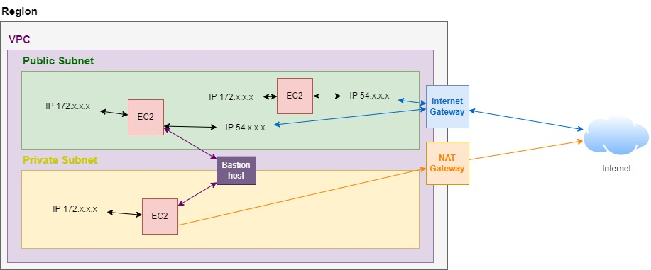

# 1. Introduction 🚩

Amazon Elastic Compute Cloud (EC2) is a web service provided by Amazon Web Services (AWS) that offers resizable compute capacity in the cloud. EC2 allows you to run virtual servers (called instances) in the cloud, giving you the flexibility to scale your computing power up or down as needed.

## 1.1. Key Features of EC2:

1. **Scalability**: 
   - Launch as many or as few virtual servers as you need.
   - Scale up or down quickly to handle changes in demand.

2. **Variety of Instance Types**: 
   - EC2 offers a wide variety of instance types optimized for different use cases, such as general-purpose, compute-optimized, memory-optimized, and storage-optimized instances.

3. **Customizable Configurations**:
   - Choose the operating system, networking features, storage options, and more for your instances.

4. **Elasticity**:
   - Automatically scale your instances based on demand with features like Auto Scaling and Elastic Load Balancing.

5. **Pay-As-You-Go Pricing**:
   - Only pay for the compute capacity that you actually use, making it cost-effective.

6. **Security**:
   - Integrates with AWS Identity and Access Management (IAM) to provide secure access.
   - Allows you to create security groups and configure network access control lists (ACLs) to control the flow of traffic to your instances.

## 1.2. Common Use Cases:
- **Hosting websites and web applications**
- **Running big data analytics**
- **Performing high-performance computing (HPC) tasks**
- **Testing and development environments**
- **Batch processing**
- **Disaster recovery and backup**

In summary, EC2 is a flexible, scalable, and secure service that enables you to run virtual machines in the cloud, suitable for a wide range of applications and workloads.

# 2. Components of a EC2 🧩

## 2.1. Elastic IP address

An Elastic IP address is a static, public IPv4 address provided by Amazon Web Services (AWS) for use with your EC2 instances. Unlike a regular public IP address that might change if you stop and start an EC2 instance, an Elastic IP address is persistent and can be associated with or disassociated from instances as needed.

## 2.2. Key Pairs

It is a set of security credentials that you use to securely connect to your EC2 instances. A key pair consists of a private key and a public key. AWS uses the public key to encrypt login information, and you use the private key to decrypt it and access your instance.

### 2.2.1. Private Key

- A file that you download and keep on your local machine. It's used to authenticate your identity when connecting to your EC2 instance.
- The private key is typically stored in a .pem file (for Linux/Unix instances) or .ppk file (for Windows instances using PuTTY).

### 2.2.2. Public key

- Stored on AWS and associated with your EC2 instance. When you launch an instance and choose a key pair, the public key is placed on the instance in an authorized location (e.g., ~/.ssh/authorized_keys for Linux instances).

## 2.3. Security Group

In Amazon Web Services (AWS), a **Security Group** acts as a virtual firewall for your EC2 instances to control inbound and outbound traffic. Security groups are used to define rules that determine what type of traffic is allowed to and from your instances.

## 2.4. AWS IAM

**AWS Identity and Access Management (IAM)** is a service that helps you securely control access to AWS resources, including EC2 instances. IAM allows you to manage who can access your resources (authentication) and what actions they can perform on those resources (authorization).

## 2.5. VPC 

A **Virtual Private Cloud (VPC)** is a virtual network dedicated to your AWS account that allows you to launch AWS resources, such as EC2 instances, in a logically isolated section of the AWS cloud. It provides full control over your virtual networking environment, including selection of your own IP address range, creation of subnets, and configuration of route tables and gateways.

# 3. Pricing 💰

## 3.1 Summay

| **Plan Type**           | **Description**                                                                                                                                 | **Use Case**                                                                                          |
|-------------------------|-------------------------------------------------------------------------------------------------------------------------------------------------|--------------------------------------------------------------------------------------------------------|
| **On-Demand Instances** | Pay for compute capacity by the hour or second with no long-term commitments.                                                                   | Development, testing, or temporary workloads.                                                          |
| **Reserved Instances**  | Commit to using EC2 for a one- or three-year term to receive significant discounts (up to 75%).                                                 | Steady-state or predictable usage, where long-term commitments make sense.                             |
| **Spot Instances**      | Purchase unused EC2 capacity at a reduced rate (up to 90% off) but can be interrupted by AWS with a two-minute warning.                         | Flexible, fault-tolerant workloads, such as big data processing, batch jobs, and testing.              |
| **Savings Plans**       | Flexible pricing model with cost savings in exchange for committing to consistent usage (measured in $/hour) for a 1- or 3-year term.           | Users with predictable workloads that can commit to consistent usage across various AWS services.      |
| **Dedicated Hosts**     | Physical servers fully dedicated to your use, meeting regulatory/compliance needs or optimizing costs with existing licenses.                   | Workloads requiring physical server isolation, such as those with specific compliance needs.           |
| **Dedicated Instances** | Instances running on hardware dedicated to a single customer, providing isolation at the instance level.                                        | Similar to Dedicated Hosts but with less control over the physical server.                             |
| **Capacity Reservations**| Reserve capacity in a specific Availability Zone for any duration, with the flexibility to turn it on and off.                                 | Ensuring capacity in a specific AZ for time-sensitive workloads.                                       |

EC2 Pricing Plans

## 3.2. Charge period 🕑
|OS                           | Period |Minimum |
|-----------------------------|--------|--------|
|Windows, Red Hat EL, Suse Es |hours   | 1h     |
|Linux                        |seconds | 1min   |
|EBS                          |seconds | 1min   |

## 3.3. Reserved Instances (RI)

### 3.3.1. Standard RI

- Less flexible;
- It can change AZ (Available Zone), IS (Instance Size), NT (Network Type);
- Pricing: 💰
### 3.3.2. Convertible RI

- More flexible;
- It can change AZ, IS, NT, Instance Type Family, OS (Operation system);
- Pricing: 💰💰

## 3.4. Saving Plans (SP)

### 3.4.1. Compute SP

- Contract: 1 to 3 years
- It is applied for Fargate, Lambda, EC2;
- Any Region, Family, Size, OS;
- Pricing: 💰💰 

### 3.4.2. EC2 SP

- Contract: 1 to 3 years;
- It is applied only to EC2;
- Only one Region and Family;
- Any Size and OS;
- Pricing: 💰

# 4. instance Life Cycle 🔄

# 5. Placement Group 🏢🏢

A Placement Group is a feature that determines how instances are placed on the underlying hardware within a single Availability Zone to meet specific requirements, such as:

- **Low-latency and high throughput**: Because the instance are in the same Rack or in the same AZ.
- **Security, fault tolerance, and overall availability**: If all instances are placed in the same rack, a failure in that rack—such as a power outage, hardware failure, or network issue—could bring down all instances at once. By spreading instances across different racks, you reduce the risk that a single hardware failure will impact all your instances.

## 5.1. Kinds of placement groups

# 6. ENI, ENA and EFA 🌐

An Elastic Network Interface (ENI) in Amazon EC2 (Elastic Compute Cloud) is a virtual network interface that can be attached to an instance in a Virtual Private Cloud (VPC). ENIs provide flexible networking functionality in EC2, allowing you to manage and configure network interfaces independently of the instances they're attached to.

- **ENI (Elastic Network Interface)**
   - Basic speed
   - Supported for all instances;
- **ENA (Elastic Network Adapter)**
   - Advanced
   - More speed
   - Just some instances;
- **EFA (Elastic Fabric Adapter)**
   - High speed;
   - MPI (Message Passing Interface);
   - Machine Learning;
   - Just some instances;

# 7. Private and Public IPs 🏠🌐

## 7.1. Private IPs
|Class | IP Address Range              | Default Subnet mask  | 
|------|-------------------------------|----------------------|
| A    | 10.0.0.0 - 10.255.255.255     | 255.**0.0.0**        |
| B    | 172.16.0.0 - 172.31.255.255   | 255.255.**0.0**      |
| C    | 192.168.0.0 - 192.168.255.255 | 255.255.255.**0**    |

- There are classes os range;
- Non-unique. The ips can be used on other private networks;
- Not publicly registered;
- Used internally;
- Assigned by a router;
- Free;
- More secure;

## 7.2. Public IPs

- Can be any address different from public ip range;
- Unique;
- Generated for Internet Provider;
- Public registered on the internet;
- Used externally
- Assigned by an ISP (Internet Service Provider);
- Not free;
- Not Secure;

## 7.3. Summary

| **Aspect**                 | **Private IP**                                             | **Public IP**                                               |
|----------------------------|------------------------------------------------------------|--------------------------------------------------------------|
| **Range/Classes**          | There are classes of range.                               | Can be any address outside the private IP range.            |
| **Uniqueness**             | Non-unique; can be used on other private networks.        | Unique across the entire internet.                          |
| **Registration**           | Not publicly registered.                                  | Publicly registered on the internet.                        |
| **Usage**                  | Used internally within a private network.                 | Used externally on the internet.                            |
| **Assignment**             | Assigned by a router.                                     | Assigned by an ISP (Internet Service Provider).             |
| **Cost**                   | Free.                                                      | Not free; typically incurs a cost from the ISP.             |
| **Security**               | More secure; limited to internal network access.          | Less secure; accessible from the internet.                  |

# 8. NAT in EC2

**Network Address Translation** (NAT) is a technique used in computer networking to manage the mapping of IP addresses between private and public networks. NAT allows multiple devices on a local network (such as a home or office network) to share a single public IP address when accessing the internet.

In EC2, is different from a regular devices. Into an EC2 instance, the user cannot see the public ip because the public-private translation occurs through the **Internet Gateway (IGW)**. Besides that, the IG works 1 to 1, it means, each EC2 private key has its own public one.

# 9. Elastic IP

An **Elastic IP** in Amazon EC2 (Elastic Compute Cloud) is a static, public IPv4 address designed for dynamic cloud computing. Elastic IP addresses allow you to maintain a persistent public IP address that you can associate with your EC2 instances, even if you stop and start them. This feature provides a way to mask instance or availability zone failures by rapidly remapping your public IP address to another instance.

## 9.1. Key Features of Elastic IP

1. **Static and Public**
   - Elastic IPs are static, meaning they don’t change over time, unlike the dynamic public IPs that are automatically assigned to EC2 instances when they are launched.
   - They are public IP addresses that are reachable from the internet.

2. **Persistence**
   - Elastic IPs remain associated with your AWS account until you explicitly release them, ensuring you have consistent IP addresses for your applications.
   - You can remap an Elastic IP to another instance in your account quickly if the instance it's currently associated with fails or is terminated.

3. **Associations**
   - An Elastic IP can be associated with an EC2 instance, a network interface, or a NAT Gateway.
   - You can associate or disassociate Elastic IPs from instances or network interfaces at any time without restarting the instances.

4. **Failover**
   - Elastic IPs enable high availability and disaster recovery by allowing you to quickly remap an IP address to another instance if the instance currently associated with it fails.
   - This feature is particularly useful for maintaining uptime and ensuring that your services remain accessible.

5. **Charges**
   - You are not charged for one Elastic IP that is associated with a running instance. However, AWS charges for any additional Elastic IPs or if an Elastic IP is associated with a stopped instance or not associated with any instance.

## 9.2. Use Cases for Elastic IP

- **Web Servers**: If you're running a web server on an EC2 instance, an Elastic IP ensures that the server is reachable at the same IP address even if you need to replace or restart the instance.
  
- **Failover Scenarios**: In the event of an instance failure, you can quickly remap the Elastic IP to a backup instance, minimizing downtime.

- **NAT Gateways**: Elastic IPs are often used in conjunction with NAT Gateways to provide a consistent public IP address for outbound traffic from instances in private subnets.

## 9.3. Example Scenario

You have a web application running on an EC2 instance with an Elastic IP. If the instance experiences issues or needs to be replaced, you can start a new instance and reassign the Elastic IP to the new instance. This way, your users experience no change in the IP address they use to access your application.

## 9.4. Limitations

- **IPv4 Only**: Elastic IP addresses are only available for IPv4. If you're using IPv6, AWS assigns addresses differently.
- **Regional**: Elastic IP addresses are specific to a region; they cannot be moved between AWS regions.

## 9.5. Summary

Elastic IP in EC2 is a static public IP address that provides flexibility, high availability, and disaster recovery options for your cloud-based applications, ensuring that your services remain accessible with a consistent IP address.

# 10. Networking Concepts 🌐

In Amazon EC2, networking is an essential aspect of managing your instances and securing your environment. Here, we'll explore the key concepts: private and public subnets, bastion host, NAT gateway, internet gateway, and route tables.

## 10.1. Private and Public Subnets

### 10.1.1. Public Subnet
- **Definition**: A public subnet is a subnet within a Virtual Private Cloud (VPC) that is associated with a route table containing a route to an Internet Gateway (IGW).
- **Internet Access**: Instances in a public subnet can have public IP addresses and can directly access the internet through the IGW.
- **Use Cases**: Typically used for resources that need to be accessible from the internet, such as web servers, load balancers, and bastion hosts.

### 10.1.2. Private Subnet
- **Definition**: A private subnet is a subnet within a VPC that is not associated with a route table containing a route to an Internet Gateway.
- **No Direct Internet Access**: Instances in a private subnet do not have public IP addresses and cannot directly access the internet.
- **Use Cases**: Used for resources that should not be exposed to the internet, such as databases, application servers, and backend services. These instances can access the internet through a NAT gateway or NAT instance if needed.

## 10.2. Bastion Host

- **Definition**: A bastion host (or jump server) is a special-purpose instance deployed in a public subnet to act as a gateway for accessing instances in a private subnet.
- **Function**: It provides secure access to instances in the private subnet via SSH or RDP, without exposing the private instances to the internet.
- **Security**: Bastion hosts are typically secured with strict access controls, including IP whitelisting, Multi-Factor Authentication (MFA), and regular security updates.

## 10.3. NAT Gateway

- **Definition**: A Network Address Translation (NAT) Gateway is an AWS-managed service that allows instances in a private subnet to access the internet while keeping their private IP addresses hidden.
- **Internet Access**: Instances in a private subnet send outbound traffic to the NAT Gateway, which translates their private IP addresses to the NAT Gateway's public IP address before forwarding the traffic to the internet.
- **Use Cases**: Ideal for instances that need to access the internet for updates, patches, or external services, without exposing them to incoming traffic from the internet.

## 10.4. Internet Gateway

- **Definition**: An Internet Gateway (IGW) is a horizontally scaled, redundant, and highly available VPC component that allows communication between instances in your VPC and the internet.
- **Function**: It enables instances in a public subnet to connect to the internet and allows internet traffic to reach those instances.
- **Use Cases**: Required for instances in a public subnet to have internet access and for allowing inbound traffic from the internet to those instances.

## 10.5. Route Tables

- **Definition**: A route table contains a set of rules (routes) that are used to determine where network traffic is directed within a VPC.
- **Function**: Each subnet in a VPC must be associated with a route table. The route table dictates how traffic is routed between subnets and to external networks, such as the internet or other VPCs.
- **Key Components**:
  - **Local Route**: A default route that allows communication within the VPC.
  - **Internet Route**: A route that directs traffic to the Internet Gateway for internet-bound traffic.
  - **NAT Gateway Route**: A route that directs traffic from a private subnet to the NAT Gateway for outbound internet access.

## 10.6. Example Scenario

- **VPC Setup**: 
  - **Public Subnet**: Contains a bastion host and a NAT Gateway. The bastion host allows secure SSH access to instances in the private subnet. The NAT Gateway enables instances in the private subnet to access the internet for software updates.
  - **Private Subnet**: Contains application servers and databases that are isolated from the internet. These servers can only access the internet through the NAT Gateway and can be managed through the bastion host.

- **Route Table Configuration**:
  - The public subnet’s route table has a route to the Internet Gateway, allowing internet access.
  - The private subnet’s route table has a route to the NAT Gateway, allowing outbound internet traffic while keeping the instances isolated from direct internet exposure.

This setup ensures a secure, scalable, and well-organized network architecture within your AWS environment.

