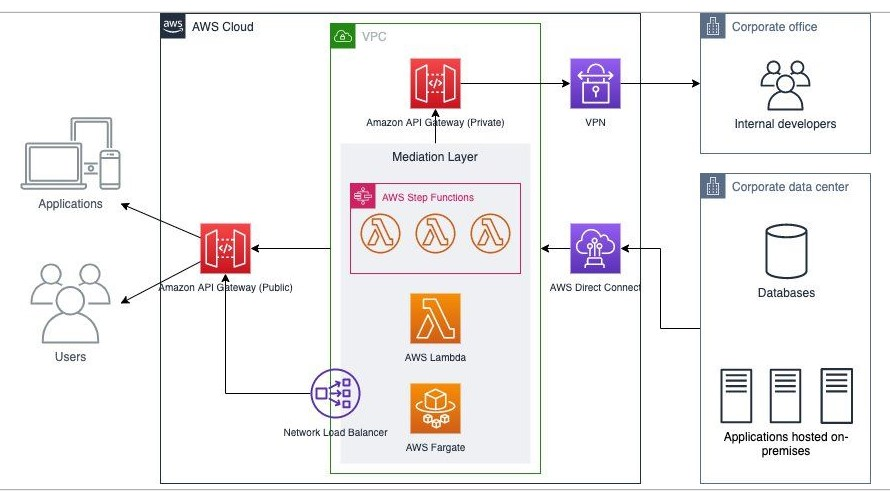

# 1. Amazon API Gateway

**Amazon API Gateway** is a fully managed service by AWS that allows developers to create, publish, maintain, monitor, and secure APIs at any scale. It enables you to build RESTful APIs, WebSocket APIs, and HTTP APIs that act as "front doors" for applications to access data, business logic, or functionality from backend services, such as AWS Lambda functions, EC2 instances, or any web service.

## 1.1. Key Features:

1. **Support for Multiple API Types**:

   - **RESTful APIs**: For standard stateless HTTP requests, such as GET, POST, PUT, DELETE.
   - **WebSocket APIs**: For real-time, two-way communication between client and server (e.g., chat apps or live updates).
   - **HTTP APIs**: A lightweight alternative to RESTful APIs, ideal for high-performance and low-latency use cases.

2. **Serverless Integration**: API Gateway seamlessly integrates with **AWS Lambda**, allowing you to create completely serverless backends without the need to manage infrastructure.

3. **API Management**: Provides complete control over your API's lifecycle, including versioning, throttling, and request/response transformations.

4. **Security Features**: Includes various security mechanisms:

   - **Amazon Cognito** integration for user authentication and authorization.
   - **API Keys** for access control.
   - **AWS Identity and Access Management (IAM)** roles for resource access control.
   - **OAuth 2.0 and custom authorizers** for token-based authentication.

5. **Scalability**: Automatically scales to handle large volumes of traffic, ensuring reliable performance even during peak loads. API Gateway can handle thousands of requests per second.

6. **Monitoring and Logging**: Provides integration with **Amazon CloudWatch** for monitoring API usage, performance metrics, and error logging, helping to troubleshoot issues and optimize performance.

7. **Throttling and Rate Limiting**: Protects backend systems by setting limits on the number of API requests per second and the burst limit. This helps prevent DDoS attacks and avoids resource exhaustion.

8. **Caching**: Provides a caching layer for API responses, reducing backend load and improving API performance by serving cached responses for repeated requests.

9. **Request/Response Transformation**: Offers tools to manipulate the format of incoming and outgoing requests and responses, including mapping templates for content transformation.

10. **Cost-Effective**: You only pay for the API calls received and the amount of data transferred out. With the pay-as-you-go pricing model, it's highly cost-effective for both small and large-scale applications.

11. **Custom Domain Names**: Supports the use of custom domain names for your APIs, making it easy to integrate your APIs with existing web applications and services.

12. **Cross-Origin Resource Sharing (CORS)**: API Gateway simplifies the setup of CORS, allowing you to securely interact with APIs across different domains.

## 1.2. Common Use Cases:

- **Building Serverless Backends**: API Gateway works seamlessly with AWS Lambda to create a fully managed, serverless backend that can scale automatically with demand.
- **Real-Time Applications**: WebSocket APIs enable real-time communication, making API Gateway suitable for chat apps, live dashboards, or collaborative platforms.
- **Microservices Architectures**: Allows developers to expose microservices through REST or HTTP APIs, ena
