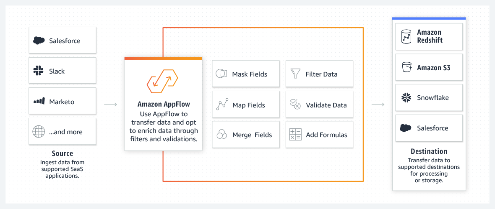

# 🔄 Amazon AppFlow

**Amazon AppFlow** is a fully managed integration service that allows you to securely transfer data between AWS services and various Software-as-a-Service (SaaS) applications (such as Salesforce, ServiceNow, Slack, Google Analytics, and more). It helps you automate data transfers, making it easy to ingest, synchronize, and analyze data from external apps within AWS services like S3, Redshift, and others, without requiring custom code.

## Key Features of Amazon AppFlow:

1. **No-Code Data Integration**: AppFlow provides a simple interface that enables users to set up data flows between AWS and SaaS applications without writing any code, making it accessible for both technical and non-technical users.

2. **Multiple Connectors**: Supports a wide range of connectors to popular SaaS applications like Salesforce, Slack, Google Analytics, Zendesk, ServiceNow, and more. These integrations allow data to flow bi-directionally between your applications and AWS services.

3. **Bidirectional Data Flows**: Data can flow from AWS to SaaS apps and vice versa, giving businesses the flexibility to move and synchronize data as needed. This enables use cases such as data synchronization, backup, and real-time data analysis.

4. **Data Transformation**: Offers built-in transformations to clean, filter, and enrich data during the transfer process. For example, you can map, concatenate, or filter fields before sending them to the target destination.

5. **Real-Time and Scheduled Data Flows**: You can create data flows to be triggered in real-time based on events (e.g., when new data is added to a source), or schedule data transfers at predefined intervals (e.g., daily, weekly).

6. **Data Security and Privacy**:

   - **Encryption**: Data in transit is encrypted using AWS KMS, ensuring secure transfers.
   - **Field-Level Encryption**: You can apply encryption to specific fields, allowing for fine-grained control over sensitive information.
   - **Compliance**: AppFlow helps maintain compliance with data protection regulations like GDPR and HIPAA by ensuring secure data transfer and processing.

7. **Integration with AWS Services**: AppFlow integrates with AWS services such as **Amazon S3**, **Amazon Redshift**, **Amazon EventBridge**, and **AWS Lambda**, allowing data to be stored, processed, or analyzed seamlessly within AWS.

8. **Versioning and Audit Logs**: Provides detailed logs and audit trails of each data flow, helping you track the success and performance of data transfers for monitoring and troubleshooting purposes.

9. **Error Handling**: Includes built-in mechanisms for error detection and automatic retries to ensure reliable data transfers even in the event of temporary failures.

10. **Cost-Effective**: AppFlow offers pay-as-you-go pricing, meaning you only pay for the number of flows and the volume of data transferred, making it an affordable solution for data integration.

## Common Use Cases:

- **SaaS Data Ingestion**: Easily ingest data from SaaS applications like Salesforce or Google Analytics into AWS servic
