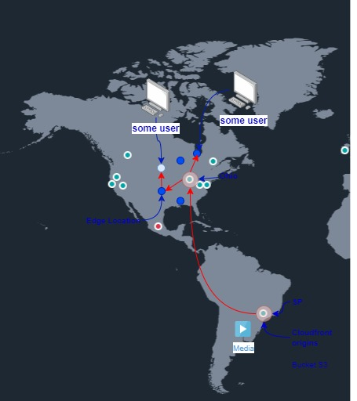
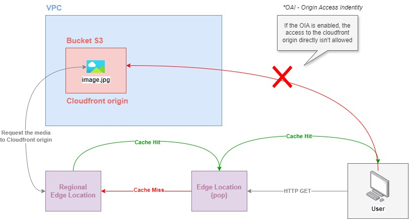
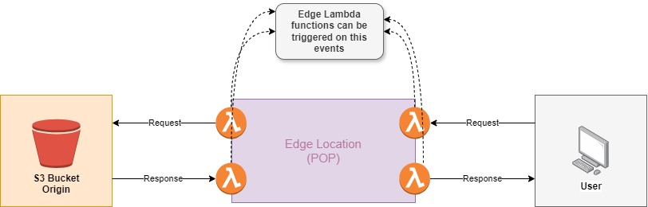

# 1. Cloudfront ☁️🌎

Amazon **CloudFront** is a **Content Delivery Network (CDN)** service provided by AWS that securely delivers content (such as websites, APIs, videos, or software) to users globally with low latency and high transfer speeds. It acts as a distribution network of globally located servers (called edge locations) that cache and serve content to users from the closest server, improving performance and reliability.

## 1.1. Key features:

- Global Edge Locations:

  - CloudFront uses a network of edge locations distributed around the world. When a user requests content, CloudFront serves it from the edge location closest to them, reducing latency.

- Content Caching:

  - CloudFront caches your content at edge locations, speeding up the delivery of frequently requested content like images, videos, and static files. The content is stored temporarily at these edge locations and is refreshed periodically.

- Support for Dynamic and Static Content:

  - CloudFront can deliver both static content (e.g., images, CSS, JavaScript files) and dynamic content (e.g., API responses, personalized content, or database-driven content). For dynamic content, CloudFront works with features like Lambda@Edge for real-time customization.

- Security:

  - CloudFront integrates with AWS services like AWS Shield for DDoS protection and AWS WAF (Web Application Firewall) for application-layer security. It also supports SSL/TLS encryption for secure content delivery and signed URLs to restrict access to certain content.

- Custom Origins:

  - CloudFront can pull content from multiple sources, including Amazon S3 buckets, Elastic Load Balancers, or even non-AWS web servers, referred to as custom origins.

- Compression and Optimization:

  - CloudFront automatically compresses files like HTML, CSS, and JavaScript to reduce the size of the data being transferred, resulting in faster load times for end users.

- Content Delivery with Lambda@Edge:

  - With Lambda@Edge, you can run code closer to users to customize and personalize the content CloudFront delivers. This allows you to modify requests or responses in real time without having to maintain servers.

- Origin Failover:

  - CloudFront provides origin failover, allowing you to specify backup origins. If CloudFront cannot retrieve content from the primary origin, it automatically fetches it from the secondary origin, improving availability.

- Real-Time Monitoring:

  - CloudFront integrates with Amazon CloudWatch, allowing you to monitor CDN performance, usage, and errors in real time. It also provides detailed analytics about request activity, cache hits/misses, and geographic distribution.

  

## 1.2. OAI

OIA in AWS CloudFront stands for **Origin Access Identity**. It is a feature used to restrict access to an Amazon S3 bucket that is being used as the origin for a CloudFront distribution. The goal of OIA is to ensure that your S3 content is only accessible through CloudFront and not directly from the S3 bucket's public URL, thus enhancing security and control over content delivery.
When it's enabled, a **policy is created** to restrict the origin accesses directly.

## 1.3. Lambda Edge

**Lambda Edge** is an AWS feature that allows you to run serverless code closer to your users by executing AWS Lambda functions at CloudFront edge locations, before or after each request and before or after each response, like the image below. This enables you to customize and modify the content delivered by CloudFront in real time, without managing servers. Lambda Edge helps improve performance and allows you to apply logic at the edge, resulting in faster responses and highly customizable content.

