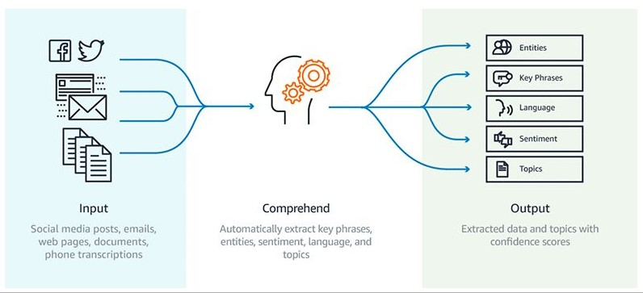

# Amazon Comprehend 🤖📖

**Amazon Comprehend** is a natural language processing (NLP) service provided by AWS that uses machine learning to find insights and relationships in text. It enables developers to analyze text data to uncover valuable information, extract key phrases, identify sentiments, and categorize content without the need for machine learning expertise. Amazon Comprehend is designed to help organizations understand and gain insights from their textual data at scale.

## Key Features of Amazon Comprehend:

1. **Entity Recognition**: Identifies and categorizes entities in the text, such as people, places, organizations, dates, and more, providing valuable context to the content.

2. **Sentiment Analysis**: Determines the sentiment of a piece of text (positive, negative, neutral, or mixed), helping organizations gauge public opinion and customer feedback.

3. **Key Phrase Extraction**: Automatically extracts important phrases and terms from text, allowing users to quickly understand the main topics discussed.

4. **Language Detection**: Automatically detects the language of the text, supporting multiple languages and making it easier to process multilingual content.

5. **Topic Modeling**: Identifies topics within a collection of documents, helping users understand the primary themes present in large datasets.

6. **Custom Classification**: Allows users to create custom classification models tailored to their specific use cases, enabling precise categorization of text data based on unique business needs.

7. **Comprehend Medical**: A specialized version of Amazon Comprehend focused on analyzing healthcare-related text, capable of identifying medical entities, conditions, treatments, and medications.

8. **Integration with Other AWS Services**: Works seamlessly with other AWS services like **Amazon S3** for data storage, **Amazon Lambda** for serverless computing, and **Amazon SageMaker** for advanced machine learning tasks.

9. **Batch and Real-Time Processing**: Supports both batch processing of large datasets and real-time processing of streaming data, making it flexible for different application needs.

10. **Cost-Effective**: Pricing is based on the amount of text processed, allowing organizations to manage costs according to their usage.

## Common Use Cases:

- **Customer Feedback Analysis**: Analyzes customer reviews, surveys, and social media interactions to extract insights on customer satisfaction and product sentiment.
- **Content Categorization**: Automatically categorizes documents, emails, or articles based on topics or themes, streamlining content management and retrieval.
- **Market Research**: Extracts key trends and sentiments from large volumes of text data, helping businesses make informed decisions based on public opinion.
- **Compliance Monitoring**: Helps organizations identify sensitive information in communications or documents, supporting compliance with regulations and policies.
- **Healthcare Insights**: Analyzes clinical notes, patient feedback, and medical literature to extract valuable insights for improved patient care and research.

Amazon Comprehend empowers businesses to leverage textual data effectively, enabling them to extract meaningful insights and improve decision-making processes.
