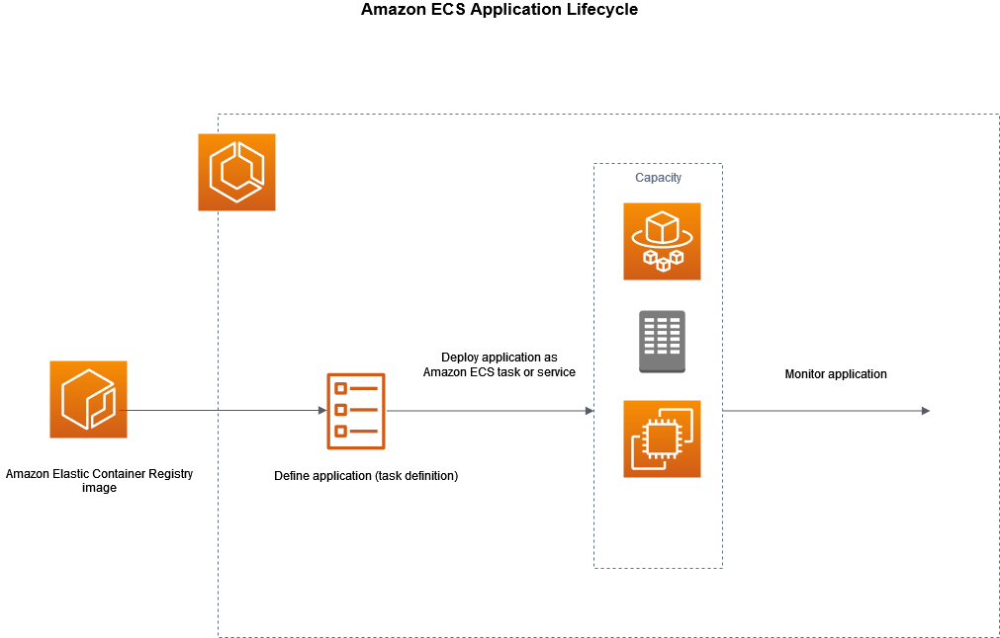
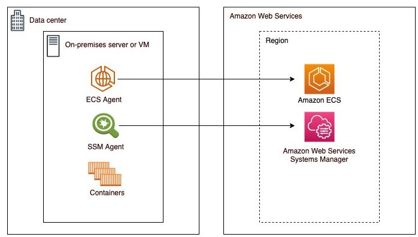

# 1. Amazon ECS (Elastic Container Service) 📦

**Amazon ECS (Elastic Container Service)** is a fully managed container orchestration service that makes it easy to deploy, manage, and scale containerized applications using **Docker**. ECS is highly integrated with other AWS services, such as Elastic Container Registry (ECR) and CloudWatch, allowing you to run your applications across a fleet of managed or self-managed instances.

## 1.1. Key Features:

1. **Container Orchestration**:

   - Amazon ECS is designed to orchestrate Docker containers, managing the deployment, scheduling, and scaling of containerized applications across clusters of EC2 instances or AWS Fargate (serverless option).

2. **Supports AWS Fargate**:

   - ECS integrates with **AWS Fargate**, a serverless compute engine, allowing you to run containers without managing the underlying infrastructure. With Fargate, you don’t need to provision or manage servers—just define the resources your application needs.

3. **High Integration with AWS Services**:

   - ECS integrates natively with AWS services like **Elastic Load Balancing (ELB)**, **IAM**, **Amazon CloudWatch**, **Amazon VPC**, and **Amazon ECR (Elastic Container Registry)**, making it easy to secure, monitor, and scale your containers.

4. **Task Definitions**:

   - In ECS, you define how your containers should behave using a **task definition**, which specifies container images, ports, CPU, memory, networking configurations, and more. ECS uses this task definition to launch and manage containers.

5. **Cluster Management**:

   - ECS allows you to create clusters of EC2 instances that act as a pool of compute capacity for your containers. ECS manages the distribution and scaling of containers across the cluster.

6. **Load Balancing and Service Discovery**:

   - ECS integrates with **Elastic Load Balancing** to automatically distribute traffic across containers. It also supports **AWS Cloud Map** for service discovery, allowing containers to find and communicate with each other.

7. **Autoscaling**:

   - ECS supports autoscaling for both the underlying EC2 instances and the containers running on them. This ensures that your application can scale up to meet traffic demands and scale down when traffic is low.

8. **Security**:
   - ECS integrates with **IAM** for secure access and permissions management. You can define granular permissions for containers, services, and clusters. ECS also supports **VPC** for networking and **AWS Secrets Manager** for storing sensitive information.

## 1.2. Application lifecycle

1. Prepare Your Application for Containers

   - Architect your application to run on containers, which package everything your software needs, including code, runtime, system tools, and libraries.

2. Create a Container Image

   - Build a container image using a Dockerfile, a plaintext file with instructions for building the container.
   - Store the built image in a registry like Amazon ECR.

3. Define a Task in Amazon ECS

   - Create a task definition in Amazon ECS. This is a JSON file that acts as a blueprint for your application, specifying:
     - The container image.
     - Operating system parameters.
     - Open ports and data volumes.
     - Other application-specific needs.

4. Deploy the Task or Service

   - Deploy the task definition as either a service (to maintain a certain number of running tasks) or a standalone task within an ECS cluster.
   - A cluster is a group of tasks or services running on ECS.

5. Task Instantiation

   - When deployed, a task is created based on the task definition and runs within the cluster.
   - If a service is used, Amazon ECS ensures the desired number of tasks are running. If any task fails, ECS will automatically replace it.

6. Container Agent Operations
   - Each container instance runs a container agent, which:
   - Sends data about running tasks and resource utilization to Amazon ECS.
   - Starts and stops tasks as per ECS's instructions.
7. Monitor Your Deployment
   - Use ECS monitoring tools to observe the performance and resource usage of your deployed tasks and services.

## 1.3. Benefits:

- **Fully Managed**: ECS takes care of cluster management, scaling, and container orchestration, so you can focus on developing and running your applications.
- **Flexible Options**: You can choose between **AWS Fargate** (serverless) or **EC2** (managed) instances to run your containers, giving you flexibility based on your needs.

- **Cost Efficiency**: With Fargate, you only pay for the resources your containers use. When using EC2, you can optimize costs by leveraging spot instances or other pricing models.

- **Scalability**: ECS makes it easy to scale your containerized applications horizontally or vertically based on demand, with built-in support for autoscaling.

- **Deep AWS Integration**: ECS is tightly integrated with the AWS ecosystem, allowing you to utilize other AWS services like IAM, VPC, CloudWatch, and more.

## 1.4. Common Use Cases:

- **Microservices**: Run and manage microservices architectures by deploying containers with independent services that can scale individually.
- **Batch Processing**: ECS can be used to run large-scale batch processing jobs with containers, dynamically scaling as needed.

- **Web Applications**: Deploy web applications in containers and use Elastic Load Balancing to distribute traffic across multiple instances.

- **CI/CD Pipelines**: Integrate ECS with CI/CD tools (like AWS CodePipeline, CodeBuild) to automate the deployment of containerized applications.

## 1.5. Summary:

**Amazon ECS** is a powerful and flexible container orchestration service that allows you to easily deploy, scale, and manage containerized applications. Whether you use **Fargate** for a serverless experience or **EC2** instances for more control, ECS integrates with the broader AWS ecosystem, making it a great choice for running containers in the cloud.

# 2. ECS Anywhere 📦🏢

ECS Anywhere is an extension of Amazon Elastic Container Service (ECS) that allows you to run and manage containers on infrastructure outside of the AWS cloud, such as on-premises servers or other cloud environments. It provides the same container orchestration capabilities as ECS in the cloud, but it gives you the flexibility to use your existing hardware or non-AWS environments.

