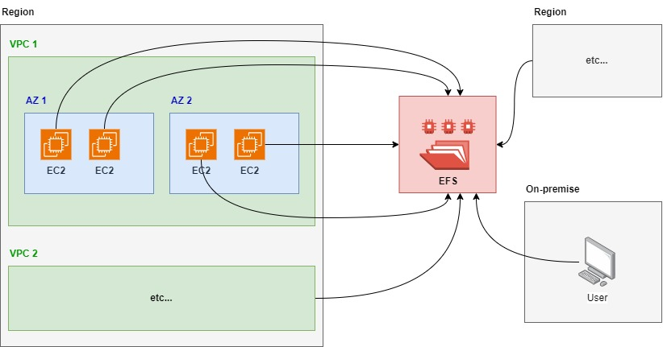

# 1. EFS 📂

**EFS (Elastic File System)** is a scalable, fully managed file storage service provided by AWS designed to be used with Amazon EC2 instances. It allows multiple EC2 instances to simultaneously access data using a shared file system. EFS is ideal for scenarios where you need file-level storage that can be accessed by several compute resources at once.

## 1.1. Key features

- **Scalable:** EFS automatically scales up or down based on the amount of data stored, so you pay only for the storage you use.
- **Elastic:** No need to provision or manage storage capacity; it grows and shrinks as needed.
- **Multi-AZ Availability:** EFS is designed to provide high availability and durability by storing data across multiple Availability Zones.
- **Shared File System:** Multiple EC2 instances across different availability zones can access the same file system concurrently.
- **POSIX-Compliant:** EFS supports file systems that comply with the Portable Operating System Interface (POSIX) standard, making it suitable for applications that require a file system interface and file access permissions.
- **Data Encryption:** You can enable encryption both at rest and in transit for your data.
- **Performance Modes:**
    - **General Purpose:** Suitable for most workloads.
    - **Max I/O:** Ideal for large-scale, highly parallel applications like big data processing.
- **Bursting Throughput:** EFS can handle spikes in workloads by allowing file systems to burst to higher throughput levels.

## 1.2. Use cases

- **Content Management:** Shared storage for web servers or content management systems.
- **Big Data and Analytics:** Parallel data processing and analytics.
- **Home Directories:** Centralized file storage for user home directories.
- **Machine Learning:** Shared storage for distributed machine learning training.

## 1.3. EFS vs EBS

| **Characteristic**  | **EFS (Elastic File System)**           | **EBS (Elastic Block Store)**            |
|---------------------|-----------------------------------------|------------------------------------------|
| **Storage Type**    | File-level storage (shared)            | Block-level storage (single instance)    |
| **Access**          | Multi-instance, multi-AZ               | Single instance, single AZ (unless detached) |
| **Use Case**        | Shared file system for multiple EC2 instances | Dedicated storage for a single EC2 instance, ideal for databases |
| **Performance**     | Network-based, higher latency           | Low-latency, high-performance            |
| **Scaling**         | Automatically scales with usage        | Pre-provisioned size                     |
| **Durability**      | Multi-AZ replication                    | AZ-specific (Snapshots for backup)      |
| **Pricing**         | Pay for what you use                    | Pay for what you provision               |

