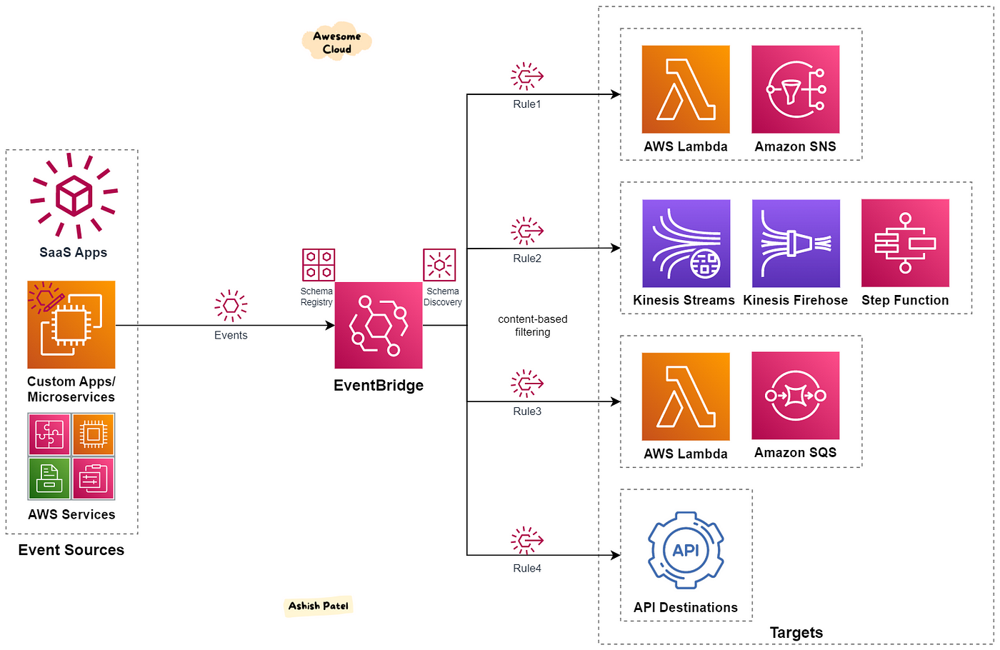

# 🌉 Amazon EventBridge

**Amazon EventBridge** is a serverless event bus service that simplifies the building of event-driven applications by allowing you to connect applications using events from AWS services, your own applications, and third-party SaaS applications. It helps decouple the components of applications, improving their scalability and maintainability.

## Key Features of Amazon EventBridge:

1. **Event-Driven Architecture**: Enables you to build applications that respond to events in real-time, facilitating a microservices architecture where different components can operate independently.

2. **Support for Multiple Event Sources**: Integrates with a wide variety of AWS services (like S3, Lambda, and CloudWatch) and can also receive events from custom applications and external SaaS providers.

3. **Schema Registry**: Allows you to manage and discover event schemas, providing a way to understand the structure of events flowing through your system and enabling validation of incoming events.

4. **Event Filtering and Routing**: You can create rules to filter events based on specific attributes and route them to different targets (such as AWS Lambda functions, SNS topics, SQS queues, or Kinesis streams) for processing.

5. **Integration with AWS Services**: Easily connects with various AWS services to process, store, or analyze events, allowing you to automate workflows and respond to changes in your environment.

6. **Custom Event Buses**: Supports creating custom event buses for your applications, enabling you to isolate events for different applications or environments while maintaining flexibility.

7. **Real-Time Processing**: Delivers events in near real-time, allowing applications to react quickly to changes and maintain up-to-date states.

8. **Dead Letter Queues**: Provides a mechanism for handling failed event deliveries by routing undeliverable events to Amazon SQS queues or SNS topics for later analysis or retry.

9. **Security and Access Control**: Integrates with AWS Identity and Access Management (IAM) for fine-grained control over who can publish or consume events, ensuring secure event handling.

10. **Cost-Effective**: Pay only for the events published and processed, without the need to provision or manage infrastructure, making it an economical solution for event-driven architectures.

## Common Use Cases:

- **Microservices Communication**: Enable services to communicate with each other through events, reducing coupling and enhancing scalability.
- **Application Workflows**: Trigger workflows based on specific events, such as starting a data processing pipeline when new data is uploaded to S3.
- **Monitoring and Alerting**: Automatically respond to changes in your environment (e.g., resource states, application errors) and send notifications or trigger remediation actions.
- **Integration with SaaS Applications**: Listen for events from third-party applications (e.g., Shopify, Zendesk) and react accordingly in your AWS environment.
- **Data Ingestion**: Collect and process events from various sources to perform analytics, monitoring, or real-time processing.

## Benefits of Amazon EventBridge:

- **Simplified Event Handling**: Streamlines the process of building event-driven applications, allowing you to focus on business logic rather than infrastructure.
- **Scalability**: Automatically scales to handle varying event loads without manual intervention, supporting both small and large applications.
- **Improved Reliability**: Built-in retries and dead letter queues ensure that events are processed reliably, even in the face of transient failures.
- **Faster Development**: Reduces the complexity of integrating different components, enabling faster development cycles and time-to-market for new features.

## Summary

Amazon EventBridge empowers developers to build robust event-driven architectures that enhance the responsiveness, scalability, and reliability of applications.

