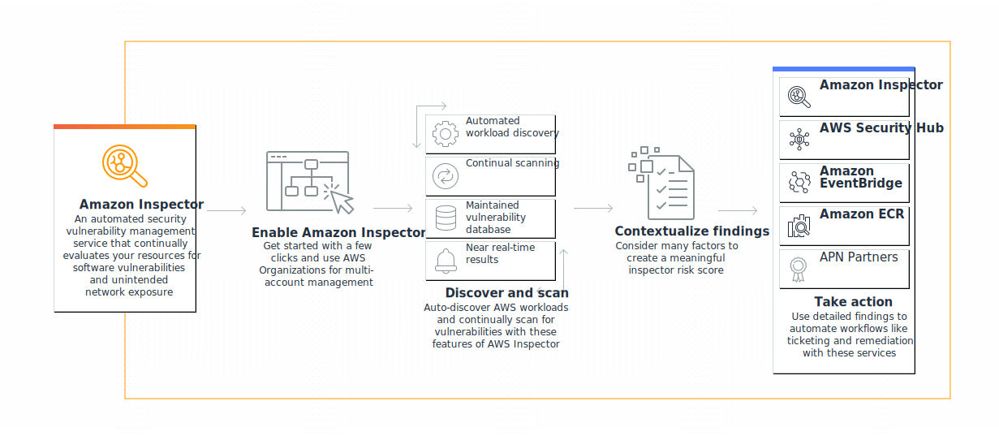

# Amazon Inspector 🔎

**Amazon Inspector** is a security assessment service provided by AWS that helps improve the security and compliance of your AWS resources. It automatically assesses applications for vulnerabilities or deviations from best practices. Amazon Inspector specifically focuses on:

- Security vulnerabilities: It scans your resources (like EC2 instances, container images, and Lambda functions) for known vulnerabilities and identifies potential security risks, such as unpatched software or system misconfigurations.

- Compliance: It checks if your resources adhere to security best practices and standards, including regulatory frameworks and internal security policies.

- Automated assessments: It continuously monitors and automatically triggers assessments when new vulnerabilities are discovered or when the configuration of resources changes.

- Detailed findings: Amazon Inspector provides a detailed list of findings with recommended remediation steps, such as patching outdated libraries or adjusting security settings.

By integrating with other AWS services like AWS Security Hub and AWS Organizations, Amazon Inspector helps centralize security findings and improve an organization's overall security posture.

