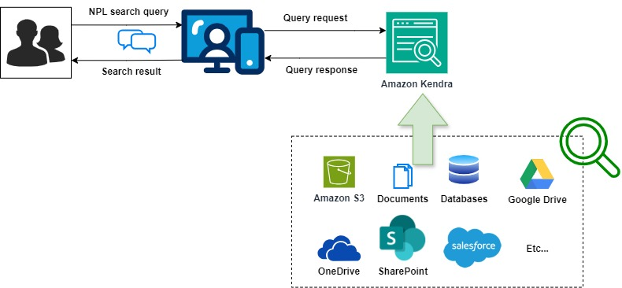

# 🔍 Amazon Kendra

**Amazon Kendra** is an intelligent search service powered by machine learning (ML) from AWS. Kendra allows organizations to build custom search solutions that understand the intent behind users’ queries, delivering more accurate search results from a wide variety of data sources such as documents, databases, websites, and more. By using natural language processing (NLP), Kendra enables more precise, context-aware search capabilities for enterprise applications.

## Key Features of Amazon Kendra:

1. **Natural Language Processing (NLP)**: Kendra can process natural language queries, allowing users to ask questions in their own words and get highly relevant results, unlike traditional keyword-based search systems.
2. **Contextual Search**: Uses machine learning to understand the context and intent behind queries, providing more precise answers rather than just a list of documents.

3. **Multiple Data Source Connectors**: Easily integrates with popular data repositories such as **Amazon S3**, **SharePoint**, **Salesforce**, **RDS**, and more, enabling you to index data from a variety of sources.

4. **Custom Relevance Tuning**: Kendra allows you to tune the search relevance according to your specific business needs, so important documents appear higher in the search results.

5. **FAQs and Document Ranking**: Automatically extracts answers from FAQs or document snippets, providing concise answers for user queries when appropriate.

6. **Domain-Specific Language Support**: Offers pre-built industry-specific search models for domains such as healthcare, legal, insurance, and more, to improve the relevance of results for specialized searches.

7. **Advanced Security**: Offers secure access control, ensuring that users can only search and retrieve documents that they are authorized to view. Kendra also integrates with existing security models and identity providers.

8. **Search Analytics**: Provides insights into how users interact with the search functionality, including query performance and search trends, enabling continuous improvement.

9. **Multi-Language Support**: Kendra supports multiple languages, allowing for broader use in multilingual organizations or customer-facing applications.

10. **Cost-Effective**: Pay-as-you-go pricing model based on the number of documents indexed and the number of search requests, making it flexible and scalable for different workloads.

## Common Use Cases:

- **Enterprise Search**: Provides employees with a powerful tool to search through vast internal knowledge bases, documents, wikis, and other resources to find information faster.
- **Customer Support Portals**: Enables more effective self-service support for customers by surfacing relevant help articles and documents in response to user queries.
- **Healthcare Knowledge Management**: Helps healthcare professionals find specific information from a large set of documents or medical records, improving decision-making and care.
- **Legal Research**: Assists legal professionals in finding relevant case laws, regulations, and documentation in a streamlined and efficient way.
- **E-commerce Search**: Enhances product search capabilities on e-commerce platforms, enabling customers to find products that match their queries with higher accuracy.

Amazon Kendra is widely used to provide a more accurate and intuitive search experience across a variety of industries, helping businesses improve information retrieval and user satisfaction.
