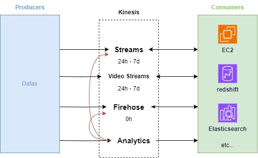

## 1. Amazon Kinesis

**Amazon Kinesis** is a cloud-based service provided by AWS that enables **real-time data processing and analysis of streaming data**. It is designed to handle large amounts of data from various sources, allowing users to collect, process, and analyze data in real time to gain insights and make informed decisions.

### 1.1. Key Features

1. **Real-Time Data Streaming**:
   - Amazon Kinesis allows users to collect and process data streams in real time, enabling immediate insights and actions based on the data being generated.

2. **Scalability**:
   - The service can easily scale to handle thousands of data streams and millions of events per second, making it suitable for high-throughput use cases.

3. **Multiple Components**:
   - Amazon Kinesis consists of several components, each serving different use cases:
     - **Kinesis Data Streams**: For building custom, real-time applications that process and analyze streaming data.
     - **Kinesis Data Firehose**: For loading streaming data into data lakes, data stores, and analytics services, such as Amazon S3, Amazon Redshift, and Amazon Elasticsearch Service.
     - **Kinesis Data Analytics**: For analyzing streaming data using standard SQL queries in real time.

4. **Integration with AWS Services**:
   - Kinesis integrates seamlessly with other AWS services, including AWS Lambda, Amazon S3, Amazon Redshift, and AWS Glue, allowing for a cohesive data processing pipeline.

5. **Data Retention**:
   - Kinesis Data Streams allows users to retain streaming data for a configurable duration (up to 365 days), providing flexibility in data processing and analysis.

6. **Enhanced Security**:
   - Kinesis offers built-in security features such as data encryption at rest and in transit, IAM roles for access control, and integration with AWS CloudTrail for logging and monitoring.

### 1.2. Use Cases

- **Real-Time Analytics**: Analyzing logs, metrics, and other data in real time to gain insights and make immediate decisions.
- **Event-Driven Applications**: Building applications that react to events in real time, such as fraud detection or monitoring social media feeds.
- **Data Ingestion**: Collecting and processing streaming data from various sources, such as IoT devices, applications, and databases.
- **Data Transformation and Loading**: Transforming and loading streaming data into data lakes or data warehouses for further analysis.

### 1.3. Summary

Amazon Kinesis is a powerful service for processing and analyzing streaming data in real time. With its ability to scale and integrate with other AWS services, it enables organizations to build real-time data applications and derive insights from their data as it flows in.

