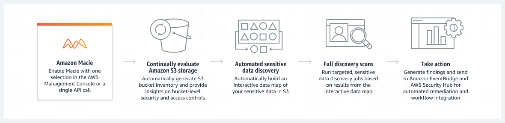

# 1. Amazon Macie 🧠🤖

Amazon Macie is a data security service provided by AWS that helps you discover, classify, and protect sensitive data stored in Amazon S3 buckets. It uses machine learning and pattern matching to identify personally identifiable information (PII), financial data, and other types of sensitive information. Key features of Amazon Macie include:

1. **Data Discovery and Classification**
   - Sensitive data identification: Macie automatically scans your S3 buckets to discover sensitive data like PII (e.g., names, social security numbers, credit card information), financial records, and intellectual property.
   - Content classification: It classifies data based on predefined criteria, such as identifying files containing sensitive information.
2. **Data Visibility and Monitoring**

   - Continuous monitoring: Macie provides ongoing visibility into how your data is accessed and shared. It monitors S3 bucket configurations and alerts you about potential security risks, such as publicly accessible buckets or buckets shared with external accounts.
   - Alerts for security risks: It can notify you when sensitive data is identified in unexpected places or when data is exposed inappropriately, helping reduce the risk of accidental data exposure.

3. **Compliance Support**

   - Data compliance: By detecting and classifying sensitive data, Amazon Macie helps with compliance requirements like GDPR, HIPAA, and CCPA, ensuring that sensitive data is properly identified and protected.

4. **Integration with AWS Services**

   - Integration with AWS Security Hub: Macie integrates with AWS Security Hub, enabling you to centralize security findings and combine them with other AWS security services like AWS Config, GuardDuty, and IAM Access Analyzer.
     Automated responses: You can set up automated actions, such as moving sensitive files to restricted locations or notifying security teams, based on findings.

5. **Machine Learning and Customization**
   - Machine learning-based analysis: Macie uses machine learning to continuously improve its ability to identify sensitive data, reducing the need for manual audits.
   - Customizable data detection: You can configure Macie to detect custom data types that are specific to your organization's needs.

## Summary

Amazon Macie is particularly useful for organizations that need to manage large amounts of data and ensure the security and privacy of sensitive information across their AWS environments.

