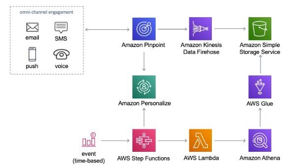

# 📧 1. Amazon Pinpoint

**Amazon Pinpoint** is a flexible and scalable marketing communication service that enables businesses to engage with their users via multiple channels such as email, SMS, push notifications, and voice messages. Pinpoint helps organizations send targeted messages based on user behavior, preferences, or demographics, and is widely used for customer engagement, marketing campaigns, transactional messages, and more.

## 1.1. Key Features:

1. **Multi-Channel Messaging**:

   - **Email**: Send marketing, transactional, and notification emails to users.
   - **SMS**: Send text messages to engage users on mobile devices, ideal for time-sensitive updates.
   - **Push Notifications**: Send push notifications to mobile app users for real-time updates.
   - **Voice Messages**: Use voice calls to deliver important messages to users.

2. **Audience Segmentation**: Allows you to create dynamic user segments based on various factors such as user behavior, demographics, location, and more, to deliver highly targeted messages.

3. **Campaign Management**: Create, schedule, and manage marketing campaigns across multiple channels. You can set up automated messaging campaigns to trigger based on user actions or predefined schedules.

4. **Transactional Messaging**: In addition to campaigns, Pinpoint allows you to send one-off transactional messages, such as order confirmations, password resets, and appointment reminders.

5. **Personalization**: Customize messages by incorporating user-specific data such as names, preferences, or recent activities, making the communication more engaging and relevant.

6. **Analytics and Reporting**: Provides detailed analytics and reports for each campaign, including open rates, click-through rates, delivery rates, and more, enabling businesses to optimize future communications based on insights.

7. **A/B Testing**: Run A/B tests for different message versions within a campaign to see which version performs better in terms of user engagement.

8. **Event Tracking**: Collect and analyze event data from your app or website, allowing you to track user behavior and engagement, which can then be used to trigger personalized messages.

9. **API Access**: Offers a flexible API for developers to send messages programmatically, enabling automation of transactional notifications or bulk messaging.

10. **Cost-Effective**: Pay only for what you use, with pricing based on the number of messages sent, making it a scalable and cost-effective solution for businesses of any size.

11. **User Engagement Workflows**: Allows you to define multi-step workflows for engaging users at various touchpoints. For example, send a welcome email when a user signs up, followed by a follow-up SMS or push notification after a few days.

12. **Security and Compliance**: Ensures message delivery compliance with regulations such as GDPR, CAN-SPAM, and others. You can also manage user consent and preferences for message subscriptions.

## 1.2. Common Use Cases:

- **Marketing Campaigns**: Drive engagement by sending promotional emails, product updates, or special offers to targeted user segments.
- **Transactional Messaging**: Send important transactional messages such as order confirmations, shipping notifications, and password resets.
- **Customer Retention**: Use personalized messaging to re-engage inactive users, recommend products, or encourage repeat purchases.
- **Event-Triggered Messaging**: Send messages based on specific events, such as sending a push notification when a user abandons their shopping cart or an SMS for account verification.
- **User Onboarding**: Welcome new users with a series of onboarding emails or notifications, helping them get started with your service or product.
- **App Engagement**: Send push notifications or in-app messages to encourage users to engage with new features, promotions, or events in your app.

## 1.3. Summary

Amazon Pinpoint provides businesses with the tools they need to effectively communicate with their users across multiple channels, improving customer engagement, retention, and satisfaction.
