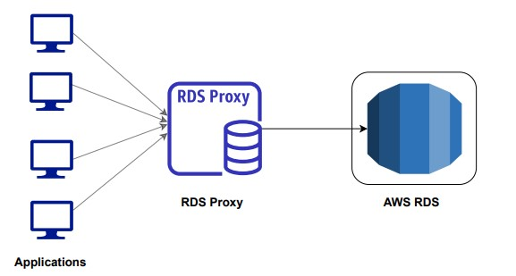

# 1. RDS 💽☁️

Amazon **Relational Database Service (RDS)** is a managed service provided by AWS that makes it easy to set up, operate, and scale a relational database in the cloud. It automates time-consuming tasks such as hardware provisioning, database setup, patching, and backups, allowing you to focus on your applications.

# 2. Supported SQL Databases 💿📀

RDS supports several popular database engines, including:

- Amazon Aurora (a MySQL and PostgreSQL-compatible relational database)
- MySQL
- PostgreSQL
- MariaDB
- Oracle Database
- Microsoft SQL Server

## 2.1. Comparison

Bellow, follows the comparison of the databases available at the moment that this document has been written:

| **Database Engine**                     | **Compatibility**                                      | **Performance**                                          | **Scalability**                                               | **Replication**                                           | **Storage**                            | **Use Case**                                                                             |
| --------------------------------------- | ------------------------------------------------------ | -------------------------------------------------------- | ------------------------------------------------------------- | --------------------------------------------------------- | -------------------------------------- | ---------------------------------------------------------------------------------------- |
| **Amazon Aurora MySQL-Compatible**      | MySQL-compatible                                       | Up to 5x faster than standard MySQL                      | Automatically scales up to 128 TB per instance                | Up to 15 read replicas, multi-region replication          | Automatically grows up to 128 TB       | Applications needing MySQL compatibility with better performance and scalability         |
| **Amazon Aurora PostgreSQL-Compatible** | PostgreSQL-compatible                                  | Up to 3x faster than standard PostgreSQL                 | Automatically scales up to 128 TB per instance                | Up to 15 read replicas, multi-region replication          | Automatically grows up to 128 TB       | Applications needing PostgreSQL compatibility with enhanced performance                  |
| **MySQL**                               | Broad compatibility                                    | Suitable for web applications, slower than Aurora        | Handles moderate workloads, manual sharding for large scale   | Up to 5 read replicas                                     | Up to 64 TB depending on instance type | Small to medium-sized web applications                                                   |
| **PostgreSQL**                          | Standards compliance, extensibility                    | Slower than MySQL but offers advanced features           | Manages large workloads, less optimized than Aurora           | Up to 5 read replicas                                     | Up to 64 TB depending on instance type | Applications requiring complex queries and data integrity                                |
| **MariaDB**                             | Drop-in replacement for MySQL                          | Similar to MySQL with some enhancements                  | Comparable to MySQL, requires manual sharding for large scale | Up to 5 read replicas                                     | Up to 64 TB depending on instance type | Alternative to MySQL with more open-source transparency                                  |
| **Microsoft SQL Server**                | Enterprise-grade, Windows-based environments           | High performance, especially for transactional workloads | Can handle large-scale applications, more complex scaling     | Transactional replication, Always On availability groups  | Up to 16 TB depending on instance type | Enterprise applications, especially within Microsoft ecosystem                           |
| **Oracle Database**                     | Enterprise-grade, advanced features for enterprise use | High performance in large-scale, mission-critical apps   | Excellent scalability, though complex                         | Data Guard, Active Data Guard, GoldenGate for replication | Up to 64 TB depending on instance type | Enterprise-grade applications requiring advanced features, data security, and compliance |

# 3. Multi-AZ x Read Replica 📈

## 3.1. Multi-AZ

**Multi-AZ** (Multiple Availability Zone) deployments provide high availability and failover support for DB instances. Here’s how it works:

- **Primary and Standby Instances**: When you create a Multi-AZ deployment, Amazon RDS automatically provisions and maintains a synchronous standby replica in a different Availability Zone (AZ). This replica is not directly accessible; it’s used for failover purposes.
- **Automatic Failover**: In the event of a failure (e.g., hardware failure, AZ outage), Amazon RDS automatically fails over to the standby replica to minimize downtime. The failover process is seamless and usually takes a few minutes.
- **Data Durability**: Multi-AZ deployments ensure that your data is replicated to the standby instance, providing durability and protection against data loss.

**Use Case**: Multi-AZ deployments are ideal for production databases where high availability and data durability are critical.

**Endpoint**: It uses a single DNS endpoint to connect to your RDS instance. This endpoint remains constant from the perspective of your application.

## 3.2. Read Replicas

**Read Replicas** are used to scale out read-heavy database workloads. They provide a way to offload read traffic from the primary database. Here’s how it works:

- **Asynchronous Replication**: Read Replicas use asynchronous replication to copy data from the primary database to one or more replica instances. This means there may be a slight delay between the primary database and the replicas.
- **Scaling Reads**: You can distribute read traffic across multiple Read Replicas to improve performance and reduce load on the primary instance.
- **Read-Only**: Read Replicas are read-only, meaning they cannot handle write operations. They are used solely for read queries.

**Use Case**: Read Replicas are useful for applications with heavy read workloads where scaling out read operations can help improve performance.

**Manual Setup**: Creating and managing Read Replicas involves manual setup. You specify which primary instance you want to replicate and how many replicas you want.

**Endpoint**: RDS instance has its own endpoint.

## 3.3. Summary

- **Multi-AZ**: Provides high availability and failover support by maintaining a synchronous standby replica in a different AZ. Best for critical production databases where uptime is crucial.
- **Read Replicas**: Improve read performance and scalability by asynchronously replicating data to one or more read-only instances. Best for applications with high read traffic.

You can use both features together to achieve high availability, data durability, and improved read performance.

# 4. Backups 💾

- Automated: 1-35 days (1sec) -> s3 (free)
- Manual: DB snapshot

# 5. What is Amazon RDS Proxy?

**Amazon RDS Proxy** is a fully managed, highly available database proxy service designed to improve the performance, scalability, and security of your applications that use **Amazon RDS** or **Aurora** databases. RDS Proxy sits between your application and the database, managing database connections more efficiently, especially for applications with unpredictable workloads or many simultaneous connections.

## 5.1. Key Features of RDS Proxy:

1. **Connection Pooling**:
   - RDS Proxy manages a pool of database connections and reuses them efficiently. This reduces the overhead of opening and closing new database connections, particularly in serverless architectures or environments with many short-lived connections (e.g., Lambda functions).
2. **Improved Scalability**:

   - By managing connection pools, RDS Proxy allows your application to handle a higher number of concurrent connections without overwhelming the database, leading to better resource utilization and scalability.

3. **High Availability**:

   - RDS Proxy automatically handles failover for Multi-AZ RDS and Aurora databases. In case of a database failover, RDS Proxy ensures a quick transition, allowing applications to continue operating with minimal downtime.

4. **Enhanced Security**:

   - RDS Proxy allows you to authenticate your applications to the database using **AWS Identity and Access Management (IAM)**, eliminating the need to store database credentials in your application code.
   - It also supports **AWS Secrets Manager**, enabling secure and automatic credential rotation.

5. **Improved Performance for AWS Lambda**:

   - When using AWS Lambda with RDS or Aurora databases, RDS Proxy reduces the overhead caused by opening and closing database connections, which can lead to latency issues in serverless environments. RDS Proxy optimizes connection reuse, resulting in faster execution.

6. **Automatic Failover**:

   - RDS Proxy can detect if a primary database becomes unavailable and automatically routes connections to a standby instance, ensuring uninterrupted application availability.

7. **Support for Read and Write Queries**:
   - RDS Proxy supports both read and write queries, making it flexible for various types of workloads, including read-heavy or write-heavy applications.

## 5.2. Use Cases for RDS Proxy:

1. **Serverless Applications**:
   - In serverless environments like AWS Lambda, RDS Proxy helps mitigate the problem of managing too many database connections by pooling connections, thus avoiding the performance bottleneck that can occur when connections are rapidly opened and closed.
2. **Connection-Intensive Workloads**:

   - Applications that require a high number of simultaneous connections to the database, such as microservices architectures or web applications with many users, benefit from RDS Proxy's efficient connection management.

3. **Enhanced Security**:

   - Applications that need secure, scalable, and managed access to databases, leveraging IAM authentication or Secrets Manager for credential management, can benefit from RDS Proxy's enhanced security features.

4. **Applications with Intermittent Traffic**:
   - RDS Proxy is ideal for applications with spiky or unpredictable workloads because it efficiently manages the connection pooling, reducing the strain on the database.

## 5.3. Conclusion:

Amazon RDS Proxy optimizes the way applications connect to Amazon RDS and Aurora databases by providing features like connection pooling, high availability, security integration with IAM and Secrets Manager, and automatic failover. It is especially useful in environments with serverless applications, microservices, or connection-heavy workloads, ensuring improved performance and scalability.

