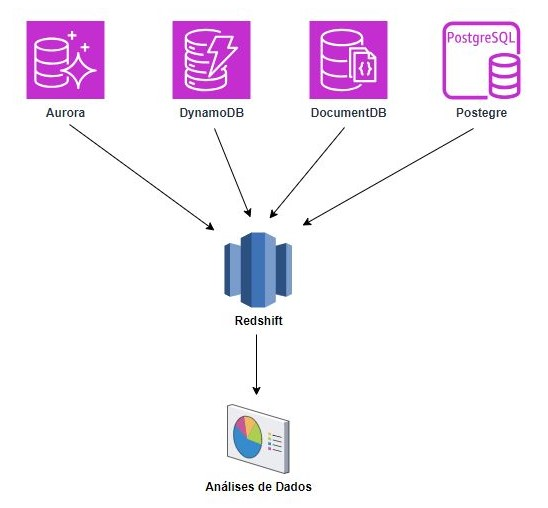
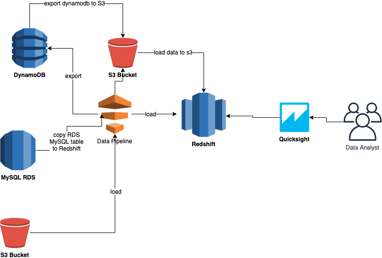

# 1. Redshift

Amazon **Redshift** is a fully managed data warehouse service provided by AWS (Amazon Web Services) that enables businesses to analyze large datasets quickly and cost-effectively. Redshift is designed to handle complex queries and analytics on vast amounts of structured data, making it ideal for use cases such as business intelligence, data lakes, reporting, and data warehousing.

Here are key features and concepts of Amazon Redshift:

- Massively Parallel Processing (MPP): Redshift distributes data across multiple nodes in a cluster and processes queries in parallel, speeding up complex queries on large datasets.

- Columnar Storage: Instead of storing data in rows like traditional databases, Redshift stores data in columns, which reduces the amount of I/O required for queries, especially when only a few columns of data are needed.

- Scalability: Redshift allows you to easily scale up or down by adding or removing nodes to your cluster. You can start small and grow as your data and processing needs increase.

- Cost-Effective: It offers pay-as-you-go pricing and on-demand or reserved instance options, making it more affordable for large-scale data analytics compared to traditional on-premises data warehouses.

- Integration with AWS Ecosystem: Redshift integrates seamlessly with other AWS services, such as S3 (for data storage), Glue (for ETL jobs), Athena, and QuickSight (for data visualization), among others.

- Data Loading: You can load data into Redshift from multiple sources, such as Amazon S3, Amazon RDS, DynamoDB, or on-premises databases, using Redshift's COPY command, AWS Data Pipeline, or AWS Glue.

- Redshift Spectrum: This feature allows you to query data directly from S3 without having to load it into Redshift first, which makes it easier to query large data lakes.

- Security: Redshift offers encryption at rest and in transit, integrates with AWS IAM (Identity and Access Management), and supports Virtual Private Cloud (VPC) for network isolation.

Amazon Redshift is commonly used for data warehousing, business intelligence, analytics workloads, and complex reporting at scale.

# 1.1. Data Warehouse

Data warehouse is like a central database in which joins data of vary sources (such as other databases, apis, aws tools, etc), where all the information can be analyzed and decisions can be made.

