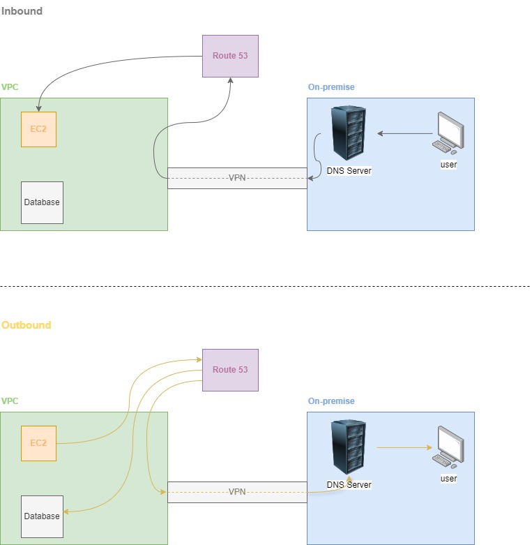

# 1. Amazon Route53 🛣️

**Amazon Route 53** is a scalable and highly available DNS web service provided by AWS. It helps in translating domain names (like www.example.com) into IP addresses, which are needed for computers to connect to each other over the internet. Route 53 is also designed to be flexible and secure, offering more than just basic DNS resolution.

## 1.1. Key Features

- DNS Management:

  - Route 53 provides DNS resolution by mapping domain names to IP addresses for AWS services (like EC2, S3) as well as external resources.
  - Supports common DNS record types like A, AAAA, CNAME, MX, TXT, NS, etc.

- Domain Registration:

  - You can purchase and manage domain names directly through Route 53. It acts as a domain registrar, allowing you to register and transfer domains.

- Traffic Routing:

  - Latency-based Routing: Route 53 directs users to the AWS region or endpoint that provides the lowest latency.
  - Geo-Location and Geo-Proximity Routing: Routes traffic based on the geographic location of users or resources.
  - Weighted Routing: Distributes traffic across multiple endpoints based on specified weights (for load balancing or testing).
  - Failover Routing: Detects the health of resources and redirects traffic to healthy endpoints during failures.

- Health Checks and Monitoring:

  - Route 53 can perform health checks on your web servers or other endpoints. If it detects that a resource is unavailable, it will automatically route traffic to healthy resources.

- DNS Failover:

  - In case of server or application failures, Route 53 can switch traffic to backup resources, improving availability and reliability.

- Integration with AWS Services:

  - Deep integration with other AWS services, like EC2, Elastic Load Balancing (ELB), S3, CloudFront, and others, making it easier to set up and manage routing for applications hosted on AWS.

- Security:

  - Route 53 supports DNSSEC (Domain Name System Security Extensions) to protect against DNS spoofing and man-in-the-middle attacks.
  - It also integrates with AWS Identity and Access Management (IAM) for access control and permissions management.

## 1.2. Pricing

While traditional DNS providers charge mostly a **fixed, upfront annual fee, regardless of traffic**, the AWS Route 53 operates on a **pay-as-you-go** model where you are **charged based on usage**, such as the number of DNS queries and hosted zones. This can be more cost-effective for low-traffic domains, but for high-traffic domains, the costs may increase depending on the level of usage.

## 1.3. Summary

Amazon Route 53 is not a DNS service with domain registration, it also handles traffic routing, health checks, and integration with AWS services, making it essential for managing scalable and reliable web applications.

# 2. Hosted Zones 📦📍

In AWS Route 53, a Hosted Zone is a container that holds information about how to route traffic for a specific domain (like example.com) and its subdomains. It functions as the DNS (Domain Name System) zone for the domain, which translates human-readable domain names into IP addresses that computers use to connect to each other.

## 2.1. Public Hosted Zone

This is used to manage DNS records for a domain that is accessible over the internet. When you register a domain or transfer it to Route 53, a public hosted zone is automatically created. This hosted zone allows you to create DNS records like **A (IPv4 address)**, **CNAME (Canonical Name)**, **MX (Mail Exchange)**, and others to direct traffic to your website or services.

## 2.2. Private Hosted Zone

This is used within an Amazon VPC (Virtual Private Cloud) to manage DNS records for internal routing of domain names that are **only accessible within the VPC**. It helps in managing domain names for resources inside your VPC, such as EC2 instances, without exposing them to the public internet.

# 3. Route 53 Polices 📜

## 3.1. Simple Routing Policy

- **Usage**: This is the default routing policy. It allows you to configure DNS records to return a single resource, such as an IP address or endpoint.
- **Scenario**: If you want to route traffic to a single resource, like a web server or a static website hosted on S3.

## 3.2. Weighted routing policy

- **Usage**: Routes traffic to multiple resources in proportions that you specify.
- **Scenario**: If you want to test new application versions by sending a small percentage of traffic to the new version while keeping most traffic on the old version.

## 3.3. Geolocation routing policy

- **Usage**: Routes traffic based on the geographic location of the user making the DNS query.
- **Scenario**: If you want users in Europe to be routed to European servers, and users in the US to North American servers.

## 3.4. Geoproximity routing policy

- **Usage**: Routes traffic based on the geographic location of your resources and allows you to adjust bias to route more or less traffic to specific resources. Obs: It is the unique routing policy that is created through Traffic Flow.
- **Scenario**: If you have resources in multiple regions and want to control the traffic distribution to them by location.

## 3.5. Latency routing policy

- **Usage**: Routes traffic to the resource that provides the lowest latency to the user based on network performance. It's not obligation to be the nearest server. Sometimes, there is a farer one, but with better latency.
- **Scenario**: If you have resources in different AWS regions and want to route traffic to the one with the best performance for the user.

## 3.6. Failover Routing

- **Usage**: This policy routes traffic to a primary resource, such as a web server, and directs traffic to a secondary resource (or failover instance) only if the primary fails. The route 53 knows that through health check.
- **Scenario**: Useful for implementing disaster recovery solutions.

## 3.7. Multivalue Answer Routing

- **Usage**: Provides multiple IP addresses (up to 8) in response to a DNS query and allows health checks on each.
- **Scenario**: Ideal for distributing traffic across multiple resources and providing DNS failover if any resource becomes unhealthy.

# 4. Traffic Policy 👮🏽‍♂️

A Traffic Policy in AWS Route 53 is a powerful feature that allows you to define complex routing configurations for your DNS traffic using a combination of routing rules. It enables more advanced traffic management and routing strategies by allowing you to create a traffic flow policy that incorporates multiple routing policies in a single configuration.

## 4.1. Key features

-**Visual Editor**: You can design traffic policies using a visual editor, allowing you to easily combine different routing policies, such as weighted, latency-based, geolocation, and more, into a single flow.

- **Reusability**: Once you create a traffic policy, it can be reused across multiple domains (hosted zones), allowing you to apply the same routing rules to different DNS names.

- **Versioning**: Traffic policies support versioning, which means you can update and change a traffic policy over time, keeping track of changes without affecting live traffic until you choose to.

- **Traffic Policy Instances**: Once a traffic policy is created, you apply it to DNS names by creating traffic policy instances. These instances define how a specific policy will be applied to a DNS name in a hosted zone.

# 5. Route 53 Resolver 🕵🏽

**Route 53 Resolver** is a DNS service within AWS Route 53 that helps manage DNS queries between on-premises networks and AWS VPCs (Virtual Private Clouds). It acts as a DNS resolver that handles both inbound and outbound DNS queries, facilitating seamless communication between AWS resources and external networks.

## 5.1. Key features

- Inbound Query Forwarding:

  - Allows on-premises networks to resolve DNS names hosted within AWS (e.g., EC2 instances in private VPCs) by forwarding DNS queries to Route 53 Resolver.
  - Use case: If you have resources in AWS VPCs that need to be accessible by name from your on-premises data center or other external networks.

- Outbound Query Forwarding:

  - Enables AWS resources (e.g., EC2 instances) in a VPC to resolve DNS names from external networks (e.g., on-premises domains or other DNS systems).
  - Use case: If your EC2 instances or other AWS services need to access on-premises systems or external services by their DNS name.

- DNS Resolution Between VPCs:

  - Facilitates DNS resolution between multiple VPCs within the same or different AWS regions using VPC peering or AWS Transit Gateway.

- Conditional Forwarding:

  - Route 53 Resolver supports conditional forwarding rules that direct specific DNS queries (based on domain names) to different DNS servers. This allows for complex DNS resolution across hybrid cloud environments.

- Integration with AWS VPC:
  - Route 53 Resolver is automatically integrated with Amazon VPC, so DNS queries from EC2 instances are automatically resolved to appropriate resources, like other VPC resources, without requiring external DNS services.

## 5.2. Benefits:

- Hybrid Cloud DNS Management: Route 53 Resolver is key for hybrid environments, where resources span across both on-premises data centers and AWS cloud environments.
- Scalability and Availability: Like other AWS services, Route 53 Resolver is scalable and highly available, ensuring consistent DNS query performance across networks.
- Security: DNS queries can be controlled and monitored with AWS services like VPC flow logs, providing visibility into DNS traffic patterns.

