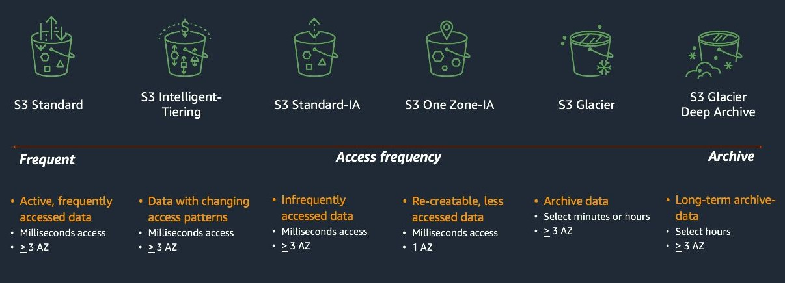
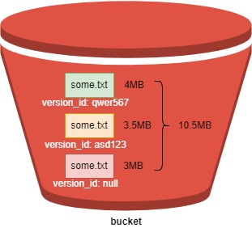
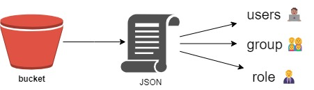
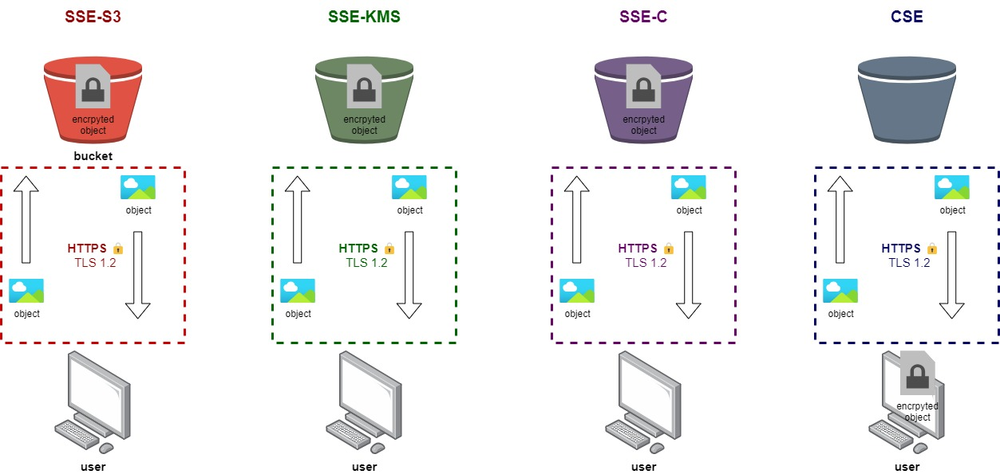
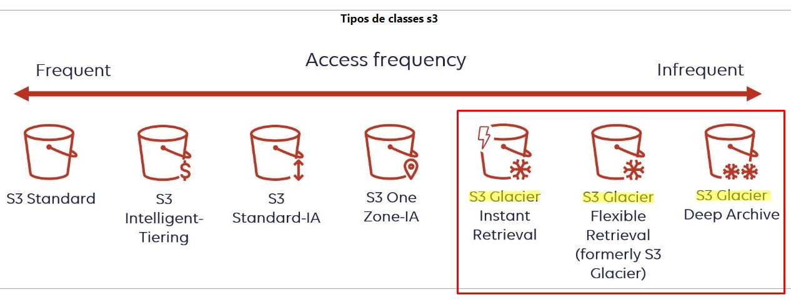

# 1. Introduction 📒

Amazon S3 (Simple Storage Service) is a scalable object storage service provided by Amazon Web Services (AWS). It is designed to store and retrieve any amount of data, at any time, from anywhere on the web.

## 1.1. Common Use Cases

- Backup and Restore: Storing backups of critical data and restoring it when needed.

- Data Archiving: Long-term storage of data that is infrequently accessed.

- Static Website Hosting: Hosting static websites and serving content directly from S3.

- Big Data Analytics: Storing large datasets for processing and analysis.

- Media Storage: Storing and serving media files such as images, videos, and documents.

# 2. Buckets 🪣

S3 organizes data into containers called buckets. Each bucket has a unique name and can contain any number of objects.

## 2.1. Core concepts

- Objects: The fundamental entity stored in S3. An object consists of the data (file), metadata (information about the file), and a unique key (identifier).

- Keys: The unique identifier for an object within a bucket. The combination of the bucket name and object key must be globally unique.

- Regions: S3 stores data in different AWS regions around the world. Choosing a region helps optimize latency and compliance.

# 3. Storage Classes 🧩

| **Storage Class**          | **Use Case**                                          | **Durability**         | **Availability**       | **Storage Cost**       | **Characteristics**                                                                                             |
|----------------------------|-------------------------------------------------------|------------------------|------------------------|------------------------|-----------------------------------------------------------------------------------------------------------------|
| **S3 Standard**            | Frequently accessed data                              | 99.999999999% (11 9's) | 99.99% over a year     | Highest                | Designed for frequently accessed data with low latency and high throughput.                                    |
| **S3 Intelligent-Tiering** | Unknown or changing access patterns                   | 99.999999999% (11 9's) | 99.9% over a year      | Varies (based on access patterns) | Automatically moves data between frequent and infrequent access tiers based on usage.                            |
| **S3 One Zone-IA**         | Infrequently accessed data, rapid availability needed | 99.999999999% (11 9's) | 99.5% over a year      | Lower than S3 Standard | Lower cost; data stored in a single Availability Zone. Ideal for infrequent access data.                       |
| **S3 Glacier**             | Archival data rarely accessed                         | 99.999999999% (11 9's) | 99.9% over a year      | Lower cost             | Retrieval times range from minutes to hours.                                                                     |
| **S3 Glacier Deep Archive**| Long-term archival data rarely accessed               | 99.999999999% (11 9's) | 99.9% over a year      | Lowest                 | Lowest cost; retrieval times range from 12 to 48 hours.                                                            |
| **S3 Outposts**            | Local storage on AWS Outposts                         | 99.999999999% (11 9's) | 99.9% over a year      | Varies (based on Outpost) | Provides S3 storage on-premises for hybrid cloud environments.                                                     |

# 4. Versioning 🔢

Each S3 file can be versioned to:

- Protects against accidental or malicious deletion of objects;
- Protects against accidentally overwrite an object;
- Allows the user to track changes to objects over time. He can retrieve previous versions to review or revert to historical data.
- Maintaining different versions of an object provides an audit trail of changes and modifications;
- Adds an extra layer of redundancy;
- Restoring a previous version of an object is straightforward. You can easily retrieve and make use of older versions without complex recovery procedures;
- helps meet compliance and legal requirements by retaining historical data. This is particularly useful for organizations with data retention policies;

Obs 👀: The file version is disabled by default. The use must enable it.

Aware 💡: The user must be aware of using of version because it takes more space. for example, if a some.txt file has 3MB of size and there is a version 2 of some.txt file with 3.5MB, the some.txt file has 3MB + 3.5MB = 6Mb. And so on.

# 5. Server Access Logging 📋

Uou can track all the activities of any objects inside of a bucket such as some versioning, deletion or update, for instance, through the server access logging. 

To do so: 

1. You need to create a new bucket (to receive the logs);
2. The log bucket must be in the same region of the data bucket (or target bucket);
3. You need to enable the "Server Access Logging" option;
4. You must select the data bucket;

# 6. Life cycle 🔄

**Lifecycle** is a feature that allows you to define rules to automatically manage the lifecycle of objects stored in an S3 bucket. This management can include actions such as transitioning objects to different storage classes, archiving them to Glacier, or deleting them after a specified period of time. The purpose of lifecycle policies is to optimize storage costs and manage the storage duration of objects.

## 6.1. Key Components of an S3 Lifecycle Policy:

- **Transition Actions**: Automatically move objects to a different storage class. For example, you might transition objects to Amazon S3 Glacier after 30 days.
- **Expiration Actions**: Automatically delete objects after a specified period of time. For example, you might delete objects that are older than a year.
- **Filter**: Specify a subset of objects in a bucket to which the lifecycle rule applies, based on prefixes or object tags.
- **Versions**: Lifecycle rules can apply to both the current version and previous versions of objects if versioning is enabled.

## 6.2. Common Use Cases:

- **Cost Optimization**: Transitioning infrequently accessed data to cheaper storage classes like S3 Glacier.
- **Data Retention**: Automatically deleting data after it is no longer needed to comply with data retention policies.
- **Archiving**: Moving old data to an archive class like Glacier to reduce costs while keeping data accessible if needed.

# 7. Object Replication 🧍🏽‍♂️🧍🏽‍♂️

Refers to the process of automatically copying objects between S3 buckets, either within the same AWS region or across different regions. This feature helps improve data availability, durability, and redundancy by ensuring that copies of your objects are stored in multiple locations.

## 7.1. Cross-Region Replication (CRR)
- Copies objects from a bucket in one AWS region to a bucket in another region.
- Useful for disaster recovery, compliance, and reducing latency by keeping data closer to users in different geographic regions.

## 7.2. Same-Region Replication (SRR)
- Copies objects between buckets within the same region.
- Useful for creating additional copies of data for compliance, sharing data across different accounts, or maintaining separate environments (e.g., production and testing).

## 7.3. Key Features
- **Automatic Replication:** Once configured, new objects are automatically replicated according to the rules you define.
- **Versioning Support:** Works with versioning, allowing you to replicate specific versions of objects.
- **Selective Replication:** You can configure replication based on prefixes or tags, meaning you can replicate only certain objects or groups of objects.
- **Replication Time Control (RTC):** An option to replicate objects within a predictable time frame, usually 15 minutes, to meet specific compliance or latency requirements.

## 7.4. Use Cases
- **Disaster Recovery:** Ensure data is replicated to a geographically distant region, protecting against regional outages or disasters.
- **Compliance:** Meet legal or regulatory requirements that mandate data to be stored in multiple locations.
- **Data Localization:** Replicate data to specific regions to comply with data sovereignty laws.
- **Low Latency Access:** Provide users in different regions faster access to data by replicating it closer to them.

# 8. Access management

## 8.1 IAM Polices

There are three ways to manage the user access of a bucket. The **IAM Polices** is one of them. This way is applied to the user, whereas the **Bucket Policy** is applied to the bucket. (It seems silly, but it is important to mention it)

## 8.2. Bucket Polices

As mentioned before, this is a access management applied to the bucket. It uses JSON like **IAM Polices**

## 8.3. ACL

The third method used to manage the user access is ACL. It stands for **Access Control List**. An ACL is a set of permissions associated with an S3 bucket or an object within that bucket. It defines which AWS accounts or groups are granted access and what level of access they have.
Like **Bucket Polices**, ACL is applied to the bucket too.

**Obs👀**: The recommendation is to follow this priority. First try to use **IAM Policies**. If it doesn't worked, try the **Bucket Policies** and, finally, the **ACL**.

**IAM Polices** > **Bucket Policies** > **ACL**

# 9. S3 Encryption 🔐

Amazon S3 offers several encryption options to help you secure your data at rest. The key differences between SSE-S3, SSE-KMS, SSE-C, and CSE relate to how and where the encryption keys are managed:

## 9.1. SSE - S3

- **It means:** Server-Side Encryption with Amazon S3-Managed Keys.
- **Key Management**: Managed entirely by AWS.
- **How it Works**: 
  - Amazon S3 encrypts each object with a unique key.
  - It then encrypts the key itself with a master key that it regularly rotates.
  - All these processes are managed by AWS.
- **Use Case**: Simplest option when you want encryption but don't want to manage any keys yourself.

## 9.2. SSE - KMS

- **It means**: Server-Side Encryption with AWS Key Management Service Keys.
- **Key Management**: Managed by AWS KMS (Key Management Service).
- **How it Works**: 
  - Each object is encrypted with a data key.
  - The data key is itself encrypted with a customer master key (CMK) stored in AWS KMS.
  - You have more control over key management and permissions.
- **Use Case**: When you need more control over encryption keys, such as the ability to audit key usage or control access permissions.

## 9.3. SSE-C

- **It means**: Server-Side Encryption with Customer-Provided Keys.
- **Key Management**: Managed by the customer (you provide the encryption keys).
- **How it Works**: 
  - You provide the encryption key to Amazon S3 with each request to write or read an object.
  - S3 then uses your provided key to perform the encryption or decryption but doesn't store the key itself.
- **Use Case**: When you want complete control over the encryption keys and don't want AWS to store or manage the keys.

## 9.4. CSE

- **It means**: Client-Side Encryption.
- **Key Management**: Managed entirely by the customer, outside of AWS.
- **How it Works**: 
  - The data is encrypted by the client before it's uploaded to Amazon S3.
  - You manage the keys and encryption process on your end.
  - S3 stores the encrypted data without knowing the keys or being involved in the encryption process.
- **Use Case**: When you want end-to-end control over encryption and decryption, ensuring that data is encrypted before it even reaches S3.

## 9.5. Summary of Key Differences

- **SSE-S3**: AWS manages everything, including the keys.
- **SSE-KMS**: AWS manages the keys, but you have more control and audit capabilities through KMS.
- **SSE-C**: You manage the keys and provide them with each request.
- **CSE**: You encrypt the data yourself before uploading to S3, and manage the keys entirely on your own.

# 10. Object Lock 🔒

Amazon S3 Object Lock is a feature that enables you to store objects using a WORM (Write Once, Read Many) model. This prevents objects from being deleted or overwritten for a specified retention period. It's commonly used for regulatory compliance, ensuring that data remains immutable during a specified retention period.

## 10.1. Object Lock modes

There are two types of protection modes in S3 Object Lock:

- **Governance Mode**:
  - Allows users with special permissions to modify or delete the object during the retention period.
  - It ensures that most users can't overwrite or delete the object but allows certain users with specific permissions (like s3:BypassGovernanceRetention) to make changes if needed.

- **Compliance Mode**:
  - Strictly enforces the retention period.
  - Once enabled, no user, including the root account, can delete or modify the object until the retention period expires. This mode is used when stricter data protection rules apply.

## 10.2. Retention periods

- **Retention Period**: A certain period in which the objects are blocked.
- **Legal Hold**: It has no expiration data. The files can only be changed if the Legal Hold is removed.

## 10.3. Use Cases

- **Regulatory Compliance**: Ensuring that certain records are kept for a mandated period (e.g., financial records, medical records).
- **Data Integrity**: Preventing accidental or malicious deletion or modification of critical data.

You can also combine Object Lock with **legal holds**, which can be placed on objects to prevent deletion until the hold is removed. Legal holds don't have an expiration date like retention periods, so they offer indefinite protection until lifted manually.

# 11. S3 Glacier 🧊

**Amazon S3 Glacier** is a cloud storage service provided by AWS, designed for long-term data archiving and backup at low costs. It's primarily used for infrequently accessed data that doesn’t require immediate retrieval. Here’s an overview of its key aspects:

## 11.1. Purpose and Use Cases
- **Archiving**: Ideal for data that must be kept for years, like compliance records, backups, medical records, and media archives.
- **Infrequent Access**: S3 Glacier is not designed for frequently accessed data. It's optimized for scenarios where data retrieval can be delayed or planned in advance.

## 11.2. Storage Classes
S3 Glacier has multiple storage classes based on access needs:

- **S3 Glacier**: Low-cost storage for data that can take several hours for retrieval.
- **S3 Glacier Deep Archive**: Even lower cost but requires up to 12 hours for retrieval, suitable for data accessed once or twice a year.

## 11.3. Retrieval Options
- **Expedited**: Allows access to data in 1-5 minutes, but at a higher cost.
- **Standard**: Data is retrieved in 3-5 hours, at moderate cost.
- **Bulk**: The most cost-effective option, but retrieval can take 5-12 hours.

## 11.4. Cost Efficiency
S3 Glacier is much cheaper than standard S3 storage because it's designed for rarely accessed data. You pay mainly for storage, and retrieval costs vary based on the speed and size of the data request.

## 11.5. Security and Durability
- **Encryption:** Data is encrypted at rest using server-side encryption.
- **Durability:** Amazon guarantees "99.999999999%" durability, meaning data is highly protected against loss.
- **Access Control:** You can define fine-grained access policies using IAM roles and bucket policies to ensure only authorized users can access the archived data.

## 11.6. Lifecycle Integration
S3 Glacier integrates well with other S3 storage classes. Through S3's Lifecycle Policies, you can automatically transition objects to Glacier after a certain period of inactivity. This can help optimize costs by moving data to cheaper storage over time.

## 11.7. Use in Compliance and Governance
Glacier's design is especially suitable for industries that require long-term retention of data for compliance (e.g., healthcare, finance). It supports features like Vault Lock that allow users to create write-once-read-many (WORM) policies to ensure data integrity over time.

## 11.8. Summary

Amazon S3 Glacier is designed for low-cost, long-term storage of infrequently accessed data, offering a range of retrieval options based on the speed needed, all while maintaining high durability and security standards.

| **Feature**               | **S3 Glacier Instant Retrieval** | **S3 Glacier Flexible Retrieval** | **S3 Glacier Deep Archive** |
|---------------------------|----------------------------------|-----------------------------------|-----------------------------|
| **Purpose**               | Long-term storage with instant access to data. | Low-cost archiving with flexible retrieval times. | Lowest-cost storage for data that is rarely accessed. |
| **Retrieval Time**         | Milliseconds (instant access).   | Minutes to hours (Expedited: 1-5 min; Standard: 3-5 hrs; Bulk: 5-12 hrs). | Hours (Standard: 12 hrs; Bulk: up to 48 hrs). |
| **Cost**                  | Higher than Flexible and Deep Archive due to instant access. | Lower than Instant Retrieval, but higher than Deep Archive. | Lowest cost among Glacier classes. |
| **Use Case**              | Frequently accessed archival data (e.g., media archives, backups with immediate retrieval needs). | Infrequently accessed data where retrieval time is not critical (e.g., backups, compliance data). | Long-term archival data accessed once or twice a year (e.g., regulatory archives, disaster recovery). |
| **Minimum Storage Duration** | 90 days                        | 90 days                           | 180 days                    |
| **Durability**            | 99.999999999% (11 nines)         | 99.999999999% (11 nines)          | 99.999999999% (11 nines)    |
| **Storage Cost**          | Moderate                        | Lower than Instant Retrieval      | Lowest                      |
| **Retrieval Cost**        | Lowest retrieval cost (no additional fees for retrieval). | Expedited retrievals are more expensive, but Bulk retrievals are cost-effective. | Higher retrieval cost compared to Flexible, especially for expedited access. |

