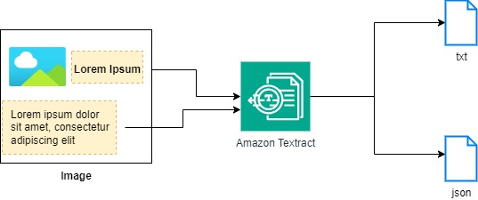

# Amazon Textract 🤖📝

**Amazon Textract** is a fully managed machine learning (ML) service by AWS that automatically extracts text and data from scanned documents and images. Textract goes beyond simple optical character recognition (OCR) by using advanced machine learning algorithms to identify and extract structured data, such as forms and tables, from documents. This service helps organizations automate document processing, reduce manual data entry, and gain insights from their document content.

## Key Features of Amazon Textract:

1. **Text Extraction**: Automatically extracts printed text, handwriting, and other text from scanned documents, images, or PDFs, making it accessible for digital processing.

2. **Form Data Extraction**: Identifies and extracts key-value pairs from forms, allowing businesses to process and store form data without manual input.

3. **Table Extraction**: Extracts tabular data from documents, preserving the structure of the table, which is useful for processing spreadsheets and reports.

4. **Support for Multiple Document Formats**: Textract can analyze various document formats, including PDFs, PNG, and JPEG files, providing flexibility in document processing.

5. **Document Analysis**: Provides comprehensive analysis of documents, including layout and relationships between text, tables, and forms, allowing for a deeper understanding of the document content.

6. **Integration with Other AWS Services**: Seamlessly integrates with other AWS services such as **Amazon S3** for storage, **Amazon Comprehend** for natural language processing, and **AWS Lambda** for event-driven workflows.

7. **Secure and Scalable**: Offers enterprise-level security, including encryption and compliance with various standards, and scales automatically to meet varying document processing loads.

8. **Cost-Effective**: Pricing is based on the number of pages processed, allowing organizations to manage costs effectively based on their document processing needs.

9. **Real-Time Processing**: Provides the ability to process documents in real-time, enabling immediate extraction of data from incoming documents or images.

10. **Machine Learning-Based**: Utilizes advanced machine learning techniques to improve the accuracy and reliability of text and data extraction over time.

## Common Use Cases:

- **Automated Document Processing**: Streamlines workflows by automatically extracting data from invoices, receipts, and other documents, reducing manual data entry.
- **Form Processing**: Captures and processes data from various forms, such as tax forms, applications, and surveys, improving efficiency and accuracy.
- **Data Extraction for Analytics**: Enables organizations to extract valuable insights from scanned documents and reports for analysis and decision-making.
- **Legal Document Management**: Assists in extracting and organizing data from legal documents, contracts, and agreements for easy retrieval and analysis.
- **Healthcare Records Processing**: Automates the extraction of data from patient records, insurance claims, and medical forms, improving operational efficiency in healthcare settings.

Amazon Textract is a powerful tool for organizations looking to enhance their document processing capabilities and improve data accessibility while minimizing manual effort.
