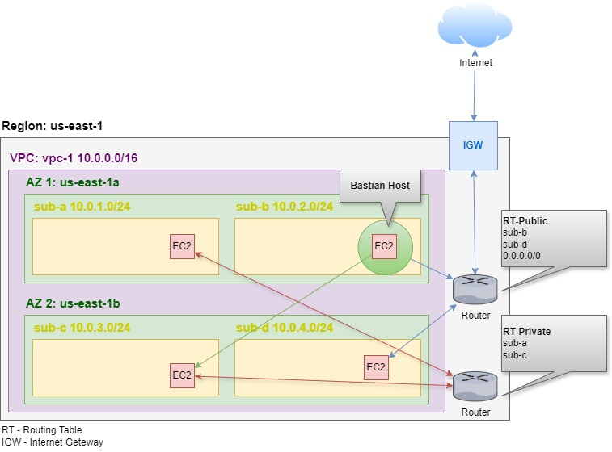
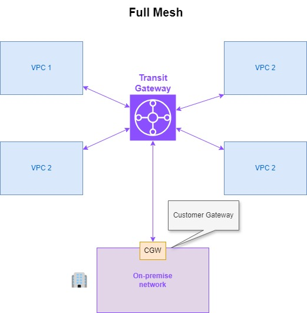
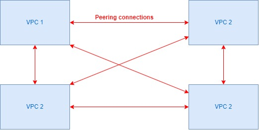
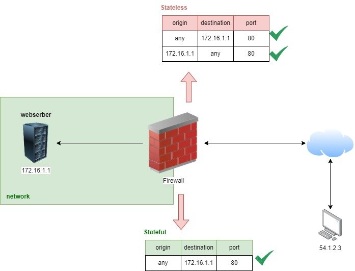
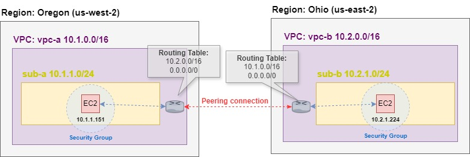
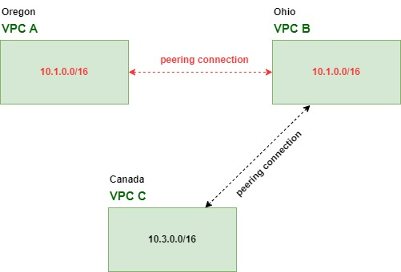
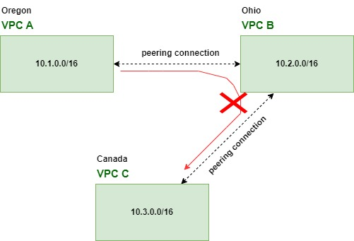
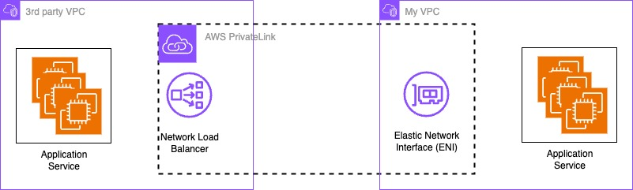

# 1. Introduction 🚩

A **Virtual Private Cloud** (VPC) in Amazon Web Services (AWS) is a virtual network that you can define within the AWS cloud. It allows you to control the networking environment of your AWS resources, providing isolation, security, and customization of your network settings. Here are some key features of a VPC:

- **Subnets**: You can divide your VPC into subnets, which are smaller networks within the VPC. Each subnet can be associated with a specific availability zone, providing high availability.

- **Routing**: VPCs allow you to define custom route tables to control the traffic flow between subnets and the internet.

- **Security Groups**: These act as virtual firewalls for your instances, controlling inbound and outbound traffic at the instance level.

- **Network Access Control Lists (NACLs)**: These provide an additional layer of security at the subnet level, controlling inbound and outbound traffic for subnets.

- **Internet Gateway**: To allow your instances within a VPC to connect to the internet, you can attach an Internet Gateway to your VPC.

- **NAT Gateway**: This allows instances in private subnets to connect to the internet while preventing inbound traffic from the internet.

- **Peering Connections**: VPC peering allows you to connect two VPCs, enabling communication between them as if they were part of the same network.

- **VPN and Direct Connect**: You can also connect your VPC to your on-premises data center using a VPN connection or AWS Direct Connect.

**OBS**: The VPC is a virtual (or logical) isolation your contents from another contents. It is not physics isolated. If you want, you can reserve a whole physical server or rack, for instance.

**OBS 2**: VPCs are associated by Region. So, it's possible different AZ (Available Zone) be in the same VPC, but not different Regions.

**OBS 3**: Even though some instances are in different subnets but they can communicate with each other because they are in the same VPC (EX: 10.0.0.0/16). However, you can configure to one subnet doesn't see other one.

**OBS 4**: When an instance is private, it can't access the internet, therefore, the user can't access the instance through aws console. The way to solve this is access the private instance through a public one in the same network. This process is called **Bastian Host**. In a nutshell, it acts as a gateway between your private network (where your private instances reside) and the outside world.

# 2. Transit Gateway vs Full Mesh

## 2.1. Transit Gateway

It is a highly scalable and central hub that you can use to connect your Virtual Private Clouds (VPCs), on-premises networks, and even other AWS accounts. It simplifies your network architecture by acting as a central routing point for all your networks, enabling you to manage and scale your network more effectively.

## 2.2. Full Mesh

It refers to a network topology where each node (e.g., VPCs, on-premises networks) is directly connected to every other node. In a full mesh configuration, every possible connection between nodes is established, leading to high redundancy and reliability but also increased complexity as the number of connections grows.

## 2.3. Peering Connection

The Transit Gateway isn't a unique way to stablish a connection among VPCs. A **peering connection** refers to a network connection between two Virtual Private Clouds (VPCs) that allows them to communicate with each other as if they were part of the same network. VPC Peering enables you to route traffic between the VPCs using private IP addresses, and it can be set up between VPCs in the same AWS account or across different AWS accounts.

If you have many VPCs or need to connect VPCs to on-premises networks, Transit Gateway simplifies the architecture by acting as a central hub.

For example, if you have 4 VPCs according to the image above, they need 6 peering connections. If the network increase, the number of connections will increase exponentially, turning this solution impracticable.

**OBS**: Even though peering connection and transit gateway have different purpose, they allow the communication between two VPCs cross-region. It means, they stablish connection of VPCs in different regions.

# 3. Stateful vs Stateless 🧱

In AWS, Security Groups (SG) and Network Access Control Lists (NACLs) are used to control inbound and outbound traffic to resources in a Virtual Private Cloud (VPC). They differ in their approach to handling traffic based on whether they are stateful or stateless.

| Feature                | Security Groups (Stateful)                                                                                            | Network Access Control Lists (NACLs) (Stateless)                             |
| ---------------------- | --------------------------------------------------------------------------------------------------------------------- | ---------------------------------------------------------------------------- |
| **State Tracking**     | Stateful (tracks connection states)                                                                                   | Stateless (does not track connection states)                                 |
| **Rules**              | Rules apply to both inbound and outbound traffic; responses are automatically allowed if inbound traffic is permitted | Separate rules are needed for both inbound and outbound traffic              |
| **Default Behavior**   | Implicitly allows return traffic for permitted inbound connections                                                    | Must explicitly allow return traffic for permitted inbound connections       |
| **Application Level**  | Associated with individual resources (e.g., EC2 instances)                                                            | Associated with subnets                                                      |
| **Granularity**        | More granular control at the instance level                                                                           | Broad control at the subnet level                                            |
| **Complexity**         | Easier to manage for dynamic applications and complex setups                                                          | Requires careful management of rules for bidirectional traffic               |
| **Rule Application**   | Rules are applied automatically to the instances within the security group                                            | Rules are applied to all traffic entering or leaving the subnet              |
| **Default Security**   | Default security group allows all outbound traffic and no inbound traffic unless explicitly allowed                   | Default NACL allows all inbound and outbound traffic                         |
| **Logging & Auditing** | Logs available through CloudWatch and other tools                                                                     | Logs available through CloudWatch and other tools                            |
| **Use Cases**          | Ideal for managing traffic to specific instances, dynamic applications                                                | Ideal for managing broad traffic rules for entire subnets, simpler scenarios |

## 3.1. Security Group

A **Security Group** in AWS is a virtual firewall that controls the inbound and outbound traffic to and from Amazon EC2 instances and other associated resources. It acts as a critical security layer in protecting your cloud infrastructure by allowing or blocking specific types of traffic based on defined rules.

## 3.2. NACL

**NACL (Network Access Control List)** in AWS is a security layer that acts as a virtual firewall for controlling inbound and outbound traffic at the subnet level within a Virtual Private Cloud (VPC). NACLs provide an additional layer of security by allowing you to set rules that govern the traffic entering or leaving the subnets in your VPC.

**OBS:** The rules are configured through a table and the order of the rows affecting the behavior of others rules with less priority. For example, if the priority of a rule the ables an inbound of a subnet is greater than a rule the disable its inbound connection, the second rule won't work.

| Order | Port | Origin        | Allow/Deny |                                             |
| ----- | ---- | ------------- | ---------- | ------------------------------------------- |
| 90    | 80   | 10.0.1.148/32 | Allow      | 
Works
        |
| 91    | 80   | 10.0.1.148/32 | Deny       | 
doesn't work
 |

# 4. VPC Peering 🪢

As mentioned earlier in the subtopic [2.3. Peering Connection](#23-peering-connection), A **peering connection** refers to a network connection between two Virtual Private Clouds (VPCs) that allows them to communicate with each other as if they were part of the same network.

To make it works, you must to create a peering connection, informing the origin VPC and the destiny one. Besides that, you must inform the new VPC route in both VPC routing table and allow their communication in both VPC securities group.

## 4.1. Overlapping

You must be aware with **Overlapping** that is when two or more VPC share the same AP address range. This overlap can create routing conflicts and prevent the successful establishment of a peering connection.

## 4.2. Transit

**Transit** refers to the ability (or rather the lack of ability) to route traffic between two VPCs via a third VPC with which both are peered.

VPC peering connection **does not support transitive routing**. A VPC cannot route traffic to another VPC via a third VPC to which it is peered.

# 5. VPC Endpoints 🛣️

**VPC endpoints** allow you to privately connect your VPC to supported AWS services and VPC endpoint services powered by AWS **PrivateLink**, without requiring an internet gateway, NAT device, VPN connection, or AWS Direct Connect. Instances in your VPC do not require public IP addresses to communicate with resources in the service. Traffic between your VPC and the service does not leave the AWS network.

## 5.1. Gateway Endpoints (public)

A Gateway Endpoint is a target in your VPC route table that allows communication between your VPC and specific AWS services privately using the AWS network. It does not require internet access or a NAT gateway. The endpoint is simply added to the route table, allowing traffic to the supported services to flow through it.

Certain AWS services are **public** by default, meaning they communicate over the internet unless you explicitly configure them to use private connectivity (such as through VPC endpoints, VPC peering, or AWS Direct Connect), such as:

- Amazon S3 (Simple Storage Service);
- Amazon DynamoDB;

So, these services create a route in the VPC route table that directs traffic them to the gateway, keeping it within the AWS network.

## 5.2. Interface Endpoints (private)

Otherwise, some AWS services are already **private** and they use the **Interface Endpoints** that is the **Elastic Network Interfaces (ENIs)** within the VPC to connect to supported AWS services through **AWS PrivateLink**. These endpoints have a private IP address from the VPC’s IP address range.

They are powered by **AWS PrivateLink**, which provides private connectivity between VPCs, AWS services, and on-premises networks.

Supported Aws Services:

- EC2 (e.g., Instance Metadata, Systems Manager)
- Lambda
- CloudWatch (Logs, Metrics)
- Elastic Load Balancing
- Amazon RDS
- Secrets Manager
- API Gateway
- SQS, SNS
- And many more...

## 5.3. Gateway Endpoint vs Interface Endpoint

| **Feature**            | **Gateway Endpoint**                         | **Interface Endpoint (PrivateLink)**                               |
| ---------------------- | -------------------------------------------- | ------------------------------------------------------------------ |
| **Service Type**       | Routing-based                                | Network interface-based                                            |
| **Supported Services** | S3, DynamoDB                                 | Many AWS services (e.g., Lambda, SQS)                              |
| **Setup**              | Route table entry                            | ENI created in VPC subnets                                         |
| **Security**           | Private routing, no internet access          | Private communication using ENIs, Security Groups, and PrivateLink |
| **Cost**               | No additional charges for data               | Costs for endpoint and data processing                             |
| **Flexibility**        | Limited to two services                      | Supports many AWS services and private services                    |
| **Use Case**           | Efficient, private access to S3 and DynamoDB | Broader use for other AWS services and custom services             |

