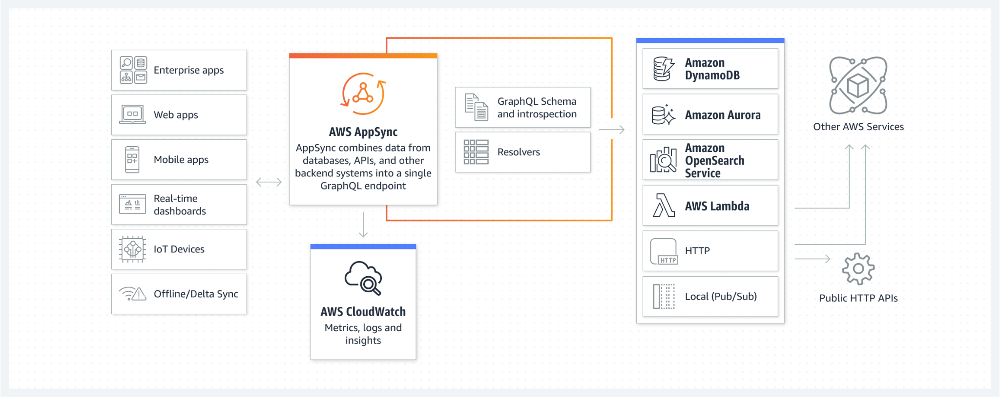

# 🔗 AWS AppSync

**AWS AppSync** is a fully managed service that simplifies the development of GraphQL APIs by providing a flexible and scalable way to access and manage data from multiple sources. AppSync enables developers to create real-time applications by seamlessly integrating with various data sources, including Amazon DynamoDB, AWS Lambda, Amazon RDS, and third-party APIs.

## Key Features of AWS AppSync:

1. **GraphQL API**: Build powerful and flexible APIs using GraphQL, allowing clients to request only the data they need and reducing over-fetching of data.

2. **Real-Time Data Synchronization**: AppSync supports real-time updates through WebSocket connections, enabling applications to receive immediate notifications of data changes.

3. **Data Source Integration**: Easily connect to multiple data sources, such as:

   - **Amazon DynamoDB**: For NoSQL data storage.
   - **AWS Lambda**: For serverless business logic and processing.
   - **Amazon RDS**: For relational database access.
   - **HTTP Endpoints**: To integrate with third-party APIs.

4. **Offline Capabilities**: Built-in support for offline data access, allowing applications to function even when there is no internet connection. Changes made while offline are automatically synchronized when the connection is restored.

5. **Authorization and Authentication**: Secure your APIs using AWS Identity and Access Management (IAM), Amazon Cognito user pools, or API keys, ensuring that only authorized users can access your data.

6. **Data Caching**: Built-in caching capabilities help improve performance by storing frequently accessed data, reducing the number of requests to the data source.

7. **Query and Mutation Resolvers**: Define how data is fetched and modified through resolvers, enabling fine-grained control over data access and transformation.

8. **Custom Domain Support**: Use custom domains for your AppSync API, allowing for better branding and user experience.

9. **Monitoring and Logging**: Integrate with AWS CloudWatch for monitoring API performance, logging requests, and tracking usage metrics.

10. **Serverless Architecture**: AppSync is designed to work seamlessly with other serverless services in the AWS ecosystem, making it easy to build and scale applications without managing infrastructure.

## Common Use Cases:

- **Single-Page Applications (SPAs)**: Build modern web applications that require real-time data updates, such as dashboards and collaboration tools.
- **Mobile Applications**: Develop mobile apps that need to sync data across devices and provide offline functionality.
- **IoT Applications**: Enable real-time data updates from IoT devices, allowing users to monitor and interact with their devices efficiently.
- **Enterprise Applications**: Create enterprise applications that integrate data from multiple sources, providing a unified view of business data.
- **Social Media Applications**: Build applications that require complex queries and data retrieval from various sources, enabling rich user experiences.

## Benefits of AWS AppSync:

- **Simplified Development**: Reduces the complexity of building and managing APIs, allowing developers to focus on building features instead of infrastructure.
- **Increased Performance**: Real-time data synchronization and efficient data fetching reduce latency and enhance user experience.
- **Scalability**: Automatically scales to handle increasing traffic and data loads without requiring manual intervention.
- **Seamless Integration**: Easily connect with various AWS services and third-party APIs to create comprehensive applications.

AWS AppSync streamlines the process of building GraphQL APIs, allowing developers to create powerful and responsive applications that can efficiently access and manage data from multiple sources.
