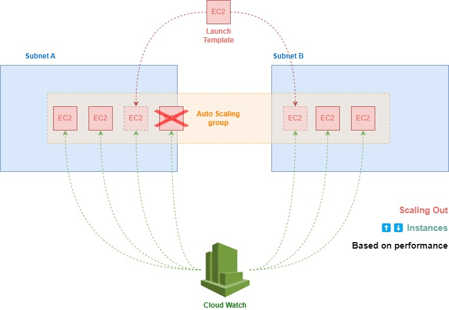
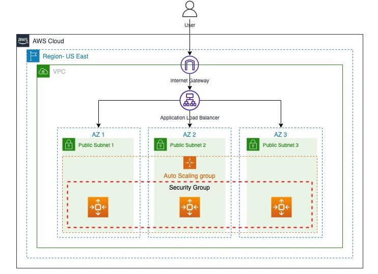

# 1. Auto Scaling 🤖📈

**Auto Scaling** in AWS is a service that automatically adjusts the number of compute resources, such as Amazon EC2 instances, based on the current demand for your application. It helps maintain application availability and allows you to scale your resources up or down automatically according to defined conditions.

## 1.1. Key Features of AWS Auto Scaling

1. **Dynamic Scaling**

   - Automatically adjusts the number of running instances in response to changing demand. For example, you can set policies to add more instances during high traffic periods and remove instances when demand decreases.

2. **Scheduled Scaling**

   - Allows you to scale your resources based on a schedule. For instance, you can automatically scale out your instances at a specific time of day when you expect high traffic.

3. **Predictive Scaling**

   - Uses machine learning models to predict traffic patterns and automatically adjust your resources in advance of expected demand changes.

4. **Health Checks and Replacement**

   - Auto Scaling performs health checks on the instances in your Auto Scaling group. If it finds an instance that is unhealthy, it can terminate the instance and launch a new one to replace it.

5. **Cost Efficiency**

   - Helps optimize costs by scaling down resources when they are not needed, thus reducing the number of instances running during low-traffic periods.

6. **Integration with Elastic Load Balancing (ELB)**
   - Auto Scaling works seamlessly with ELB to distribute traffic across your instances. When new instances are launched, they are automatically added to the ELB, and when instances are terminated, they are removed from the load balancer.

## 1.2. How Auto Scaling Works

1. **Auto Scaling Groups**

   - The core concept of Auto Scaling is the Auto Scaling Group, which is a collection of EC2 instances managed as a group. You define the minimum, maximum, and desired number of instances in the group.

2. **Scaling Policies**

   - You can define policies that dictate when and how Auto Scaling should adjust the number of instances. These policies can be based on metrics like CPU utilization, request count, or even custom metrics you define.

3. **Launch Configuration/Launch Template**
   - Specifies the configuration information for instances in the Auto Scaling group, including instance type, Amazon Machine Image (AMI), key pairs, security groups, and block device mapping.

## 1.3. Use Cases

- **Handling Variable Traffic:** Automatically scale your web or application servers up during peak hours and down during off-peak hours.
- **Maintaining High Availability:** Ensure that your application remains available by automatically replacing failed instances.
- **Optimizing Costs:** Run only the instances you need, scaling down when demand is low to save on costs.

AWS Auto Scaling simplifies the management of compute resources, ensuring that your application remains responsive and cost-efficient by automatically adjusting the capacity to match the demand.

A group of auto scaling EC2 can distribute instances among different AZ in the same region, **but not in different regions**.

## 1.4. Types of scalability types

- **Dynamic Scaling**: Automatically adjusts the number of instances in response to changing demand. There are different dynamic scaling policies:
  - **Target Tracking Scaling:** Adjusts capacity to keep a specific metric (like CPU usage) at a target value.
  - **Step Scaling:** Adjusts capacity based on larger/smaller changes in demand.
  - **Simple Scaling:** Adds or removes instances based on a single scaling action triggered by CloudWatch alarms.
- **Predictive Scaling**: Uses machine learning to forecast future demand and adjusts the number of instances in advance to handle expected traffic spikes. It helps prevent over- or under-provisioning.
- **Scheduled Scaling**: Automatically scales resources based on a predefined schedule. This is useful when you expect predictable traffic patterns, such as daily or seasonal spikes.
