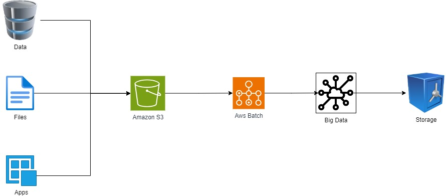

# 1. Aws Batch

**AWS Batch** is a fully managed service that enables you to run batch computing workloads efficiently on the AWS Cloud. It dynamically provisions the right compute resources (such as EC2 instances or spot instances) based on the volume and resource requirements of your batch jobs, so you can run hundreds or thousands of jobs without managing or maintaining a dedicated infrastructure.

## 1.1. Key Features of AWS Batch
- **Job Scheduling:**
    - AWS Batch automatically schedules jobs across the optimal compute resources based on job requirements such as CPU, memory, and GPU.
    - Jobs can be scheduled using priorities and dependencies, allowing complex workflows.

- **Compute Environment Management:**
    - AWS Batch manages compute environments by provisioning, scaling, and terminating compute resources as needed.
    - It supports a range of compute environments, including on-demand, spot instances (for cost savings), or custom EC2 instances.

- **Integration with Other AWS Services:**
    - AWS Batch integrates seamlessly with other AWS services like Amazon S3 (for data storage), AWS Lambda, and Amazon CloudWatch (for monitoring).
    - You can define your batch jobs using Docker containers, making it easier to deploy and manage dependencies.

- **Automatic Scaling:**
    - The compute resources scale automatically based on the size and needs of the batch jobs. This eliminates the need to manage the infrastructure manually.

- **Job Execution Environment:**
    - AWS Batch supports Docker containers, allowing for consistent and isolated execution environments. This makes it easy to package and run jobs without worrying about the underlying infrastructure.

- **Cost Optimization:**
    - AWS Batch allows you to use Amazon EC2 Spot Instances, which can reduce costs by up to 90% compared to On-Demand Instances.

## 1.2. Use Cases:

- **Data Processing:** Batch processing large datasets, including data transformation, ETL jobs, or big data processing.
- **Image & Video Rendering:** Processing multimedia workloads that require parallel and distributed computing.
- **Genomics & Scientific Research:** Running compute-intensive tasks like genome sequencing or simulation modeling.
- **Financial Modeling:** Complex simulations, risk modeling, and large-scale computations for financial data.

## 1.3. How AWS Batch Works:

1. **Define Job Definitions:** You specify job parameters such as the Docker image, CPU, memory, and environment variables.
2. **Submit Jobs:** You submit jobs to a job queue, and AWS Batch schedules them based on the available resources and priority.
3. **Compute Environment:** AWS Batch automatically provisions and manages compute environments, choosing the appropriate EC2 instance types and scaling them as needed.
4. **Job Execution:** Jobs are executed when resources become available, and the system monitors job progress until completion.

AWS Batch is ideal for running large-scale, time-consuming workloads where you want to take advantage of cloud scalability and cost-efficiency without managing complex infrastructure manually.

