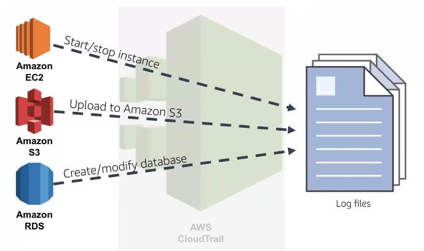

# 1. Amazon CloudTrail ☁️🛤️

Amazon CloudTrail is a service that enables governance, compliance, and operational and risk auditing of your AWS account. It provides a comprehensive view of user activity by recording actions taken on your AWS resources. CloudTrail logs API calls made through the AWS Management Console, AWS SDKs, command line tools, and other AWS services, allowing you to track changes and monitor your AWS environment.

## 1.1. Key Features of Amazon CloudTrail

1. **Event History**:

   - CloudTrail records and stores account activity and API usage, providing an event history for your AWS account.
   - You can view events for a specified time range and filter by resource type or user.

2. **Data Events**:

   - In addition to management events, CloudTrail can log data events, which provide detailed information about object-level operations in Amazon S3 and AWS Lambda functions.
   - This feature allows you to track activities like file uploads, deletions, and access requests for S3 objects.

3. **Trail Configuration**:

   - You can create a CloudTrail trail to continuously log events across all regions or a specific region.
   - Trails can be configured to store logs in an S3 bucket, enabling long-term storage and analysis.

4. **Integration with AWS Services**:

   - CloudTrail integrates with AWS services like Amazon CloudWatch Logs, enabling real-time monitoring and alerts based on specific API calls or events.
   - You can also use AWS Lambda functions to automatically respond to CloudTrail events.

5. **Security and Compliance**:

   - CloudTrail helps organizations meet compliance requirements by providing logs of all actions taken within an AWS account.
   - You can use CloudTrail logs for security analysis, resource tracking, and auditing access to sensitive data.

6. **CloudTrail Insights**:

   - CloudTrail Insights can detect unusual activity in your account by analyzing API call patterns.
   - It provides alerts for anomalies, such as unexpected spikes in API calls, helping you identify potential security issues.

7. **Multi-Region and Global Services Support**:

   - CloudTrail can log events from multiple regions and AWS global services, ensuring comprehensive monitoring of your account.
   - This feature is especially useful for organizations with a global AWS presence.

8. **Event Filtering and Search**:

   - You can filter events based on various criteria, such as event name, resource type, and user identity.
   - The search functionality allows for quick retrieval of relevant events, making it easier to audit and analyze user activity.

9. **Integration with Third-Party Tools**:
   - CloudTrail logs can be exported and integrated with third-party security and monitoring tools for enhanced visibility and incident response.

## 1.2. Common Use Cases

- **Security Auditing**: Monitor and audit API calls and user activities for security compliance and risk management.
- **Compliance Reporting**: Generate reports for regulatory compliance by providing detailed logs of user and API activities.
- **Change Tracking**: Track changes to AWS resources and configurations to understand the history and evolution of your environment.
- **Incident Investigation**: Investigate security incidents or operational issues by analyzing CloudTrail logs for relevant events.
- **Resource Management**: Monitor resource usage and access patterns to optimize resource management and reduce costs.

## 1.3. Summary

Amazon CloudTrail is an essential service for maintaining transparency and accountability in your AWS environment, enabling organizations to monitor user activity and meet compliance requirements effectively.

In a nutshell, CloudTrail is a service that registers all realized activities in a AWS account.

