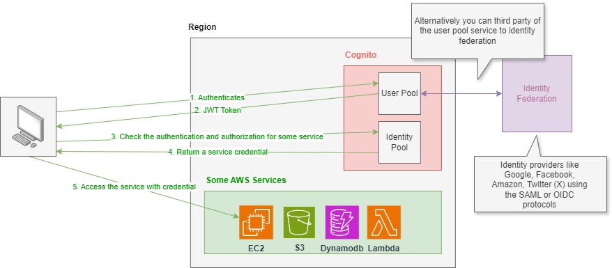

# 1. AWS Cognito 📱👨🏽‍💻

AWS **Cognito** is a fully managed service from Amazon Web Services that provides authentication, authorization, and user management for web and mobile applications. It allows you to add sign-up, sign-in, and access control features to your applications quickly and securely, with support for multiple identity providers (IdPs), including social identity providers (like Google, Facebook, and Apple) and enterprise identity providers via SAML 2.0 and OpenID Connect.

## 1.1. Key features

- **User Pools:**

  - A user directory to manage and authenticate users.
  - Supports features like multi-factor authentication (MFA), password recovery, and email/phone verification.
  - Can be integrated with social IdPs (e.g., Google, Facebook) or with external identity providers via SAML and OpenID Connect.

- **Identity Pools:**

  - Allows you to grant users temporary access to AWS services (such as S3, DynamoDB, etc.) via AWS Identity and Access Management (IAM) roles.
  - Users can authenticate via a User Pool or other external IdPs (such as social logins or federated identities).

- **Federated Identities:**

  - Identity federation allows users to authenticate with external identity providers like Google, Facebook, or SAML-based enterprise IdPs.
  - Provides temporary AWS credentials for authenticated users to securely access AWS resources.

- **Security:**

  - Provides OAuth 2.0, OpenID Connect (OIDC), and SAML 2.0 support.
  - Offers built-in security mechanisms like token expiration, multi-factor authentication (MFA), and CAPTCHA.

- **Scalability:**
  - Automatically scales to handle millions of users without the need for infrastructure management.

## 1.2. Typical Use Cases

- **Authentication for web and mobile apps:** Use Cognito User Pools to handle user registration, login, and user profile management.
- **Federated Identity Management:** Use Cognito Identity Pools to allow users to authenticate with social providers (like Google or Facebook) or enterprise IdPs.
- **Securing AWS Resources:** Use Identity Pools to provide users with temporary AWS credentials to access AWS services securely.

