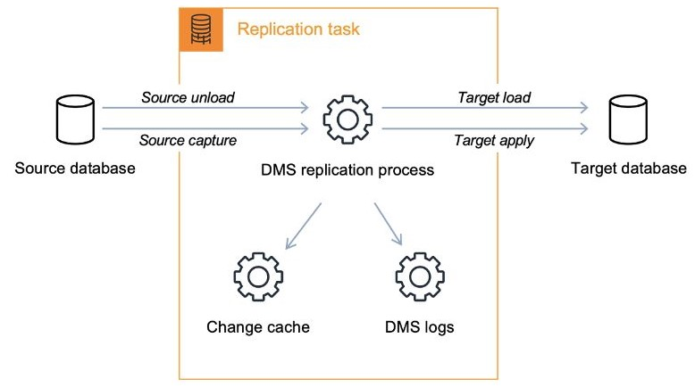

# 🛠️ AWS Database Migration Service (AWS DMS)

**AWS Database Migration Service (DMS)** is a fully managed service that helps you migrate databases to AWS quickly and securely. It supports various database platforms, enabling you to migrate databases from on-premises, other cloud environments, or between different AWS databases with minimal downtime.

1. Total Charge: The DMS copies the whole tables content of the origin database to the destination, creating a initial database.
2. Change Data Capture (CDC): The DMS captures the incremental changes and replicates the changes to the destination.

## Key Features of AWS DMS:

1. **Supports Homogeneous and Heterogeneous Migrations**:

   - **Homogeneous Migration**: Migrate databases between the same type of database engines (e.g., Oracle to Oracle, MySQL to MySQL).
   - **Heterogeneous Migration**: Migrate between different database engines (e.g., Oracle to Amazon Aurora, Microsoft SQL Server to MySQL).

2. **Minimal Downtime**:

   - AWS DMS uses continuous data replication, meaning your source database remains operational during the migration process, minimizing downtime for your applications.

3. **Wide Database Support**:

   - DMS supports a wide range of relational databases, NoSQL databases, and data warehouses, including **Amazon RDS**, **Amazon Aurora**, **Amazon Redshift**, **DynamoDB**, and many third-party databases like Oracle, MySQL, Microsoft SQL Server, MongoDB, and more.

4. **Continuous Data Replication**:

   - AWS DMS allows you to continuously replicate data from your source database to your target, ensuring that changes made during the migration process are captured and applied to the target database.

5. **Schema Conversion Tool**:

   - For heterogeneous migrations, AWS offers the **AWS Schema Conversion Tool (AWS SCT)** to help convert your database schema and code to match the target database.

6. **Automatic Failover**:

   - If the migration instance fails for any reason, DMS automatically provisions a new instance and restarts the migration process, ensuring reliability.

7. **Supports Data Transformation**:

   - You can transform data during the migration process, such as modifying column names, data types, or applying data filters to include or exclude specific rows.

8. **Scalability**:

   - AWS DMS can handle large-scale database migrations with high throughput. The service can scale resources up or down depending on the size of your database and the amount of data being migrated.

9. **Monitoring and Alerts**:
   - AWS DMS integrates with **Amazon CloudWatch** to provide real-time monitoring of migration progress, performance metrics, and alerts for any issues that may arise during the migration.

## Common Use Cases:

- **Cloud Migration**: Migrate your on-premises databases to AWS-managed services such as Amazon RDS or Amazon Aurora with minimal downtime.

- **Cross-Cloud Migrations**: Move databases from other cloud providers like Google Cloud or Azure to AWS to centralize your workloads.

- **Database Modernization**: Modernize your database infrastructure by migrating from legacy, proprietary databases to modern cloud-native databases like Amazon Aurora or Amazon Redshift.

- **Replication Across Regions**: Use DMS to replicate data across different AWS regions for disaster recovery or for creating multi-region architectures.

- **Development and Testing**: Replicate your production database to a test environment in AWS for development and testing purposes without disrupting your production workloads.

## Steps in the AWS DMS Migration Process:

1. **Set Up Source and Target Databases**: Identify and configure the source (on-premises or cloud database) and the target database (on AWS).

2. **Create a Replication Instance**: Set up a replication instance in AWS DMS that will handle the migration process.

3. **Define Migration Tasks**: Create migration tasks specifying the data you want to migrate (e.g., full data migration, incremental replication, etc.).

4. **Start Data Migration**: AWS DMS will begin migrating the data while keeping the source database operational.

5. **Continuous Replication**: If needed, DMS can continuously replicate changes from the source database to the target, ensuring the target is up to date.

6. **Cutover**: After ensuring that your target database is in sync with the source, you can perform a cutover and switch to the new database.

## Benefits of AWS DMS:

- **Ease of Use**: AWS DMS simplifies the complex task of database migration, with minimal configuration and maintenance required.
- **Cost-Effective**: Pay only for the resources you use during the migration, without the need for expensive migration tools or services.

- **Reduced Downtime**: Continuous data replication allows you to keep your databases operational during the migration process, minimizing downtime and disruption.

- **Supports a Variety of Databases**: DMS works with a wide range of databases, making it easy to migrate your existing infrastructure to AWS.

- **Reliability**: Automated failover and robust monitoring features ensure a reliable and secure migration process.

## Summary

AWS Database Migration Service helps organizations move their databases to AWS efficiently, securely, and with minimal disruption, enabling modern, scalable, and cost-effective database infrastructure in the cloud.
