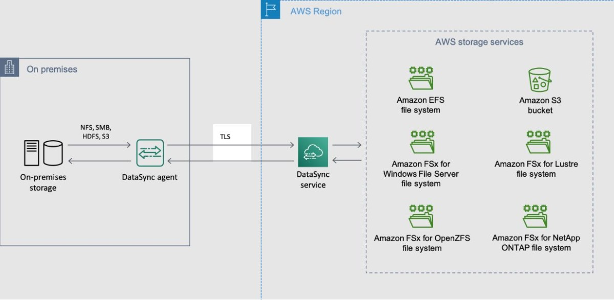
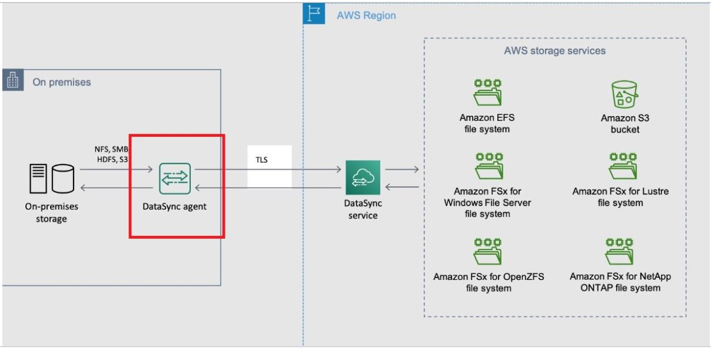

# 🔄 AWS DataSync

**AWS DataSync** is a data transfer service that simplifies, automates, and accelerates the process of moving large amounts of data between on-premises storage and AWS services, or between different AWS storage services. It is ideal for use cases such as data migrations, backups, and data replication for disaster recovery.

## Key Features of AWS DataSync:

1. **Automated Data Transfer**: Automates the transfer of data between on-premises storage, Amazon S3, Amazon EFS, and Amazon FSx for Windows File Server. It can also transfer data between AWS storage services.

2. **Fast and Efficient**: Transfers data at speeds up to 10 times faster than traditional methods like open-source tools or scripts, thanks to its built-in optimizations such as network bandwidth management, data compression, and parallel transfer techniques.

3. **Incremental Data Transfer**: After the initial data transfer, DataSync can transfer only changed files, reducing time and costs for subsequent syncs.

4. **Managed Service**: AWS manages the infrastructure, scaling, and reliability, allowing you to focus on transferring data rather than managing servers or scripts.

5. **Data Integrity Checks**: Performs automatic integrity checks both during and after data transfer to ensure that files are transferred accurately and completely.

6. **Bandwidth Throttling**: Enables you to control how much network bandwidth is used during the data transfer process, allowing you to optimize for performance or minimize network impact.

7. **Security Features**: Supports encryption for data in transit and integrates with AWS Identity and Access Management (IAM) for access control, ensuring data is transferred securely.

8. **Monitoring and Logging**: Integrates with Amazon CloudWatch to provide monitoring of data transfer tasks and logging for audit and troubleshooting purposes.

9. **Cost-Effective**: Pricing is based on the amount of data transferred, making it a flexible and cost-effective solution for moving large datasets without upfront infrastructure costs.

## Common Use Cases:

- **Data Migration**: Move large amounts of data from on-premises storage to AWS, typically during cloud migration or hybrid cloud setups.
- **Backup and Archive**: Automate the backup of on-premises files to AWS storage services, such as Amazon S3 or Amazon EFS, for long-term storage and disaster recovery.
- **Disaster Recovery**: Replicate critical data between AWS regions or services to ensure data availability and recoverability in case of a disaster.
- **Data Processing Workflows**: Transfer large datasets into AWS for further processing or analysis using AWS services like AWS Lambda, Amazon S3, or Amazon EMR.
- **Hybrid Cloud Architectures**: Sync data between on-premises environments and AWS to maintain a hybrid setup where applications run both locally and in the cloud.

## Benefits of AWS DataSync:

- **Speed**: Transfers data faster than traditional methods with built-in optimizations and parallel data transfer techniques.
- **Simplicity**: Automates the transfer process with minimal manual intervention, reducing operational overhead.
- **Scalability**: Scales automatically to handle large datasets and fluctuating data volumes.
- **Security**: Provides strong security controls, including encryption and IAM integration, to protect sensitive data.
- **Reliability**: Ensures reliable and accurate data transfers with integrity checks and error handling mechanisms.

## Location

In AWS DataSync, a "**location**" refers to a storage endpoint where data is either being transferred from or to. It defines the source or destination for the data being moved during the transfer process.

- There are two types of locations in AWS DataSync:

  - Source Location: The location from which data is being copied or transferred.
  - Destination Location: The location to which data is being transferred.

- AWS DataSync supports various types of storage systems for locations, such as:

  - Amazon S3: An S3 bucket where data is stored.
  - Amazon EFS: Amazon Elastic File System, a scalable file storage service for use with AWS cloud services.
  - Amazon FSx: A fully managed file system (FSx for Windows File Server or FSx for Lustre).
  - NFS (Network File System): An on-premises or in-cloud NFS server.
  - SMB (Server Message Block): An on-premises or in-cloud SMB server.

When setting up a DataSync task, you specify the source and destination locations, and DataSync handles the secure, optimized transfer between these locations.

## Summary

AWS DataSync offers a robust, fast, and cost-effective solution for transferring large amounts of data between on-premises storage and AWS, or between different AWS services.
