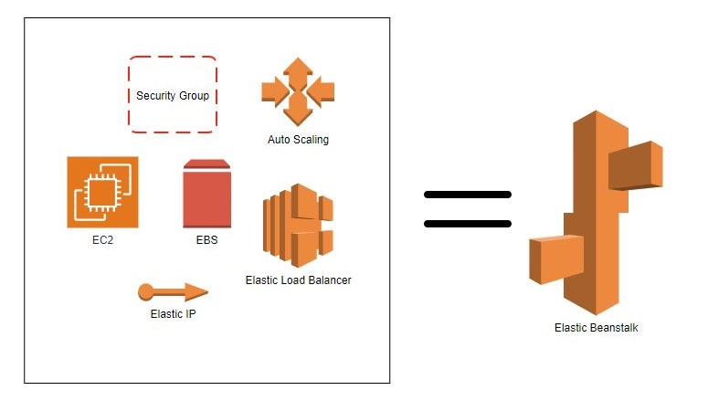

# 1. AWS Elastic Beanstalk 🫘

**AWS Elastic Beanstalk** is a **Platform-as-a-Service (PaaS)** offering from Amazon Web Services (AWS) that simplifies the process of deploying, managing, and scaling web applications and services. It allows developers to quickly deploy applications in several popular languages (like Java, .NET, PHP, Node.js, Python, Ruby, Go, and Docker) without worrying about the underlying infrastructure.

## 1.1. Key Features:

1. **Automated Deployment**: Elastic Beanstalk handles the deployment process automatically. You simply upload your application, and it takes care of provisioning the necessary resources such as EC2 instances, load balancers, and auto-scaling groups.

2. **Managed Environment**: AWS manages the operating system, runtime environment, application servers, and security patches for you, allowing you to focus on coding and application features.

3. **Customization**: While Elastic Beanstalk simplifies many things, it still offers flexibility. You can customize the environment and tweak the configuration settings of the underlying AWS resources as needed.

4. **Automatic Scaling**: Elastic Beanstalk automatically scales your application to handle the workload. It can scale both up and down, depending on traffic, and you can configure auto-scaling policies to meet your needs.

5. **Monitoring and Logging**: Integrated with **Amazon CloudWatch**, Elastic Beanstalk provides performance metrics and logs for the applications you deploy. This makes it easy to monitor your application’s health and performance.

6. **Multi-language Support**: Elastic Beanstalk supports several programming languages and platforms, including:
   - Java with Tomcat
   - Python
   - Node.js
   - PHP
   - Ruby
   - .NET on Windows Server
   - Go
   - Docker (custom environments)

## 1.2. Workflow:

1. **Upload Code**: You upload your application code to Elastic Beanstalk via the AWS Management Console, AWS CLI, or an integrated development environment (IDE).
2. **Provision Resources**: Elastic Beanstalk automatically provisions and configures the necessary AWS resources, such as EC2 instances, RDS (optional for databases), Elastic Load Balancers, and Auto Scaling groups.

3. **Monitoring and Scaling**: The platform continuously monitors the application’s health and performance, scaling up or down according to traffic demand.

4. **Manage Environment**: While AWS handles most of the heavy lifting, you still have control over aspects of your environment, including scaling triggers, security, instance types, and network configurations.

## 1.3. When to Use AWS Elastic Beanstalk:

- You want to **deploy applications quickly** without manually managing infrastructure.
- You prefer a **fully managed platform** for tasks like load balancing, scaling, and monitoring.
- You want to **focus on code** and application logic rather than the complexities of infrastructure management.
- You need to run **standard web applications** or services, such as websites or APIs, with minimal operational overhead.

## 1.4. Benefits:

- **Ease of Use**: Ideal for developers who want to focus on writing code without needing deep AWS expertise to manage infrastructure.
- **Flexibility**: While Beanstalk automates much of the infrastructure management, it still allows for advanced configurations and customizations.
- **Cost-effective**: You only pay for the underlying AWS services (like EC2, RDS) that your application uses, and there’s no additional charge for using Elastic Beanstalk itself.

## 1.5. Drawbacks:

- **Less Control**: While you can customize settings, you don’t have full control over every aspect of the infrastructure, which may not be suitable for highly specific or complex deployments.
- **Limited Advanced Features**: For highly customized infrastructures, microservices architecture, or large-scale enterprise applications, other services like **AWS ECS** or **Kubernetes (EKS)** might be more appropriate.

## 1.6. Summary:

In summary, **AWS Elastic Beanstalk** is a powerful tool for quickly deploying and scaling web applications without dealing with the complexity of infrastructure management. It's designed to streamline the process for developers, making it easier to get applications up and running on AWS.

# 2. Beanstalk vs Amplify

| **Feature**                        | **AWS Amplify**                                                    | **AWS Elastic Beanstalk**                                                      |
| ---------------------------------- | ------------------------------------------------------------------ | ------------------------------------------------------------------------------ |
| **Best For**                       | Frontend, mobile, and full-stack serverless apps                   | Backend web applications, traditional architectures                            |
| **Supported Languages/Frameworks** | Frontend (React, Angular, Vue, etc.), mobile (React Native, Ionic) | Backend: Node.js, Python, Ruby, Java, .NET, PHP                                |
| **Architecture**                   | Serverless, Fully Managed                                          | Managed infrastructure (EC2, RDS, ELB, etc.)                                   |
| **CI/CD**                          | Built-in CI/CD for frontend apps                                   | No built-in CI/CD (requires integration with external tools like CodePipeline) |
| **Infrastructure Control**         | Minimal control over infrastructure                                | More control over EC2, VPC, networking, etc.                                   |
| **Customization**                  | Limited (focus on ease-of-use)                                     | High (allows fine-tuning of resources)                                         |
| **Scaling**                        | Automatic scaling for serverless apps                              | Auto Scaling for EC2, manual configuration possible                            |
| **Target Use Case**                | Serverless web/mobile apps                                         | Web apps needing control over servers and infrastructure                       |
| **Cost**                           | Pay for usage (serverless functions, storage)                      | Pay for the underlying AWS resources (EC2, RDS, etc.)                          |
