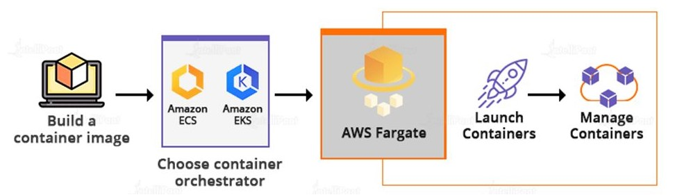

# 1. Aws Fargate

**AWS Fargate** is a **serverless compute engine for running containers**, specifically designed to work with Amazon Elastic Container Service (ECS) and Amazon Elastic Kubernetes Service (EKS). It allows you to run containers without having to manage the underlying EC2 instances or infrastructure.

## 1.1. Key Features of Fargate:

- **No Server Management:** You don't need to provision, scale, or manage servers. Fargate automatically handles the underlying infrastructure for running your containerized applications.

- **Scaling and Auto-Provisioning:** Fargate automatically scales your containerized applications based on demand. You simply define the resources (CPU, memory) your containers need, and Fargate handles the rest.

- **Pay-as-You-Go Pricing:** With Fargate, you pay for the exact amount of vCPU and memory resources that your containers use, billed per second. This is different from managing EC2 instances, where you have to pay for the full instance uptime.

- **Security Isolation:** Each Fargate task or pod runs in its own compute environment, providing enhanced security by isolating workloads at the task level. This avoids the need for sharing an EC2 instance between multiple workloads.

- **Supports Both ECS and EKS:**

  - ECS (Elastic Container Service) is Amazon’s fully managed container orchestration service. With Fargate, ECS tasks can run without managing EC2 instances.
  - EKS (Elastic Kubernetes Service) is Amazon’s managed Kubernetes service. Fargate allows you to run Kubernetes pods without managing servers.

## 1.2. How AWS Fargate Works:

- **With ECS:** When you create an ECS task definition, you can specify to use Fargate as the launch type. ECS will then deploy the containerized application on Fargate-managed infrastructure.

- **With EKS**: You can deploy Kubernetes pods to Fargate by specifying a Fargate profile in your EKS cluster. This profile determines which pods should run on Fargate.

## 1.3. Use Cases for AWS Fargate:

- **Microservices:** Run containerized microservices where each service can be deployed independently with its own scaling and resources.

- **Batch Jobs:** Ideal for running background or batch jobs that scale automatically without requiring server management.

- **CI/CD Pipelines:** Automate continuous integration and delivery pipelines with containers, enabling seamless scaling and isolation.

- **Event-Driven Applications:** Combine Fargate with other AWS services like Amazon SQS or SNS to run tasks in response to events without provisioning infrastructure.

## 1.4. Benefits of AWS Fargate:

- **Simplified Operations:** Since Fargate abstracts the infrastructure, you focus on designing and running containers rather than managing servers.
- **Improved Resource Efficiency:** You avoid over-provisioning since Fargate only charges for the resources your containers use, helping optimize costs.
- **Enhanced Security:** Fargate provides task-level security boundaries, improving isolation and reducing risks from multi-tenancy.

## 1.5. Summary

In summary, AWS Fargate simplifies container management by removing the need to provision and manage infrastructure, making it a great option for developers who want to focus on building applications rather than managing the underlying environment.

