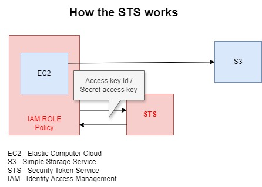

# 1. Introduction 📒

AWS Identity Access Management (IAM) is a web service that helps you securely control access to AWS services and resources for your users. It enables you to create and manage AWS users and groups, and use permissions to allow or deny their access to AWS resources.

You can access it through:

- CLI (Command Line Interface);
- AWS Console;
- API;

# 2. Users, Groups and policies 🧑👨‍👩‍👧‍👦 📜

- **Users**: Who can access to the services and work on them. When some user is created, by default it doesn't have any privileges.
- **Groups**: They organize the conjunct of users with the same privileges.
- **Roles**: They are applied to the AWS services instead of users.
- **Polices**: They are rules that can able or disable the access of groups or certain users.

# 3. Authentication 🛡️

The user can authenticate itself through:

- Console: The user send its user **name**, **password** and **MFA** (Multi Factor Authentication) optionally.

- CLI and API: Both of them the user need to send its **access key id** and the **secret access key**.

**OBS**:

- You can manage the policy of password creations. For example, how strong the password must be with low case, up case, minimum and maximum length, especial characters, etc.
-

# 4. STS - Security Token Service 🔐

WS Security Token Service (STS) is a web service that enables you to request temporary, limited-privilege credentials for AWS Identity and Access Management (IAM) users or for users you authenticate (federated users). These temporary credentials provide the same permissions as long-term security credentials, such as IAM user credentials

# 5. Entity Policy x Resource Policy 📝

In AWS Identity and Access Management (IAM), identity policies and resource policies are two types of policies that define permissions for accessing AWS resources. They serve different purposes and are attached to different entities.

## 5.1. Entity Policy

They are applied to users, groups or roles.

### 5.1.1. Inline

When the policy is applied to one single user or role (1-1 relationship).

### 5.1.2. Customer managed / AWS managed

When the policy is applied to a groups (1-N relationship).

## 5.2. Resource Policy

When the policy is applied to a service (or resource) such as EC2, S3, etc.

# 6. Best practices 🏆

- Do not use the root as user;
- Create IAM individual accounts;
- Create groups and policies to them instead of a single user;
- Allow as little permission as possible;
- As beginner, start using AWS managed instead of Customer managed policies;
- Able the MFA;
- Do always the revision of policy passwords;

# 7. Identity Federation 🌐🔐

**Identity federation** in AWS is a method that allows users to access AWS resources using credentials from an external identity provider (IdP), without having to create separate IAM (Identity and Access Management) users in AWS for each user. This provides a secure and scalable way to manage authentication and access control across different systems.

## 7.1. Key features

- **Federated Identity Providers (IdP):**

  - AWS supports identity federation with well-known IdPs like Active Directory (AD), SAML 2.0 (Security Assertion Markup Language), OpenID Connect (OIDC), and OAuth providers such as Google, Facebook, Microsoft, etc.

- **Temporary Security Credentials:**

  - Federated users are not assigned permanent IAM credentials. Instead, AWS issues temporary security credentials via AWS Security Token Service (STS). These credentials allow access to AWS resources for a limited period.

- **Single Sign-On (SSO):**

  - Federation allows SSO so that users can access AWS services with a single set of credentials from their enterprise or social IdP without needing separate AWS credentials.

- **SAML-based Federation:**

  - Often used with enterprise services like Microsoft Active Directory Federation Services (ADFS) or other SAML 2.0 providers to allow on-premises users to authenticate with AWS using their existing credentials.

- **Web Identity Federation:**
  - Used for apps that authenticate users via social IdPs (e.g., Google, Facebook, or Amazon Cognito). After authentication, AWS grants temporary access to resources such as S3 or DynamoDB.

## 7.2. Use cases

- **Enterprise SSO:** Allow employees to sign in to AWS using their corporate Active Directory credentials via a SAML IdP.
- **Web and Mobile Apps:** Allow users to sign in to AWS-powered applications using their social media accounts.
- **Cross-Account Access:** Federated access can also be used to allow users from one AWS account to access resources in another account without creating IAM users in each account.

## 7.3. How it works

1. The user logs into their external identity provider (such as AD, Google, etc.).
2. The IdP authenticates the user and provides an authentication token or assertion.
3. AWS uses STS to assume a role based on the user's identity and issues temporary security credentials.
4. The user gains temporary access to AWS resources, based on the permissions attached to the assumed IAM role.

## 7.4. Benefits

- **Centralized Authentication:** You manage user identities and permissions centrally, without needing to replicate users in AWS.
- **Increased Security:** Reduces the risk of managing multiple credentials across systems and allows for strong identity controls.
- **Simplified Access:** Users don’t need separate AWS credentials and can use their existing identities to gain access to AWS services.

**SAML Federation:** A company using Active Directory can allow employees to log in to AWS Management Console using their existing corporate credentials, thanks to SAML-based identity federation.

## 7.5. Security protocols comparison

| Feature                             | **Active Directory (AD)**                                                                  | **SAML 2.0**                                                                  | **OpenID Connect (OIDC)**                                                     | **OAuth 2.0**                                                                        |
| ----------------------------------- | ------------------------------------------------------------------------------------------ | ----------------------------------------------------------------------------- | ----------------------------------------------------------------------------- | ------------------------------------------------------------------------------------ |
| **Type**                            | Directory Service (Identity Management)                                                    | Authentication and Authorization Protocol                                     | Authentication Protocol (on top of OAuth 2.0)                                 | Authorization Framework                                                              |
| **Purpose**                         | Centralized user management, device management, and authentication in Windows environments | Federated Identity and Single Sign-On (SSO)                                   | Federated Authentication (used for Single Sign-On and user login)             | Delegated Authorization for APIs                                                     |
| **Primary Use Case**                | Manage identities, devices, and groups within enterprise networks                          | Enterprise-level SSO, Federated identity between organizations                | Web and Mobile app authentication (Social Login)                              | Granting third-party apps limited access to user resources without sharing passwords |
| **Technology**                      | LDAP (Lightweight Directory Access Protocol), Kerberos, NTLM                               | XML-based protocol                                                            | JSON Web Tokens (JWT), built on OAuth 2.0                                     | JSON Web Tokens (JWT) or OAuth tokens                                                |
| **Authentication or Authorization** | Authentication and Authorization                                                           | Both (authentication via SAML assertions, authorization via roles/attributes) | Primarily **authentication**, but extends OAuth 2.0 for limited authorization | **Authorization**, delegates access to resources (e.g., APIs)                        |
| **Identity Provider (IdP)**         | Active Directory (AD) Domain Controller                                                    | External IdP (e.g., Okta, Active Directory Federation Services)               | Social IdPs (e.g., Google, Facebook) or enterprise IdPs                       | Any IdP implementing OAuth 2.0                                                       |
| **Token Type**                      | N/A (Uses Kerberos tickets or NTLM tokens)                                                 | SAML Assertion (XML)                                                          | ID Token (JWT)                                                                | Access Token (JWT or OAuth token)                                                    |
| **Single Sign-On (SSO)**            | Not directly for SSO (can be used with ADFS or other solutions)                            | Yes, widely used for enterprise SSO                                           | Yes, SSO in consumer and web apps (social login)                              | No, typically for authorization, not authentication                                  |
| **Federated Identity**              | No, though AD can integrate with ADFS for SAML support                                     | Yes, widely used for federated identity                                       | Yes, primarily for consumer web and mobile apps                               | No, focuses on authorization rather than identity                                    |
| **Mobile and Web Compatibility**    | Not designed for mobile/web apps                                                           | Web-based (not mobile-friendly)                                               | Excellent for web and mobile apps                                             | Primarily used for web and mobile APIs                                               |
| **Security Mechanism**              | Kerberos, NTLM                                                                             | Public key infrastructure (signatures, encryption)                            | Based on OAuth 2.0; JWT tokens signed using public/private key pairs          | Token-based, OAuth scopes and permissions                                            |
| **User Attributes Handling**        | User attributes managed within AD (e.g., groups, roles)                                    | Passed via SAML Assertions                                                    | User information passed in ID token or from UserInfo endpoint                 | Not user-centric (focuses on resource access permissions)                            |
| **Encryption/Signing**              | Encrypted and secured within AD protocols                                                  | Uses XML signatures and encryption                                            | Uses JWT signing and encryption                                               | Can use signed/encrypted JWTs                                                        |
| **Common IdP Providers**            | Microsoft Active Directory (on-premises)                                                   | Active Directory Federation Services (ADFS), Okta, Ping Identity              | Google, AWS Cognito, Okta                                                     | Google, AWS Cognito, GitHub, Facebook, etc.                                          |
| **User Experience**                 | Internal enterprise users (authentication to domain)                                       | Used for enterprise SSO to log into multiple services                         | Users authenticate with external providers (e.g., social logins)              | User grants third-party access without sharing credentials                           |
| **Complexity**                      | Can be complex (requires on-premises setup and integration)                                | High (due to XML, enterprise-level configuration)                             | Simpler than SAML (JSON-based, easier for modern apps)                        | Relatively simple for developers                                                     |
| **Adoption**                        | Enterprise/Corporate networks                                                              | Enterprises, government institutions, and B2B integrations                    | Consumer-facing apps, modern web/mobile applications                          | Common for API-based systems, mobile apps, and services                              |
| **Common Use Cases**                | Enterprise user management, device management, group policy                                | Enterprise SSO, B2B integrations, accessing SaaS tools                        | Social login, user authentication in modern apps                              | API access delegation (e.g., a calendar app accessing a user's Google Calendar)      |

This approach is widely used to ensure seamless integration between on-premises or external systems and AWS while improving security and user experience.
