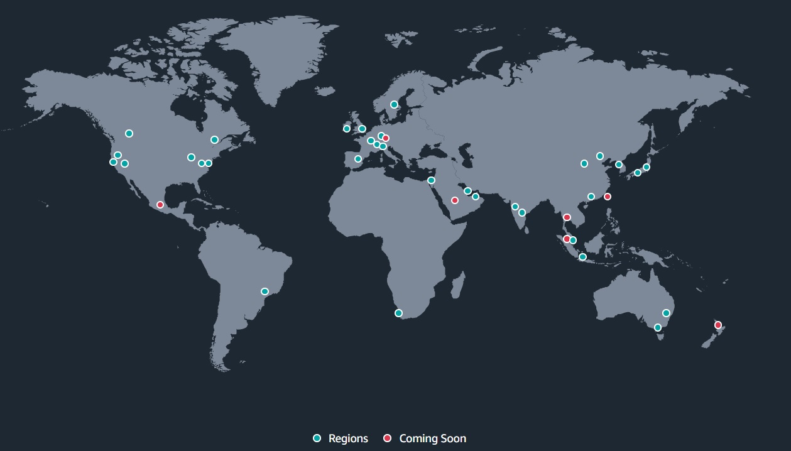
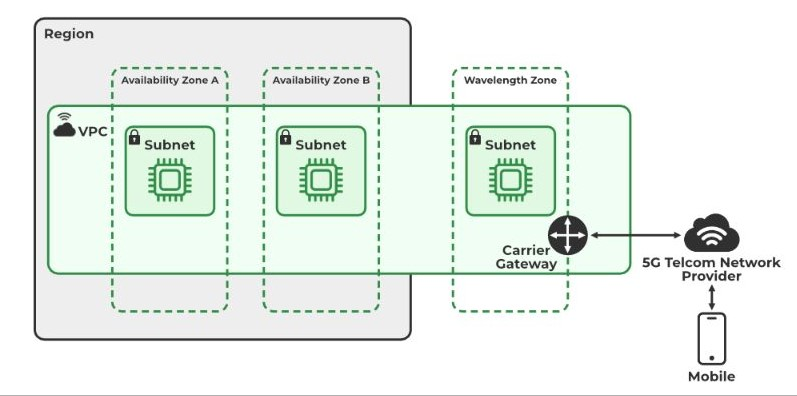
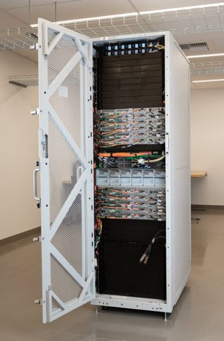

# 1. Infrastructure 🏗️

The AWS has many data centers distributed to the whole world, according to the image below. To organize its infrastructure, the AWS divides it in **regions**, **available zone**, **local zone**, **wavelength** and **outputs**.

## 1.1. Region

**Definition**: A region is a geographical area that contains multiple data centers. AWS divides the world into different regions to provide redundancy, fault tolerance, and low-latency access to its services.

**Characteristics**:

- **Geographical Separation**: Regions are physically isolated from each other.
- **Service Availability**: Each region has its own set of available services.
- **Data Residency**: Allows data to be stored in specific locations to comply with legal and regulatory requirements.

**Example**: `us-east-1` (North Virginia), `eu-west-1` (Ireland)

## 1.2. Available Zone (AZ)

**Definition**: An Availability Zone is a distinct location within a region that is engineered to be isolated from failures in other Availability Zones. Each AZ has its own power, cooling, and networking to ensure high availability.

**Characteristics**:

- **Redundancy**: Provides redundancy and failover options within a region.
- **High Availability**: Allows for deploying applications across multiple AZs to increase fault tolerance.
- **Low Latency**: Provides low-latency network connectivity to other AZs in the same region.

**Example**: `us-east-1a`, `us-east-1b`

## 1.3. Local Zone (LZ)

**Definition**: A Local Zone is an extension of an AWS region that is geographically closer to large population centers, providing low-latency access to AWS services.

**Characteristics**:

- **Proximity**: Located in major cities, offering reduced latency for applications that require proximity to end-users.
- **Partial Region Services**: Supports a subset of AWS services available in the main region.

**Example**: Local Zones in Los Angeles, Boston

## 1.4. Wavelength

**Definition**: AWS Wavelength extends AWS infrastructure to telecom networks, providing ultra-low latency and high-bandwidth access to applications running on AWS.

**Characteristics**:

- **Telecom Integration**: Deploys AWS services within telecom networks to deliver low-latency experiences.
- **Edge Computing**: Supports edge computing use cases, such as IoT and real-time data processing.

**Example 1**: Wavelength Zones in collaboration with carriers like Verizon and Vodafone

**Example 2:** You can extend a VPC to one or more wavelength zones, using a resource such as EC2 to execute applications that require ultra low latency (the infrastructure is closer to the user)

## 1.5. Outposts

**Definition**: AWS Outposts bring AWS hardware and services to on-premises locations, enabling a consistent hybrid cloud experience with native AWS services and APIs.

**Characteristics**:

- **On-Premises Deployment**: Provides AWS infrastructure on-premises to support workloads that require low latency or local data processing.
- **Consistency**: Offers the same AWS experience and APIs on-premises as in the AWS cloud.
- **Hybrid Cloud**: Integrates seamlessly with AWS cloud services for a unified hybrid cloud environment.

**Example**: AWS Outposts racks delivered to customer data centers

# 2. Warm Standby vs Pilot Light 🌪️🫨🌋⛈️🌊

**Warm Standby** and **Pilot Light** are disaster recovery (DR) strategies used in cloud computing, particularly in **AWS**, to minimize downtime and data loss in the event of a failure. Both strategies are designed to ensure business continuity, but they differ in terms of infrastructure readiness and recovery speed.

## 2.1. Pilot Light

**Pilot Light** is a **minimal version** of a recovery environment that is always running. It focuses on keeping critical components of your system running in a low-cost, scaled-down mode, allowing you to "ignite" them quickly in case of a disaster.

### 2.1.1. Key Characteristics:

- **Minimal Resources**: Only the core components of your environment are kept running. For example, the database and essential services like load balancers or key infrastructure are operational in standby mode, but at a minimal scale.
- **Quick Scale-Up**: In the event of a disaster, you rapidly scale up the pilot light environment by launching additional resources such as EC2 instances, application servers, or web servers to handle production workloads.
- **Cost-Effective**: Since only a small portion of the infrastructure is running, costs are lower compared to a fully operational environment.
- **Recovery Time**: Slightly slower than Warm Standby because you need to scale up and deploy the rest of the infrastructure, but it's faster than starting from scratch.

### 2.1.2. Use Case:

- Ideal for systems where **minimal functionality** must be preserved during normal operations, but you can afford to take some time (minutes to hours) to fully recover the complete environment.

## 2.2. Warm Standby

**Warm Standby** is a more **fully-functional scaled-down version** of your production environment that is always running. Unlike Pilot Light, it includes more of your infrastructure, but at reduced capacity. This setup allows you to quickly switch over to the warm standby environment with minimal scaling and configuration.

### 2.2.1. Key Characteristics:

- **Partial Production Environment**: A small, fully functional version of your production environment is running at all times. For instance, all components, including web servers, application servers, and databases, are running, but scaled down to handle only a portion of the normal traffic.
- **Quick Recovery**: In the event of a disaster, you can scale up the environment quickly and reroute all traffic to this environment, ensuring a faster recovery.
- **Higher Cost**: Since more of the infrastructure is already running, Warm Standby is more expensive than Pilot Light but still cheaper than maintaining a fully replicated environment.
- **Recovery Time**: Faster than Pilot Light because the infrastructure is already running, though it may still require some scaling up to handle production-level traffic.

### 2.2.2. Use Case:

- Suitable for applications where **fast recovery** is critical, and you want a partially operational version of your environment that can quickly scale up to full production.

## 2.3. Comparison: Pilot Light vs Warm Standby

| **Feature**             | **Pilot Light**                                   | **Warm Standby**                                           |
| ----------------------- | ------------------------------------------------- | ---------------------------------------------------------- |
| **Infrastructure**      | Only core, critical components are running.       | A scaled-down version of the full environment is running.  |
| **Cost**                | Lower cost (minimal resources running).           | Higher cost than Pilot Light (more resources running).     |
| **Recovery Time (RTO)** | Slower than Warm Standby (needs scaling up).      | Faster than Pilot Light (requires less scaling).           |
| **Recovery Process**    | Scale up from minimal infrastructure.             | Scale up from partially operational environment.           |
| **Best Use Case**       | Cost-sensitive DR with longer recovery tolerance. | Faster recovery required with moderate downtime tolerance. |

## 2.4. Conclusion:

- **Pilot Light**: Suitable for businesses looking for **low-cost disaster recovery** with slightly longer recovery times.
- **Warm Standby**: A better option when **faster recovery** is essential but still requires some cost control by keeping a partially functional environment.
