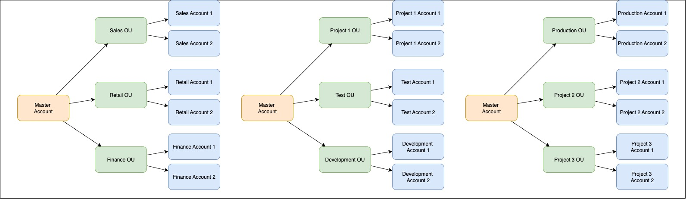

# AWS Organizations

AWS Organizations is an account management service that enables you to consolidate multiple AWS accounts into an organization that you create and centrally manage.

## Key Features

- **Centralized Management**: Manage multiple AWS accounts from a central location
- **Consolidated Billing**: Single payment method for all AWS accounts
- **Hierarchical Grouping**: Organize accounts into organizational units (OUs)
- **Service Control Policies (SCPs)**: Control permissions for accounts or OUs
- **API Integration**: Automate AWS account creation and management

## Organization Structure

- **Root**: The parent container for all accounts and OUs
- **Organizational Units (OUs)**: Groups of AWS accounts that can be managed together
- **Member Accounts**: Individual AWS accounts in the organization
- **Management Account**: The account used to create and manage the organization

## Organizational Units (OUs) in Detail

Organizational Units (OUs) are containers for AWS accounts that help you organize and manage your accounts hierarchically. They provide a powerful way to group accounts and apply policies at scale.

### OU Hierarchy

- Can create nested OUs (OUs within OUs)
- Maximum depth of nested OUs: 5 levels
- Each OU can contain:
  - Multiple AWS accounts
  - Other OUs (nested)
  - A combination of both

### OU Management

1. **Creation and Organization**:
   - Create OUs based on common requirements
   - Group accounts by function, environment, or project
   - Move accounts between OUs as needed
   - Rename or delete OUs (must be empty to delete)

2. **Policy Application**:
   - Apply SCPs at the OU level
   - Policies cascade down to all accounts in the OU
   - Nested OUs inherit policies from parent OUs
   - Can override or add additional policies at lower levels

### Common OU Structures

1. **Environment-based**:
   ```
   Root
   ├── Production
   ├── Staging
   └── Development
   ```

2. **Department-based**:
   ```
   Root
   ├── Finance
   ├── Marketing
   ├── Engineering
   └── HR
   ```

3. **Project-based**:
   ```
   Root
   ├── Project A
   │   ├── Development
   │   └── Production
   └── Project B
       ├── Development
       └── Production
   ```



### OU Best Practices

1. **Design Considerations**:
   - Plan OU structure before implementation
   - Consider future growth and scalability
   - Document OU hierarchy and policies
   - Use consistent naming conventions

2. **Security**:
   - Apply stricter policies at higher levels
   - Use separate OUs for high-security workloads
   - Regularly audit OU memberships
   - Implement change control for OU structure

3. **Management**:
   - Limit OU administration to select personnel
   - Regular review of OU structure
   - Monitor policy inheritance
   - Keep OU structure as simple as possible

## Service Control Policies (SCPs)

SCPs offer central control over the maximum available permissions for all accounts in your organization:

- Define allowed/denied AWS service actions
- Apply to member accounts and OUs
- Don't affect users/roles in the management account
- Use JSON policy documents similar to IAM policies

## Best Practices

1. **Security**:
   - Use SCPs to enforce security baselines
   - Implement least-privilege access
   - Regular security audits

2. **Organization Structure**:
   - Create OUs based on business functions
   - Use naming conventions for accounts
   - Document organization design

3. **Cost Management**:
   - Enable consolidated billing
   - Set up cost allocation tags
   - Monitor spending across accounts

## Benefits

- **Enhanced Security**: Centralized control and policy management
- **Cost Optimization**: Consolidated billing and volume discounts
- **Operational Efficiency**: Simplified account management
- **Compliance**: Standardized controls across accounts
- **Automation**: API-driven account management

## Common Use Cases

1. **Multi-Account Environments**:
   - Development/Testing/Production separation
   - Department or project-based isolation
   - Subsidiary company management

2. **Compliance Requirements**:
   - Enforce security standards
   - Implement regulatory controls
   - Audit policy compliance

3. **Cost Management**:
   - Track departmental spending
   - Share reserved instance benefits
   - Optimize resource usage

## Integration with Other AWS Services

- AWS Control Tower
- AWS IAM
- AWS CloudTrail
- AWS Config
- AWS RAM (Resource Access Manager)
