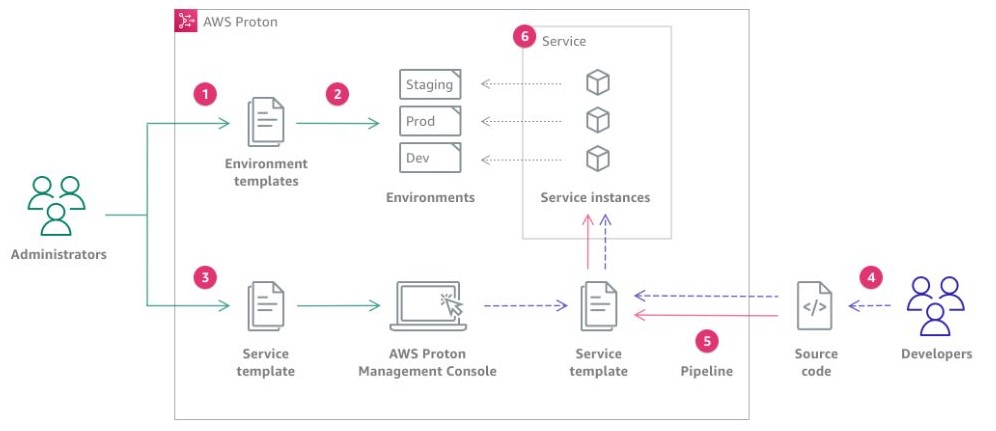

# 1. AWS Proton

AWS Proton is a fully managed application delivery service designed to automate the provisioning, deployment, and management of containerized and serverless applications. It aims to streamline the development process for microservices architectures by providing developers with templates for infrastructure, application deployments, and configuration management.

## 1.1. Key Features of AWS Proton

1. **Infrastructure as Code**:

   - AWS Proton allows you to define your infrastructure and application environments as code using templates. This approach promotes consistency and repeatability in deployments.

2. **Service Templates**:

   - You can create and manage service templates that encapsulate infrastructure resources, CI/CD pipelines, and application configurations. These templates can be reused across multiple services.

3. **Environment Management**:

   - AWS Proton supports environment provisioning for applications, allowing you to create, manage, and delete environments that can be used for staging, production, and other deployment needs.

4. **Integration with CI/CD Tools**:

   - The service integrates with popular CI/CD tools, such as AWS CodePipeline and GitHub Actions, enabling automated deployment workflows and continuous integration practices.

5. **Multi-Account and Multi-Region Support**:

   - AWS Proton can be used across multiple AWS accounts and regions, providing flexibility for organizations that operate in complex environments.

6. **Monitoring and Observability**:
   - The service integrates with Amazon CloudWatch and AWS X-Ray for monitoring application pe

## 1.2. How it works

A environment model is used to create one or more environments that, in Proton, represents a group of resources of shared infrastructure, such as a database or a VPC, that are used by several applications or services:

1. As an Administrator, you create and register an Environment Template with AWS Proton, which defines the shared resources.

2. AWS Proton deploys one or more Environments, based on an Environment Template.

3. As an Administrator, you create and register a Service Template with AWS Proton, which defines the related infrastructure, monitoring, and CI/CD resources as well as compatible Environment Templates.

4. As a Developer, you select a registered Service Template and provide a link to your Source code repository.

5. AWS Proton provisions the Service with a CI/CD Pipeline for your Service instances.

6. AWS Proton provisions and manages the Service and the Service Instances that are running the Source code as was defined in the selected Service Template. A Service Instance is an instantiation of the selected Service Template in an Environment for a single stage of a Pipeline (for example Prod).
