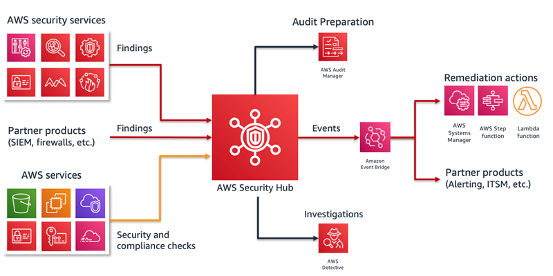

# 1. Aws Security Hub

**AWS Security Hub** is a comprehensive security service that provides a centralized view of your security posture across your AWS environment. It aggregates and prioritizes security findings from various AWS services and third-party tools, helping you detect and respond to potential security issues more efficiently. Key features of AWS Security Hub include:

1. Centralized Security Findings
   - Aggregation of findings: Security Hub collects and aggregates security data from AWS services like Amazon GuardDuty, AWS Macie, AWS Firewall Manager, and third-party security solutions (e.g., Check Point, Trend Micro).
   - Unified dashboard: It provides a single pane of glass to view and manage all security findings, making it easier to track and address potential risks.
2. Automated Compliance Checks
   - Security standards: Security Hub can automatically run security checks based on well-known standards, such as AWS Foundational Security Best Practices, CIS AWS Foundations Benchmark, and Payment Card Industry Data - Security Standard (PCI DSS).
   - Compliance status: You can view detailed compliance reports that show your compliance status for these standards across your AWS accounts.
3. Integrated Findings
   - Standardized findings: All security data and findings are standardized using the AWS Security Finding Format (ASFF), which ensures consistency across different services and tools, making it easier to analyze and prioritize findings.
   - Automatic prioritization: Security Hub automatically prioritizes findings based on severity, helping you focus on the most critical security issues.
4. Continuous Monitoring and Insights
   - Ongoing security monitoring: Security Hub continuously monitors your environment and updates findings in real-time as new vulnerabilities or security issues are discovered.
   - Insights: It provides insights into security trends across your environment, such as recurring issues or potential misconfigurations.
5. Automation and Response
   - Automated workflows: Security Hub integrates with AWS services like AWS Lambda, AWS Systems Manager, and AWS Step Functions to automate security workflows. For example, you can set up automated remediation actions (like isolating compromised instances) based on specific findings.
   - Custom actions: You can define custom actions that trigger automated workflows in response to specific security events.
6. Integration with AWS Organizations
   - Multi-account support: Security Hub supports multi-account environments through AWS Organizations, enabling centralized security monitoring and management for all your AWS accounts.
7. Third-Party Integrations

   - Partner solutions: AWS Security Hub integrates with many third-party security products (e.g., Splunk, Palo Alto Networks, and Tenable), allowing you to incorporate external security data into the hub.
   - SIEM Integration: It can be integrated with Security Information and Event Management (SIEM) tools to streamline incident response.

   ## summary

   AWS Security Hub helps organizations improve their security posture by providing a comprehensive view of security findings, automating compliance checks, and enabling quick remediation actions. It simplifies the security management process, making it easier to detect, prioritize, and resolve security issues.

