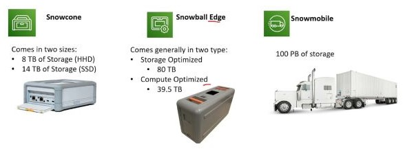

# ❄️ AWS Snow Family

**AWS Snow Family** is a collection of physical devices that help organizations move large amounts of data into and out of AWS, especially in cases where transferring data over the internet is impractical due to bandwidth limitations, cost, or time constraints. The devices are rugged, secure, and designed to work in environments with limited or no network connectivity.

## Key Devices in the AWS Snow Family:

### 1. **AWS Snowcone**

- **Smallest Member**: The Snowcone is the smallest and most portable member of the Snow Family. It is designed for edge computing, data migration, and transport of up to 8 terabytes (TB) of data.
- **Portable**: Weighs only 4.5 lbs (2.1 kg), making it easy to transport and operate in remote locations.
- **Edge Computing**: Supports running applications at the edge with AWS IoT Greengrass and other local processing capabilities.
- **Storage Capacity**: 8 TB of usable storage.
- **Power Options**: Can be powered via standard power outlets or even by an in-vehicle power supply for mobile deployments.

### 2. **AWS Snowball Edge**

- **Data Transfer and Edge Computing**: Snowball Edge devices are designed for both large-scale data migration (up to petabytes) and edge computing in remote or disconnected environments.
- **Two Versions**:
  - **Storage Optimized**: Offers 80 TB of usable storage for data transfer and local processing.
  - **Compute Optimized**: Provides compute capabilities (including GPU options) for running advanced applications like machine learning or data analysis on the edge.
- **Durability**: Ruggedized for use in harsh environments such as ships, mines, or factories.
- **Encryption**: Built-in hardware encryption ensures that your data is protected while in transit.

### 3. **AWS Snowmobile**

- **Exabyte-Scale Data Migration**: The Snowmobile is a 45-foot long ruggedized shipping container that can transfer up to 100 petabytes (PB) of data in a single shipment.
- **Extreme Scale**: Used for massive data transfers, such as large data centers or video libraries, where internet transfers would take too long or be too expensive.
- **Secure and Fast**: Snowmobile is equipped with multiple layers of security, including encryption, GPS tracking, and 24/7 video surveillance, ensuring the safe transfer of your data.
- **Physical Transport**: Data is physically transported to an AWS region and uploaded to Amazon S3.

## Key Features of AWS Snow Family:

1. **Offline Data Transfer**: Allows you to transfer massive amounts of data without relying on network bandwidth, reducing transfer times from weeks or months to just a few days.
2. **Edge Computing**: The devices support local processing and machine learning capabilities at the edge, allowing you to process and analyze data before transferring it to AWS.

3. **Rugged Design**: The devices are designed to operate in harsh and disconnected environments, ensuring durability in extreme conditions like industrial sites or remote locations.

4. **Highly Secure**: All devices are tamper-proof and feature hardware-based encryption to protect your data. Data is encrypted with 256-bit encryption keys that you manage using AWS Key Management Service (KMS).

5. **Efficient Data Migration**: Whether migrating data from data centers, video archives, or disaster recovery backups, the Snow Family makes it faster and cost-effective to transfer large datasets.

6. **Integration with AWS Services**: Data can be ingested directly into services like Amazon S3, enabling further processing and analysis with AWS’s suite of tools.

7. **Flexible Deployment**: Can be deployed to edge locations with limited connectivity for both data migration and on-site computing, making it ideal for IoT, machine learning, and analytics use cases.

## Common Use Cases:

- **Data Center Migration**: Transfer large datasets, such as media libraries, archives, or backups, from on-premises data centers to AWS.
- **Disaster Recovery**: Ensure that large backups or data archives are securely transferred to AWS for disaster recovery purposes.
- **Edge Computing**: Process and analyze data at the edge, such as in remote oil rigs, ships, or manufacturing plants, before uploading to the cloud.
- **Remote Locations**: Transfer data from locations with limited or no internet connectivity, such as research stations, mining sites, or mobile operations.
- **Military and Field Operations**: Use for secure, portable data transfer and processing in highly sensitive or hostile environments.

## Benefits of AWS Snow Family:

- **Speed**: Reduces the time required to transfer large datasets from weeks or months to just days.
- **Scalability**: Devices like Snowmobile can transfer up to 100 PB in a single shipment, handling even the largest data migration projects.
- **Security**: All data is encrypted during transit and at rest, with hardware security measures to prevent tampering.
- **Cost-Effective**: Enables data transfer without the need for expensive, high-bandwidth network connections, making it a cost-effective solution for large-scale data migration.

The **AWS Snow Family** provides a robust, secure, and scalable way to move vast amounts of data into the cloud, making it essential for organizations with large datasets or those operating in remote or challenging environments.
