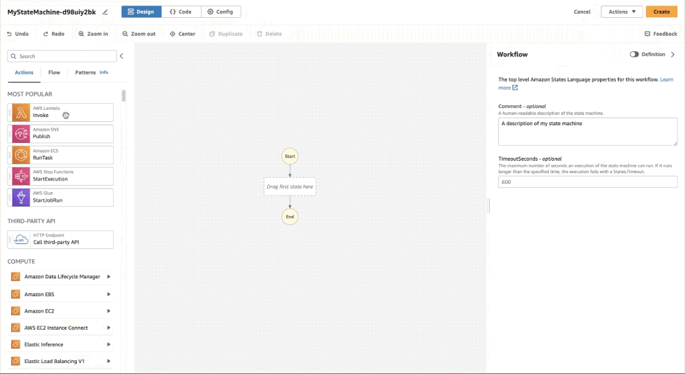

# 🛠️ AWS Step Functions

**AWS Step Functions** is a fully managed orchestration service that allows you to coordinate and manage complex workflows by combining AWS services into serverless workflows. It provides a visual interface to design and execute workflows, making it easier to build and maintain applications that require multiple steps and components.

## Key Features of AWS Step Functions:

1. **Workflow Orchestration**: Simplifies the coordination of multiple AWS services into workflows, enabling you to define how tasks are executed and in what order.

2. **State Machine Model**: Uses a state machine model to define workflows, allowing you to manage the state of each task, transitions, and error handling.

3. **Visual Workflow Designer**: Provides a visual interface to design workflows, making it easy to see the flow of execution and the relationships between tasks.

4. **Error Handling and Retry Logic**: Automatically handles errors and allows you to define retry logic for failed tasks, ensuring reliable execution of workflows.

5. **Service Integration**: Integrates seamlessly with a wide range of AWS services, including AWS Lambda, Amazon SQS, Amazon SNS, AWS Batch, and more, enabling you to build complex applications.

6. **Parallel Execution**: Supports parallel execution of tasks, allowing you to improve performance by running tasks simultaneously rather than sequentially.

7. **Long-Running Workflows**: Can manage long-running workflows with built-in capabilities to wait for human approval or external events.

8. **Cost-Effective**: Pay only for what you use, with no upfront costs, making it a cost-effective solution for building and managing workflows.

9. **Security Features**: Integrates with AWS Identity and Access Management (IAM) for access control and supports encryption for data in transit and at rest.

10. **Monitoring and Logging**: Provides integration with Amazon CloudWatch for monitoring the execution of workflows and logging events for troubleshooting and auditing.

## Common Use Cases:

- **Microservices Coordination**: Orchestrate the execution of microservices in a specific order or based on certain conditions, promoting decoupling and scalability.
- **Data Processing Pipelines**: Build complex data processing workflows that involve multiple steps, such as data extraction, transformation, and loading (ETL).
- **Human Approval Workflows**: Implement workflows that require human intervention or approval before proceeding to the next step.
- **Batch Processing**: Coordinate the execution of batch jobs across multiple AWS services, ensuring that tasks are completed in the correct sequence.
- **Event-Driven Architectures**: Respond to events and trigger workflows automatically based on changes in data or system states.

## Benefits of AWS Step Functions:

- **Ease of Use**: Simplifies the development and management of workflows with a visual interface and predefined integrations.
- **Reliability**: Automatically handles failures, retries, and state management, ensuring robust and fault-tolerant workflows.
- **Scalability**: Scales automatically to handle increased workloads without manual intervention, making it suitable for applications with varying demands.
- **Flexibility**: Supports a wide range of use cases, from simple task coordination to complex multi-step workflows.

AWS Step Functions provides a powerful and flexible way to orchestrate and manage workflows in the cloud, enabling you to build resilient and scalable applications.
