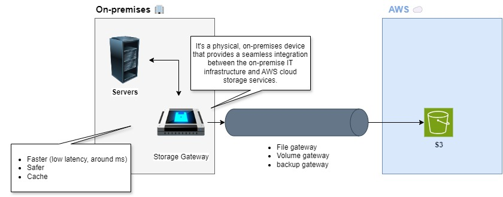

## 1. AWS Storage Gateway

**AWS Storage Gateway** is a hybrid cloud storage service that enables on-premises applications to use cloud storage seamlessly. It connects on-premises environments with AWS storage services, allowing businesses to store and manage data in the cloud while retaining local access to frequently used data.

### 1.1. Key Features

1. **Hybrid Cloud Storage**:
   - AWS Storage Gateway provides a bridge between on-premises environments and AWS cloud storage, allowing organizations to leverage both local and cloud resources effectively.

2. **Gateway Types**:
   - There are three types of gateways, each serving different use cases:
     - **File Gateway**: Provides a file interface to Amazon S3 and allows you to store files as objects in S3. It uses standard file protocols (NFS, SMB) for easy integration with existing applications.
     - **Volume Gateway**: Offers block storage and supports iSCSI-based storage volumes. It can be used to create backup and disaster recovery solutions with Amazon S3 and Amazon EBS.
     - **Tape Gateway**: Emulates a physical tape backup solution, allowing organizations to use existing tape-based backup processes with cloud storage. It integrates with AWS Storage Gateway and archives data in Amazon S3 or Amazon S3 Glacier.

3. **Data Caching**:
   - AWS Storage Gateway employs local caching to ensure low-latency access to frequently accessed data. It stores a portion of the data locally while seamlessly transferring data to and from the cloud.

4. **Seamless Integration with AWS Services**:
   - The service integrates with various AWS storage services, such as Amazon S3, Amazon S3 Glacier, and Amazon EBS, enabling users to build comprehensive storage solutions.

5. **Security**:
   - AWS Storage Gateway provides data encryption in transit and at rest, ensuring that sensitive data is secure. It also supports AWS Identity and Access Management (IAM) for access control.

6. **Cost-Effective**:
   - By using AWS Storage Gateway, organizations can reduce the costs associated with maintaining on-premises storage infrastructure while benefiting from the scalability and durability of AWS cloud storage.

### 1.2. Use Cases

- **Backup and Archiving**: Using the Tape Gateway to replace physical tape libraries with cloud storage for backup and archiving solutions.
- **Cloud Data Migration**: Migrating on-premises data to Amazon S3 for disaster recovery and data protection.
- **File Sharing**: Using the File Gateway to provide on-premises applications with access to cloud-based file storage.
- **Development and Testing**: Creating development and testing environments in the cloud while retaining local access to data.

### 1.3. Summary

AWS Storage Gateway is a versatile hybrid cloud storage solution that enables organizations to extend their on-premises storage capabilities to the cloud. With its various gateway types, data caching features, and seamless integration with AWS services, Storage Gateway helps businesses manage their data more effectively, ensuring low-latency access and cost-effective storage solutions.

