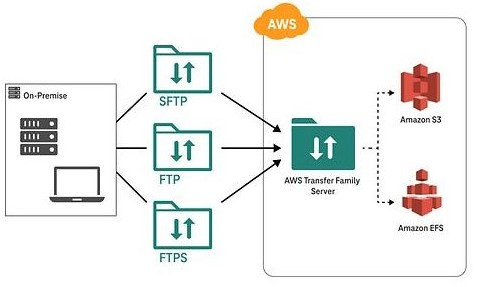

# 🔁 AWS Transfer Family

**AWS Transfer Family** is a fully managed service that enables you to transfer files into and out of AWS storage services using popular protocols like SFTP (Secure File Transfer Protocol), FTPS (File Transfer Protocol Secure), and FTP (File Transfer Protocol). It simplifies the migration of file-based workflows to AWS while maintaining compatibility with your existing tools and systems.

## Key Features of AWS Transfer Family:

1. **Support for Standard Protocols**: Supports SFTP, FTPS, and FTP protocols, allowing you to easily transfer files without changing existing applications or file transfer workflows.

2. **Fully Managed**: AWS handles the infrastructure, scaling, and server maintenance for you, removing the need to manage file transfer servers manually.

3. **Integration with AWS Storage**: Files transferred through AWS Transfer Family can be stored directly in **Amazon S3** or **Amazon EFS**, enabling you to use AWS’s storage services for reliable and scalable file storage.

4. **Authentication Options**: Supports a variety of authentication methods, including AWS Identity and Access Management (IAM), Active Directory (AD), and custom identity providers like LDAP, to control access to file transfer servers.

5. **Encryption**: Ensures the security of data in transit by supporting encryption with TLS and SSH protocols, and integrates with AWS KMS for encrypting files at rest.

6. **Access Control**: Provides fine-grained access control through IAM roles and policies, allowing you to define which users have access to specific files and directories.

7. **High Availability and Scalability**: Automatically scales to meet the needs of your file transfer workloads, ensuring that you can handle increasing file transfer demands without manual intervention.

8. **Monitoring and Logging**: Integrates with Amazon CloudWatch and AWS CloudTrail to provide detailed monitoring, logging, and auditing capabilities for file transfer activity.

9. **Custom Workflows**: Supports integration with AWS Lambda for running custom workflows when files are uploaded or downloaded, enabling automation of tasks like data processing, notifications, or additional security checks.

10. **Cost-Effective**: Pay only for the data you transfer and store, with no upfront fees or server maintenance costs, making it a cost-effective solution for file transfer needs.

## Common Use Cases:

- **Data Exchange**: Enable secure file exchanges with external partners or internal teams using standard file transfer protocols.
- **File-Based Workflows**: Migrate existing on-premises file transfer workflows to AWS while maintaining the same protocols and processes.
- **Data Ingestion**: Automate the ingestion of large datasets into Amazon S3 or Amazon EFS for further processing or analysis in AWS.
- **Compliance Requirements**: Meet industry-specific regulatory or security requirements that mandate the use of certain file transfer protocols like SFTP or FTPS.
- **Backup and Restore**: Transfer critical files between on-premises systems and AWS for backup, disaster recovery, or archival purposes.

## Benefits of AWS Transfer Family:

- **Simplicity**: Makes it easy to migrate file transfer workflows to AWS with minimal changes to your existing systems.
- **Security**: Ensures that your file transfers are secure, with encryption in transit and at rest, as well as access control through IAM and other authentication methods.
- **Scalability**: Automatically scales to handle high volumes of file transfers, ensuring smooth perform
