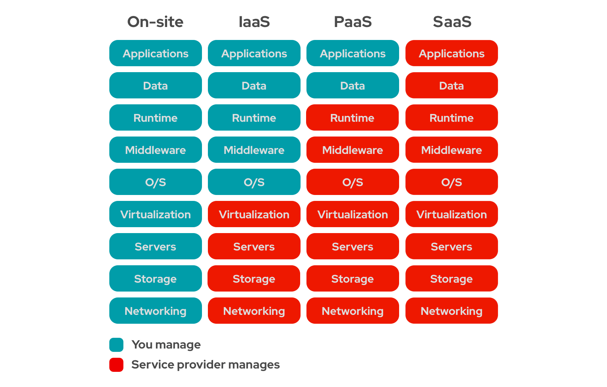
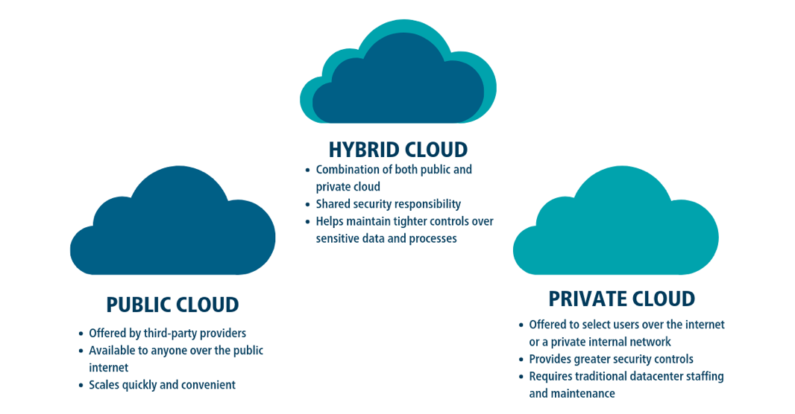

# 1. What is cloud computing? 📚

Cloud computing is the delivery of computing services over the internet, including storage, processing power, and software applications. It allows users to access and use these resources on-demand, paying only for what they use, without needing to invest in and maintain physical hardware and infrastructure. This model provides scalability, flexibility, and cost savings, enabling users to efficiently manage their IT needs.

To have an ideia the imporance of Cloud Computing is, it is important to know how the software development was before of it.

Before the advent of cloud computing, businesses and individuals typically relied on traditional on-premises computing infrastructure. Here are some key aspects of how computing was managed before cloud computing:

## 1.1. On-Premises Data Centers

- **Physical Servers**: Organizations needed to purchase, set up, and maintain physical servers to run their applications and store data.
- **Dedicated IT Staff**: A dedicated IT team was required to manage the hardware, software, networking, and security.
- **High Initial Costs**: Significant capital expenditure was necessary for hardware acquisition, setup, and maintenance.
- **Space Requirements**: Organizations needed physical space to house the servers, including considerations for power and cooling.

## 1.2. Software Deployment

- **Manual Installation**: Software was manually installed on individual computers or servers.
- **Patch Management**: IT staff had to manually apply updates and patches to all systems, which was time-consuming and prone to human error.
- **Limited Access**: Access to applications and data was generally limited to the local network unless complex and often costly remote access solutions were implemented.

## 1.3. Scalability and Flexibility

- **Limited Scalability**: Scaling up meant purchasing additional hardware, which could be slow and expensive.
- **Overprovisioning**: Organizations often had to overprovision resources to handle peak loads, leading to inefficiency and wastage.
- **Lack of Flexibility**: Responding to changing business needs and demands was challenging due to the rigidity of the infrastructure.

## 1.4. Backup and Disaster Recovery

- **Manual Backups**: Data backup processes were often manual or semi-automated, requiring physical storage devices such as tapes or external drives.
- **Complex Disaster Recovery Plans**: Creating and maintaining disaster recovery plans was complex and costly, involving redundant hardware and off-site storage.

## 1.5. Software Licensing

- **Perpetual Licensing**: Software was typically purchased with perpetual licenses, requiring significant upfront costs.
- **Limited Collaboration Tools**: Collaboration tools were often limited, with file sharing and collaborative work restricted to local network environments.

## 1.6. Networking

- **Dedicated Networks**: Companies needed to set up and maintain their own networking infrastructure, including routers, switches, and firewalls.
- **Complex Remote Access**: Providing remote access to applications and data was complex and required specialized VPNs and secure gateways.

# 2. Benefits of Cloud Computing 👍

The shift to cloud computing brought numerous benefits over traditional on-premises solutions:

- **Reduced Capital Expenditure**: With cloud services, the need for large upfront investments in hardware and infrastructure is eliminated.
- **Operational Expenditure**: Costs are shifted to a pay-as-you-go model, providing financial flexibility.
- **Scalability**: Resources can be scaled up or down dynamically, ensuring efficient use of resources.
- **Global Accessibility**: Applications and data can be accessed from anywhere with an internet connection.
- **Automatic Updates**: Cloud providers handle software updates and maintenance, ensuring systems are always up-to-date.
- **Enhanced Collaboration**: Cloud-based tools facilitate collaboration and data sharing across different locations and devices.
- **Simplified Backup and Recovery**: Cloud services often include automated backup and disaster recovery solutions, enhancing data protection.

# 3. Types of Clouding Computing 🔧💻🏭

So, Cloud computing is the delivery of computing services over the internet ("the cloud"). These services include:

- **Infrastructure as a Service (IaaS):** Provides virtualized computing resources over the internet. Examples include Amazon Web Services (AWS) EC2, Google Cloud Compute Engine, and Microsoft Azure.

- **Platform as a Service (PaaS):** Provides a platform allowing customers to develop, run, and manage applications without dealing with the underlying infrastructure. Examples include Google App Engine, AWS Elastic Beanstalk, and Microsoft Azure App Services.

- **Software as a Service (SaaS):** Delivers software applications over the internet, on a subscription basis. Examples include Google Workspace, Microsoft Office 365, and Salesforce.

- **Function as a Service (FaaS):** A serverless computing service where developers can build and run application functionalities without managing servers. Examples include AWS Lambda, Google Cloud Functions, and Azure Functions.

# 4. Public, Private and Hybrid 🌐🔒☁️

## 4.1. Public Cloud

**Definition**: Public cloud services are provided by third-party vendors over the internet, making resources available to the general public.

**Characteristics**:

- **Scalability**: Easily scalable to meet demand.
- **Cost-Effective**: Pay-as-you-go pricing model.
- **Accessibility**: Accessible from anywhere with an internet connection.
- **Maintenance**: The service provider manages maintenance and updates.

**Examples**:

- Amazon Web Services (AWS)
- Microsoft Azure
- Google Cloud Platform (GCP)

**OBS:**: When we are talking about "public", it not means that the server applications are public in which any one can access them. It means that the application share the physical server with others ones, but there are security proccess of authentication and authorization.

## 4.2. Private Cloud

**Definition**: Private cloud services are dedicated to a single organization, providing more control over data, security, and compliance.

**Characteristics**:

- **Exclusive Access**: Resources are used exclusively by one organization.
- **Customization**: More customizable to meet specific organizational needs.
- **Security**: Enhanced security and privacy as it is typically hosted on-premises or in a private data center.
- **Control**: Greater control over infrastructure and data.

**Examples**:

- VMware Private Cloud
- OpenStack

## 4.3. Hybrid Cloud

**Definition**: Hybrid cloud combines public and private clouds, allowing data and applications to be shared between them.

**Characteristics**:

- **Flexibility**: Can choose where to run workloads based on specific needs and policies.
- **Cost Efficiency**: Use public cloud for less-sensitive operations and private cloud for sensitive, critical operations.
- **Scalability**: Utilize public cloud resources for bursty workloads while keeping sensitive data secure in the private cloud.
- **Interoperability**: Ensures seamless integration and data portability between environments.

**Examples**:

- AWS Outposts
- Microsoft Azure Stack
- Google Anthos

## 4.4. Comparison

| Feature           | Public Cloud                | Private Cloud                 | Hybrid Cloud                              |
| ----------------- | --------------------------- | ----------------------------- | ----------------------------------------- |
| **Scalability**   | High                        | Limited by internal resources | High, combining both environments         |
| **Cost**          | Pay-as-you-go               | High upfront cost             | Variable, depends on usage                |
| **Control**       | Limited                     | High                          | High                                      |
| **Security**      | Good, but less than private | High                          | High, with flexible policies              |
| **Accessibility** | Very accessible             | Restricted                    | Flexible, depends on setup                |
| **Maintenance**   | Managed by provider         | Managed by organization       | Managed by both provider and organization |

Each cloud model has its advantages and use cases, depending on the specific needs of an organization. Public clouds are ideal for general, scalable, and cost-effective services. Private clouds are suited for organizations needing high security, control, and customization. Hybrid clouds offer a balance, leveraging both public and private cloud benefits.

## 5. Shared Responsabilities 🤝

### 5.1. Customer Responsibilities

5.1.1. **Data Security**

- Encryption of data in transit and at rest.
- Backup and recovery of data.

5.1.2. **Application Security**

- Secure coding practices.
- Implementing and managing identity and access management (IAM).
- Monitoring and logging application activities.

5.1.3. **Operating System**

- Patching and updating the operating system.
- Configuring and managing the operating system.

5.1.4. **Network Configuration**

- Managing security groups, network access control lists (NACLs), and VPNs.
- Implementing network security measures such as firewalls and intrusion detection systems.

5.1.5. **Identity and Access Management (IAM)**

- Creating and managing AWS IAM users, groups, and roles.
- Configuring multi-factor authentication (MFA).

5.1.6. **Compliance**

- Ensuring compliance with relevant laws, regulations, and industry standards.
- Managing and auditing access to data and resources.

5.1.7. **Monitoring and Logging**

- Setting up and managing logging services (e.g., AWS CloudTrail, Amazon CloudWatch).
- Monitoring application performance and security.

5.1.8. **Application Management**

- Developing, deploying, and managing applications.
- Ensuring application scalability and reliability.

### 5.2. AWS Responsibilities

5.2.1. **Infrastructure Security**

- Physical security of data centers.
- Securing hardware and software infrastructure.

5.2.2. **Networking**

- Managing global and regional network infrastructure.
- Providing secure and reliable network connectivity.

5.2.3. **Hardware and Software**

- Maintenance and updating of server hardware and virtualization software.
- Managing the physical servers, storage, and networking hardware.

5.2.4. **Operational Management**

- Ensuring high availability and disaster recovery.
- Providing a secure and compliant infrastructure.

5.2.5. **Compliance**

- Meeting and maintaining compliance with global standards and regulations (e.g., ISO 27001, SOC 1/2/3).
- Providing compliance certifications and attestations.

5.2.6. **Monitoring and Logging**

- Monitoring and maintaining the health and performance of AWS services.
- Providing logging and monitoring tools for customers (e.g., AWS CloudTrail, Amazon CloudWatch).

5.2.7. **Service Management**

- Providing and managing AWS services (e.g., EC2, S3, RDS).
- Ensuring service availability and reliability.

5.2.8. **Security**

- Implementing and managing physical and environmental security measures.
- Providing security features and services (e.g., AWS Shield, AWS WAF).

By sharing responsibilities, AWS and customers can work together to ensure the security, reliability, and compliance of applications and data hosted on AWS.
