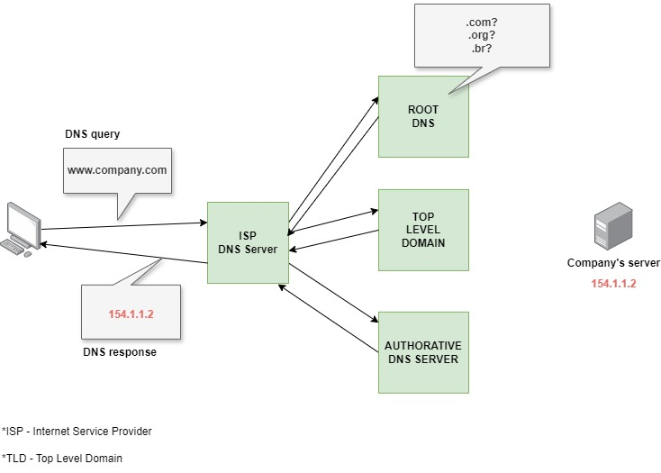

# DNS 📖

DNS, or **Domain Name System**, is a fundamental part of the internet's infrastructure. It translates human-friendly domain names into IP addresses, which computers use to identify each other on the network. Here’s a breakdown of how DNS works and its key components:

## 1.2. Purpose of DNS

- **Domain Name to IP Address Translation:**
  - Humans use domain names (like `www.example.com`) to access websites and services because they are easier to remember than numeric IP addresses (like `192.0.2.1`).
  - DNS translates these domain names into IP addresses so that computers can communicate with each other over the internet.

## 1.3. How DNS Works

1. **User Request:**

   - When you enter a URL in your browser, it needs to find the corresponding IP address to connect to the server.

2. **DNS Query:**

   - Your computer sends a DNS query to a DNS resolver (often provided by your ISP or a public DNS service).

3. **DNS Resolver:**

   - The resolver is responsible for querying DNS servers to find the IP address associated with the domain name.

4. **Recursive Lookup:**

   - The resolver starts by asking root DNS servers for information about the domain. Root servers direct the resolver to top-level domain (TLD) servers (.com, .org, etc.).

5. **TLD Servers:**

   - TLD servers direct the resolver to authoritative DNS servers for the domain.

6. **Authoritative DNS Servers:**

   - These servers hold the actual DNS records for the domain. They provide the resolver with the IP address.

7. **Response:**

   - The resolver sends the IP address back to your computer, which then uses it to connect to the web server hosting the website.

8. **Caching:**
   - To speed up future requests, the IP address and domain name are cached by the resolver and your computer for a period of time (determined by the Time-To-Live or TTL value in the DNS records).

## 1.3. Key Components of DNS

1. **Domain Names:**

   - Structured hierarchically. For example, in `www.example.com`, `com` is the top-level domain (TLD), `example` is the second-level domain, and `www` is a subdomain.

2. **DNS Records:**

   - **A Record:** Maps a domain name to an IPv4 address.
   - **AAAA Record:** Maps a domain name to an IPv6 address.
   - **CNAME Record:** Maps a domain name to another domain name (canonical name).
   - **MX Record:** Specifies mail exchange servers for the domain.
   - **NS Record:** Specifies authoritative DNS servers for the domain.
   - **TXT Record:** Allows the domain to hold arbitrary text, often used for verification and security purposes.

3. **DNS Servers:**
   - **Root DNS Servers:** The top-level servers that direct queries to TLD servers.
   - **TLD DNS Servers:** Handle the TLDs and direct queries to the authoritative servers.
   - **Authoritative DNS Servers:** Store DNS records for specific domains and provide the final answer for DNS queries.

## 1.4. DNS Caching

- **Local Cache:**

  - Your computer and DNS resolver cache DNS records to reduce lookup times and avoid excessive querying.

- **DNS TTL (Time-To-Live):**
  - Specifies how long a DNS record is cached before it needs to be refreshed.

## 1.4. Summary

DNS is crucial for translating domain names into IP addresses, allowing users to access websites and services using human-readable names. It operates through a hierarchy of servers and records, with caching to improve efficiency and performance.
