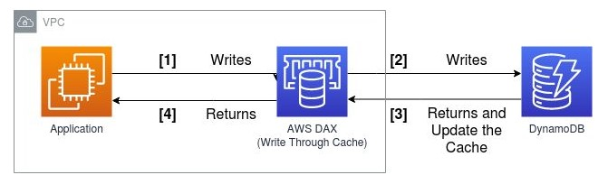
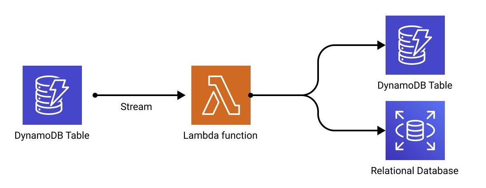

# 1. DynamoDB vs Elasticache

## 1.1. DynamoDB

Amazon DynamoDB is a fully managed NoSQL database service provided by Amazon Web Services (AWS). It is designed for applications that require low-latency, high-performance access to large amounts of data. DynamoDB is particularly well-suited for use cases such as real-time analytics, gaming, IoT, mobile apps, and more.

## 1.2. DAX

**DynamoDB Accelerator (DAX)** is an in-memory caching service designed specifically for Amazon DynamoDB. It helps improve the performance of read-heavy applications by providing fast, in-memory response times for queries and reads.

### 1.2.1. Key Features

- **In-Memory Caching:**

  - DAX provides an in-memory cache that stores frequently accessed data, reducing the need to query the DynamoDB database for every request.

- **Microsecond Response Times:**

  - With DAX, applications can achieve single-digit millisecond response times for read operations, significantly improving performance compared to the traditional DynamoDB read latencies.

- **Fully Managed:**

  - DAX is a fully managed service, meaning AWS handles all the operational aspects, such as setup, patching, scaling, and replication, allowing developers to focus on building their applications.

- **Seamless Integration:**

  - DAX is compatible with existing DynamoDB APIs, making it easy to integrate into existing applications with minimal code changes.

- **Cluster Configuration:**

  - DAX can be deployed in clusters, which provide high availability and fault tolerance. Clusters can automatically scale to handle varying workloads.

- **Write-Through Cache:**

  - DAX automatically updates the cache whenever data is written to DynamoDB, ensuring that the cached data is always up-to-date.

- **Data Consistency:**
  - DAX supports strong consistency for read operations, allowing applications to retrieve the most current data as needed.

### 1.2.2. Use cases

- **Read-Heavy Workloads**: Applications that require high throughput for read operations, such as gaming leaderboards, social media feeds, or IoT applications.
- **Caching Frequently Accessed Data**: Applications that frequently access the same data can benefit from the reduced latency offered by DAX.
- **Real-Time Analytics**: Use cases that require quick data retrieval for real-time analysis or reporting can leverage DAX for faster insights.

### 1.2.3. Summary

DynamoDB Accelerator (DAX) enhances the performance of Amazon DynamoDB by providing an in-memory caching layer that delivers fast read operations. It is particularly beneficial for applications with heavy read workloads, improving response times while reducing the load on the underlying DynamoDB tables.

## 1.3. DynamoDB Streams

DynamoDB Streams is a feature of Amazon DynamoDB that captures changes to items in a DynamoDB table in near real-time. Whenever data in the table is modified (e.g., inserted, updated, or deleted), DynamoDB Streams records these changes, making them available for processing by other AWS services or your application.

Thus, it provides a powerful mechanism to capture and react to changes in your DynamoDB tables. It enables real-time event-driven architectures, data replication, and synchronization with other systems. By integrating DynamoDB Streams with services like AWS Lambda, you can easily trigger automated workflows and build scalable applications that respond immediately to data changes.

## 1.2. Elasticache

Amazon ElastiCache is a fully managed in-memory data store and caching service provided by Amazon Web Services (AWS). It is designed to improve the performance of your web applications by enabling faster data retrieval from in-memory databases, which can significantly reduce the load on your primary database.

## 1.3. Difference

| **Feature**           | **Amazon DynamoDB**                                            | **Amazon ElastiCache**                                                  |
| --------------------- | -------------------------------------------------------------- | ----------------------------------------------------------------------- |
| **Purpose**           | Fully managed NoSQL database                                   | Fully managed in-memory data store and caching service                  |
| **Data Model**        | Key-value and document store                                   | Key-value store (supports Redis and Memcached)                          |
| **Data Storage**      | Persistent, stored on disk                                     | In-memory, typically non-persistent (Redis supports persistence)        |
| **Performance**       | Low latency, high throughput                                   | Extremely low latency, sub-millisecond response times                   |
| **Scalability**       | Automatically scales horizontally                              | Scales by adding nodes and increasing instance sizes                    |
| **Replication**       | Multi-region, automatic scaling, and global tables             | Supports replication (Redis) and automatic failover                     |
| **Data Durability**   | Durable with automatic backups and point-in-time recovery      | Volatile by default (Redis offers snapshot and AOF persistence options) |
| **Use Case**          | Applications needing reliable, scalable storage                | Applications needing fast, in-memory data access                        |
| **Common Use Cases**  | Real-time bidding, e-commerce, IoT, mobile apps                | Caching, session storage, real-time analytics, gaming leaderboards      |
| **Supported Engines** | Proprietary (AWS-built NoSQL service)                          | Redis, Memcached                                                        |
| **Capacity Modes**    | On-demand and provisioned capacity modes                       | Scales based on node addition and cluster configuration                 |
| **Security**          | Encryption at rest and in transit, fine-grained access control | Encryption, VPC integration, and IAM support                            |
