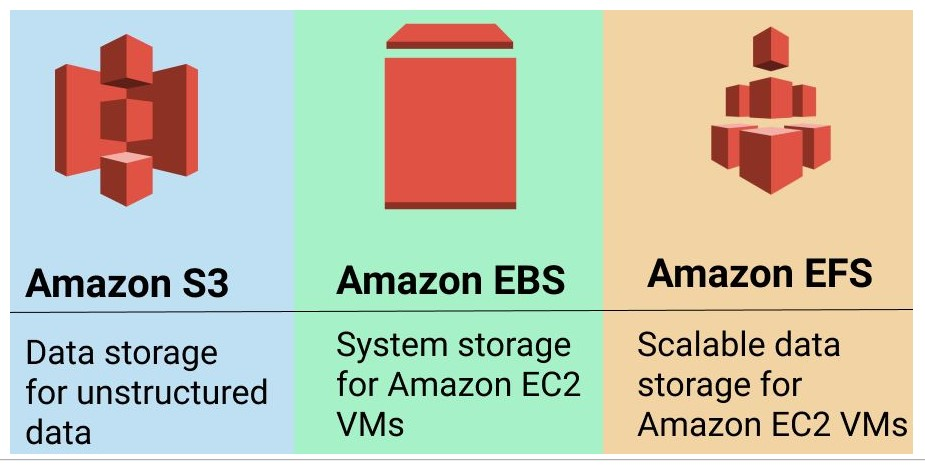

# 1. Storage 📁

- [Snapshot](../services/storage-snapshot.md)
- [Amazon Elastic Block Store (Amazon EBS)](../services/amazon-ebs.md)
- [Amazon Elastic File System (Amazon EFS)](../services/amazon-efs.md)
- [Simple Storage Service (S3)](../services/amazon-s3.md)
- [Aws Storage Gateway](../services/aws-storage-gateway.md)
- [Amazon FSx](../services/amazon-fsx.md)

# 2. S3 vs EBS vs EFS

- EFS (Elastic File System): Storage via NFS. 
- EBS (Elastic Block Store): It's like an EC2 HD (Hard Drive)
- S3 (Simple Storage Service): Objects Storage

# 3. Amazon EFS vs Amazon FSx

[EFS vs FSx](../services/amazon-fsx.md)